# BloodLink Backend Class Diagrams (PlantUML Format)

> Full 61 Class Diagrams across all 13 modules, 100% aligned with NestJS backend source code and Prisma schema.
> Compatible with PlantUML server, IntelliJ/VSCode PlantUML extension, and AI analyzers.

## Table of Contents

- [Module 3.1: Auth Feature](#module-31-auth-feature)
  - [3.1.1 Overview Class Diagram - Auth Feature](#311-overview-class-diagram---auth-feature-auth-overview)
  - [3.1.2.1 Class Diagram - Register](#3121-class-diagram---register-auth-register)
  - [3.1.2.2 Class Diagram - Verify OTP](#3122-class-diagram---verify-otp-auth-verify-otp)
  - [3.1.2.3 Class Diagram - Resend OTP](#3123-class-diagram---resend-otp-auth-resend-otp)
  - [3.1.2.4 Class Diagram - Login](#3124-class-diagram---login-auth-login)
  - [3.1.2.5 Class Diagram - Refresh Token](#3125-class-diagram---refresh-token-auth-refresh-token)
  - [3.1.2.6 Class Diagram - Forgot Password](#3126-class-diagram---forgot-password-auth-forgot-password)
  - [3.1.2.7 Class Diagram - Reset Password](#3127-class-diagram---reset-password-auth-reset-password)
- [Module 3.2: User Profile and Account Administration Feature](#module-32-user-profile-and-account-administration-feature)
  - [3.2.1 Overview Class Diagram - User Profile and Account Administration Feature](#321-overview-class-diagram---user-profile-and-account-administration-feature-users-overview)
  - [3.2.2.1 Class Diagram - View and Update Profile](#3221-class-diagram---view-and-update-profile-users-profile)
  - [3.2.2.2 Class Diagram - Upload Profile Avatar](#3222-class-diagram---upload-profile-avatar-users-avatar)
  - [3.2.2.3 Class Diagram - Change Password with OTP](#3223-class-diagram---change-password-with-otp-users-change-password)
  - [3.2.2.4 Class Diagram - Admin Manage Users](#3224-class-diagram---admin-manage-users-users-admin-manage)
  - [3.2.2.5 Class Diagram - Import and Export Users Excel](#3225-class-diagram---import-and-export-users-excel-users-excel)
- [Module 3.3: Donor Profile, Appointment and Donation Feature](#module-33-donor-profile-appointment-and-donation-feature)
  - [3.3.1 Overview Class Diagram - Donor Profile, Appointment and Donation Feature](#331-overview-class-diagram---donor-profile-appointment-and-donation-feature-donor-overview)
  - [3.3.2.1 Class Diagram - Register and Update Donor Profile](#3321-class-diagram---register-and-update-donor-profile-donor-profile)
  - [3.3.2.2 Class Diagram - Update Donor Availability](#3322-class-diagram---update-donor-availability-donor-availability)
  - [3.3.2.3 Class Diagram - Book and Cancel Donation Slot](#3323-class-diagram---book-and-cancel-donation-slot-donor-booking)
  - [3.3.2.4 Class Diagram - View My Slots and History](#3324-class-diagram---view-my-slots-and-history-donor-history-slots)
  - [3.3.2.5 Class Diagram - Admin Manage Slots and Excel](#3325-class-diagram---admin-manage-slots-and-excel-donor-admin-slots-excel)
  - [3.3.2.6 Class Diagram - Record Blood Donation](#3326-class-diagram---record-blood-donation-donor-record-donation)
- [Module 3.4: Blood Request and Matching Feature](#module-34-blood-request-and-matching-feature)
  - [3.4.1 Overview Class Diagram - Blood Request and Matching Feature](#341-overview-class-diagram---blood-request-and-matching-feature-request-overview)
  - [3.4.2.1 Class Diagram - Create Blood Request](#3421-class-diagram---create-blood-request-request-create)
  - [3.4.2.2 Class Diagram - View and Track Requests](#3422-class-diagram---view-and-track-requests-request-view-track)
  - [3.4.2.3 Class Diagram - Update, Cancel and Delete Request](#3423-class-diagram---update-cancel-and-delete-request-request-crud)
  - [3.4.2.4 Class Diagram - Process Blood Request](#3424-class-diagram---process-blood-request-request-process)
  - [3.4.2.5 Class Diagram - Inventory Allocation and Release](#3425-class-diagram---inventory-allocation-and-release-request-allocations)
  - [3.4.2.6 Class Diagram - Find and Manage Donor Matches](#3426-class-diagram---find-and-manage-donor-matches-request-matches)
  - [3.4.2.7 Class Diagram - Import and Export Requests Excel](#3427-class-diagram---import-and-export-requests-excel-request-excel)
- [Module 3.5: Blood Inventory Feature](#module-35-blood-inventory-feature)
  - [3.5.1 Overview Class Diagram - Blood Inventory Feature](#351-overview-class-diagram---blood-inventory-feature-inventory-overview)
  - [3.5.2.1 Class Diagram - View Inventory List and Statistics](#3521-class-diagram---view-inventory-list-and-statistics-inventory-list-stats)
  - [3.5.2.2 Class Diagram - Receive Blood Unit](#3522-class-diagram---receive-blood-unit-inventory-receive)
  - [3.5.2.3 Class Diagram - Update Blood Unit](#3523-class-diagram---update-blood-unit-inventory-update)
  - [3.5.2.4 Class Diagram - Discard Blood Unit](#3524-class-diagram---discard-blood-unit-inventory-discard)
  - [3.5.2.5 Class Diagram - Import and Export Inventory Excel](#3525-class-diagram---import-and-export-inventory-excel-inventory-excel)
- [Module 3.6: Donation Schedule Administration Feature](#module-36-donation-schedule-administration-feature)
  - [3.6.1 Overview Class Diagram - Donation Schedule Administration Feature](#361-overview-class-diagram---donation-schedule-administration-feature-schedules-overview)
  - [3.6.2.1 Class Diagram - View and Manage Donation Schedules](#3621-class-diagram---view-and-manage-donation-schedules-schedules-crud)
  - [3.6.2.2 Class Diagram - Track Schedule Donors and Excel Export](#3622-class-diagram---track-schedule-donors-and-excel-export-schedules-donors-excel)
- [Module 3.7: Master Data and Facility Administration Feature](#module-37-master-data-and-facility-administration-feature)
  - [3.7.1 Overview Class Diagram - Master Data and Facility Administration Feature](#371-overview-class-diagram---master-data-and-facility-administration-feature-master-data-overview)
  - [3.7.2.1 Class Diagram - Manage Medical Facilities and Excel](#3721-class-diagram---manage-medical-facilities-and-excel-master-data-facilities)
  - [3.7.2.2 Class Diagram - Manage Blood Types and Components](#3722-class-diagram---manage-blood-types-and-components-master-data-blood-types-components)
  - [3.7.2.3 Class Diagram - Manage Blood Compatibility Rules](#3723-class-diagram---manage-blood-compatibility-rules-master-data-compatibility)
  - [3.7.2.4 Class Diagram - Manage Donation Interval Rules](#3724-class-diagram---manage-donation-interval-rules-master-data-interval-rules)
  - [3.7.2.5 Class Diagram - Retrieve System Lookups](#3725-class-diagram---retrieve-system-lookups-master-data-lookups)
- [Module 3.8: Blog Content Feature](#module-38-blog-content-feature)
  - [3.8.1 Overview Class Diagram - Blog Content Feature](#381-overview-class-diagram---blog-content-feature-blog-overview)
  - [3.8.2.1 Class Diagram - Manage Blog Categories](#3821-class-diagram---manage-blog-categories-blog-categories)
  - [3.8.2.2 Class Diagram - View and Manage Blog Posts](#3822-class-diagram---view-and-manage-blog-posts-blog-posts)
  - [3.8.2.3 Class Diagram - User Comment Interactions](#3823-class-diagram---user-comment-interactions-blog-comments-user)
  - [3.8.2.4 Class Diagram - Admin Comment Moderation](#3824-class-diagram---admin-comment-moderation-blog-comments-admin)
- [Module 3.9: Education Content Feature](#module-39-education-content-feature)
  - [3.9.1 Overview Class Diagram - Education Content Feature](#391-overview-class-diagram---education-content-feature-education-overview)
  - [3.9.2.1 Class Diagram - Manage Education Categories](#3921-class-diagram---manage-education-categories-education-categories)
  - [3.9.2.2 Class Diagram - View and Manage Education Documents](#3922-class-diagram---view-and-manage-education-documents-education-documents)
- [Module 3.10: Dashboard Feature](#module-310-dashboard-feature)
  - [3.10.1 Overview Class Diagram - Dashboard Feature](#3101-overview-class-diagram---dashboard-feature-dashboard-overview)
  - [3.10.2.1 Class Diagram - Get Dashboard Statistics](#31021-class-diagram---get-dashboard-statistics-dashboard-stats)
- [Module 3.11: Notification Feature](#module-311-notification-feature)
  - [3.11.1 Overview Class Diagram - Notification Feature](#3111-overview-class-diagram---notification-feature-notifications-overview)
  - [3.11.2.1 Class Diagram - User Notification Operations](#31121-class-diagram---user-notification-operations-notifications-user)
  - [3.11.2.2 Class Diagram - Admin Notification Management](#31122-class-diagram---admin-notification-management-notifications-admin)
- [Module 3.12: System Settings Feature](#module-312-system-settings-feature)
  - [3.12.1 Overview Class Diagram - System Settings Feature](#3121-overview-class-diagram---system-settings-feature-system-settings-overview)
  - [3.12.2.1 Class Diagram - View and Update System Settings](#31221-class-diagram---view-and-update-system-settings-system-settings-crud)
- [Module 3.13: File Upload Feature](#module-313-file-upload-feature)
  - [3.13.1 Overview Class Diagram - File Upload Feature](#3131-overview-class-diagram---file-upload-feature-cloudinary-overview)
  - [3.13.2.1 Class Diagram - Upload Image](#31321-class-diagram---upload-image-cloudinary-upload)

---

## Module 3.1: Auth Feature

### 3.1.1 Overview Class Diagram - Auth Feature (`auth_overview`)

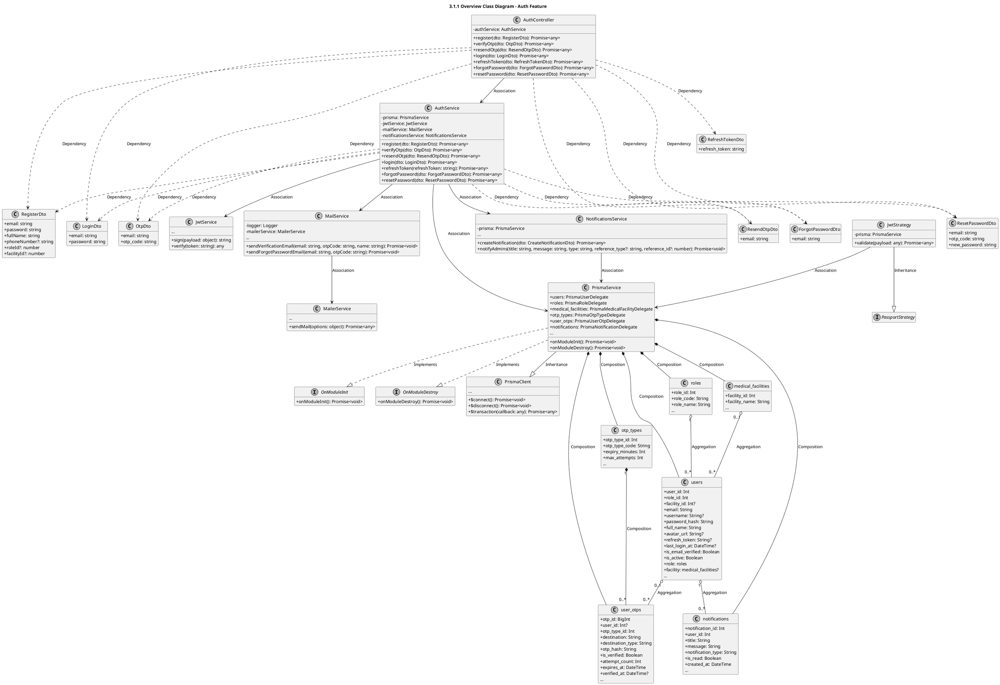
```plantuml
@startuml
title 3.1.1 Overview Class Diagram - Auth Feature
skinparam classAttributeIconSize 0
skinparam monochrome true
skinparam shadowing false
skinparam defaultFontName Arial
hide empty members

class AuthController {
  -authService: AuthService
  +register(dto: RegisterDto): Promise<any>
  +verifyOtp(dto: OtpDto): Promise<any>
  +resendOtp(dto: ResendOtpDto): Promise<any>
  +login(dto: LoginDto): Promise<any>
  +refreshToken(dto: RefreshTokenDto): Promise<any>
  +forgotPassword(dto: ForgotPasswordDto): Promise<any>
  +resetPassword(dto: ResetPasswordDto): Promise<any>
}

class AuthService {
  -prisma: PrismaService
  -jwtService: JwtService
  -mailService: MailService
  -notificationsService: NotificationsService
  +register(dto: RegisterDto): Promise<any>
  +verifyOtp(dto: OtpDto): Promise<any>
  +resendOtp(dto: ResendOtpDto): Promise<any>
  +login(dto: LoginDto): Promise<any>
  +refreshToken(refreshToken: string): Promise<any>
  +forgotPassword(dto: ForgotPasswordDto): Promise<any>
  +resetPassword(dto: ResetPasswordDto): Promise<any>
}

class RegisterDto {
  +email: string
  +password: string
  +fullName: string
  +phoneNumber?: string
  +roleId?: number
  +facilityId?: number
}

class LoginDto {
  +email: string
  +password: string
}

class OtpDto {
  +email: string
  +otp_code: string
}

class ResendOtpDto {
  +email: string
}

class RefreshTokenDto {
  +refresh_token: string
}

class ForgotPasswordDto {
  +email: string
}

class ResetPasswordDto {
  +email: string
  +otp_code: string
  +new_password: string
}

class JwtService {
  +sign(payload: object): string
  +verify(token: string): any
  ...
}

class MailService {
  -logger: Logger
  -mailerService: MailerService
  +sendVerificationEmail(email: string, otpCode: string, name: string): Promise<void>
  +sendForgotPasswordEmail(email: string, otpCode: string): Promise<void>
  ...
}

class MailerService {
  +sendMail(options: object): Promise<any>
  ...
}

class NotificationsService {
  -prisma: PrismaService
  +createNotification(dto: CreateNotificationDto): Promise<any>
  +notifyAdmins(title: string, message: string, type: string, reference_type?: string, reference_id?: number): Promise<void>
  ...
}

class JwtStrategy {
  -prisma: PrismaService
  +validate(payload: any): Promise<any>
}

interface PassportStrategy {
}

interface OnModuleInit {
  +onModuleInit(): Promise<void>
}

interface OnModuleDestroy {
  +onModuleDestroy(): Promise<void>
}

class PrismaClient {
  +$connect(): Promise<void>
  +$disconnect(): Promise<void>
  +$transaction(callback: any): Promise<any>
  ...
}

class PrismaService {
  +users: PrismaUserDelegate
  +roles: PrismaRoleDelegate
  +medical_facilities: PrismaMedicalFacilityDelegate
  +otp_types: PrismaOtpTypeDelegate
  +user_otps: PrismaUserOtpDelegate
  +notifications: PrismaNotificationDelegate
  ...
  +onModuleInit(): Promise<void>
  +onModuleDestroy(): Promise<void>
}

class users {
  +user_id: Int
  +role_id: Int
  +facility_id: Int?
  +email: String
  +username: String?
  +password_hash: String
  +full_name: String
  +avatar_url: String?
  +refresh_token: String?
  +last_login_at: DateTime?
  +is_email_verified: Boolean
  +is_active: Boolean
  +role: roles
  +facility: medical_facilities?
  ...
}

class roles {
  +role_id: Int
  +role_code: String
  +role_name: String
  ...
}

class medical_facilities {
  +facility_id: Int
  +facility_name: String
  ...
}

class otp_types {
  +otp_type_id: Int
  +otp_type_code: String
  +expiry_minutes: Int
  +max_attempts: Int
  ...
}

class user_otps {
  +otp_id: BigInt
  +user_id: Int?
  +otp_type_id: Int
  +destination: String
  +destination_type: String
  +otp_hash: String
  +is_verified: Boolean
  +attempt_count: Int
  +expires_at: DateTime
  +verified_at: DateTime?
  ...
}

class notifications {
  +notification_id: Int
  +user_id: Int
  +title: String
  +message: String
  +notification_type: String
  +is_read: Boolean
  +created_at: DateTime
  ...
}

AuthController --> AuthService : Association
AuthController ..> RegisterDto : Dependency
AuthController ..> LoginDto : Dependency
AuthController ..> OtpDto : Dependency
AuthController ..> ResendOtpDto : Dependency
AuthController ..> RefreshTokenDto : Dependency
AuthController ..> ForgotPasswordDto : Dependency
AuthController ..> ResetPasswordDto : Dependency
AuthService ..> RegisterDto : Dependency
AuthService ..> LoginDto : Dependency
AuthService ..> OtpDto : Dependency
AuthService ..> ResendOtpDto : Dependency
AuthService ..> ForgotPasswordDto : Dependency
AuthService ..> ResetPasswordDto : Dependency
AuthService --> PrismaService : Association
AuthService --> JwtService : Association
AuthService --> MailService : Association
AuthService --> NotificationsService : Association
JwtStrategy --|> PassportStrategy : Inheritance
JwtStrategy --> PrismaService : Association
MailService --> MailerService : Association
NotificationsService --> PrismaService : Association
PrismaService --|> PrismaClient : Inheritance
PrismaService ..|> OnModuleInit : Implements
PrismaService ..|> OnModuleDestroy : Implements
PrismaService *-- users : Composition
PrismaService *-- roles : Composition
PrismaService *-- medical_facilities : Composition
PrismaService *-- otp_types : Composition
PrismaService *-- user_otps : Composition
PrismaService *-- notifications : Composition
roles "1" o-- "0..*" users : Aggregation
medical_facilities "0..1" o-- "0..*" users : Aggregation
users "0..1" o-- "0..*" user_otps : Aggregation
otp_types "1" *-- "0..*" user_otps : Composition
users "1" o-- "0..*" notifications : Aggregation
@enduml
```

---

### 3.1.2.1 Class Diagram - Register (`auth_register`)

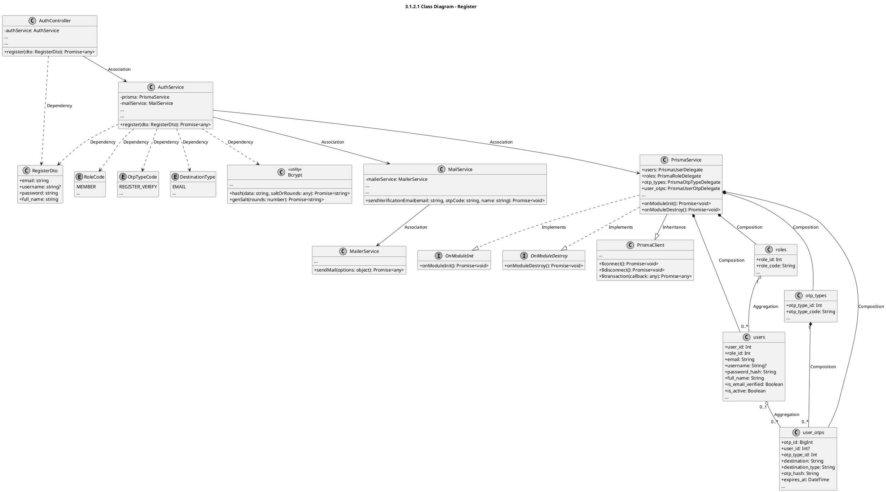
```plantuml
@startuml
title 3.1.2.1 Class Diagram - Register
skinparam classAttributeIconSize 0
skinparam monochrome true
skinparam shadowing false
skinparam defaultFontName Arial
hide empty members

class AuthController {
  -authService: AuthService
  ...
  +register(dto: RegisterDto): Promise<any>
  ...
}

class RegisterDto {
  +email: string
  +username: string?
  +password: string
  +full_name: string
}

enum RoleCode {
  MEMBER
  ...
}

enum OtpTypeCode {
  REGISTER_VERIFY
  ...
}

enum DestinationType {
  EMAIL
  ...
}

class AuthService {
  -prisma: PrismaService
  -mailService: MailService
  ...
  +register(dto: RegisterDto): Promise<any>
  ...
}

class Bcrypt <<utility>> {
  +hash(data: string, saltOrRounds: any): Promise<string>
  +genSalt(rounds: number): Promise<string>
  ...
}

class MailService {
  -mailerService: MailerService
  ...
  +sendVerificationEmail(email: string, otpCode: string, name: string): Promise<void>
  ...
}

class MailerService {
  +sendMail(options: object): Promise<any>
  ...
}

interface OnModuleInit {
  +onModuleInit(): Promise<void>
}

interface OnModuleDestroy {
  +onModuleDestroy(): Promise<void>
}

class PrismaClient {
  +$connect(): Promise<void>
  +$disconnect(): Promise<void>
  +$transaction(callback: any): Promise<any>
  ...
}

class PrismaService {
  +users: PrismaUserDelegate
  +roles: PrismaRoleDelegate
  +otp_types: PrismaOtpTypeDelegate
  +user_otps: PrismaUserOtpDelegate
  ...
  +onModuleInit(): Promise<void>
  +onModuleDestroy(): Promise<void>
}

class users {
  +user_id: Int
  +role_id: Int
  +email: String
  +username: String?
  +password_hash: String
  +full_name: String
  +is_email_verified: Boolean
  +is_active: Boolean
  ...
}

class roles {
  +role_id: Int
  +role_code: String
  ...
}

class otp_types {
  +otp_type_id: Int
  +otp_type_code: String
  ...
}

class user_otps {
  +otp_id: BigInt
  +user_id: Int?
  +otp_type_id: Int
  +destination: String
  +destination_type: String
  +otp_hash: String
  +expires_at: DateTime
  ...
}

AuthController --> AuthService : Association
AuthController ..> RegisterDto : Dependency
AuthService --> PrismaService : Association
AuthService --> MailService : Association
AuthService ..> RegisterDto : Dependency
AuthService ..> RoleCode : Dependency
AuthService ..> OtpTypeCode : Dependency
AuthService ..> DestinationType : Dependency
AuthService ..> Bcrypt : Dependency
MailService --> MailerService : Association
PrismaService --|> PrismaClient : Inheritance
PrismaService ..|> OnModuleInit : Implements
PrismaService ..|> OnModuleDestroy : Implements
PrismaService *-- users : Composition
PrismaService *-- roles : Composition
PrismaService *-- otp_types : Composition
PrismaService *-- user_otps : Composition
roles "1" o-- "0..*" users : Aggregation
users "0..1" o-- "0..*" user_otps : Aggregation
otp_types "1" *-- "0..*" user_otps : Composition
@enduml
```

---

### 3.1.2.2 Class Diagram - Verify OTP (`auth_verify_otp`)

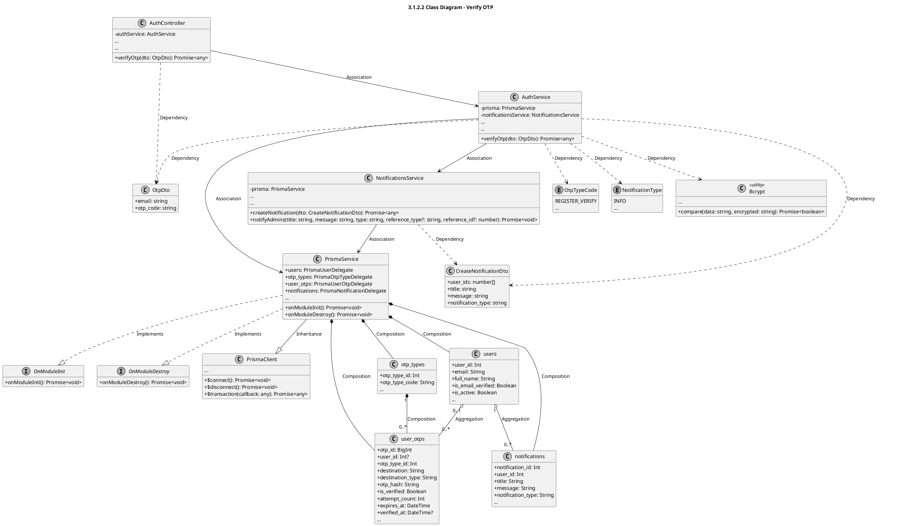
```plantuml
@startuml
title 3.1.2.2 Class Diagram - Verify OTP
skinparam classAttributeIconSize 0
skinparam monochrome true
skinparam shadowing false
skinparam defaultFontName Arial
hide empty members

class AuthController {
  -authService: AuthService
  ...
  +verifyOtp(dto: OtpDto): Promise<any>
  ...
}

class OtpDto {
  +email: string
  +otp_code: string
}

class CreateNotificationDto {
  +user_ids: number[]
  +title: string
  +message: string
  +notification_type: string
}

enum OtpTypeCode {
  REGISTER_VERIFY
  ...
}

enum NotificationType {
  INFO
  ...
}

class AuthService {
  -prisma: PrismaService
  -notificationsService: NotificationsService
  ...
  +verifyOtp(dto: OtpDto): Promise<any>
  ...
}

class Bcrypt <<utility>> {
  +compare(data: string, encrypted: string): Promise<boolean>
  ...
}

class NotificationsService {
  -prisma: PrismaService
  ...
  +createNotification(dto: CreateNotificationDto): Promise<any>
  +notifyAdmins(title: string, message: string, type: string, reference_type?: string, reference_id?: number): Promise<void>
  ...
}

interface OnModuleInit {
  +onModuleInit(): Promise<void>
}

interface OnModuleDestroy {
  +onModuleDestroy(): Promise<void>
}

class PrismaClient {
  +$connect(): Promise<void>
  +$disconnect(): Promise<void>
  +$transaction(callback: any): Promise<any>
  ...
}

class PrismaService {
  +users: PrismaUserDelegate
  +otp_types: PrismaOtpTypeDelegate
  +user_otps: PrismaUserOtpDelegate
  +notifications: PrismaNotificationDelegate
  ...
  +onModuleInit(): Promise<void>
  +onModuleDestroy(): Promise<void>
}

class users {
  +user_id: Int
  +email: String
  +full_name: String
  +is_email_verified: Boolean
  +is_active: Boolean
  ...
}

class otp_types {
  +otp_type_id: Int
  +otp_type_code: String
  ...
}

class user_otps {
  +otp_id: BigInt
  +user_id: Int?
  +otp_type_id: Int
  +destination: String
  +destination_type: String
  +otp_hash: String
  +is_verified: Boolean
  +attempt_count: Int
  +expires_at: DateTime
  +verified_at: DateTime?
  ...
}

class notifications {
  +notification_id: Int
  +user_id: Int
  +title: String
  +message: String
  +notification_type: String
  ...
}

AuthController --> AuthService : Association
AuthController ..> OtpDto : Dependency
AuthService --> PrismaService : Association
AuthService --> NotificationsService : Association
AuthService ..> OtpDto : Dependency
AuthService ..> OtpTypeCode : Dependency
AuthService ..> NotificationType : Dependency
AuthService ..> CreateNotificationDto : Dependency
AuthService ..> Bcrypt : Dependency
NotificationsService --> PrismaService : Association
NotificationsService ..> CreateNotificationDto : Dependency
PrismaService --|> PrismaClient : Inheritance
PrismaService ..|> OnModuleInit : Implements
PrismaService ..|> OnModuleDestroy : Implements
PrismaService *-- users : Composition
PrismaService *-- otp_types : Composition
PrismaService *-- user_otps : Composition
PrismaService *-- notifications : Composition
users "0..1" o-- "0..*" user_otps : Aggregation
otp_types "1" *-- "0..*" user_otps : Composition
users "1" o-- "0..*" notifications : Aggregation
@enduml
```

---

### 3.1.2.3 Class Diagram - Resend OTP (`auth_resend_otp`)

```plantuml
@startuml
title 3.1.2.3 Class Diagram - Resend OTP
skinparam classAttributeIconSize 0
skinparam monochrome true
skinparam shadowing false
skinparam defaultFontName Arial
hide empty members

class AuthController {
  -authService: AuthService
  ...
  +resendOtp(dto: ResendOtpDto): Promise<any>
  ...
}

class ResendOtpDto {
  +email: string
}

enum OtpTypeCode {
  REGISTER_VERIFY
  ...
}

enum DestinationType {
  EMAIL
  ...
}

class AuthService {
  -prisma: PrismaService
  -mailService: MailService
  ...
  +resendOtp(dto: ResendOtpDto): Promise<any>
  ...
}

class Bcrypt <<utility>> {
  +hash(data: string, saltOrRounds: any): Promise<string>
  ...
}

class MailService {
  -mailerService: MailerService
  ...
  +sendVerificationEmail(email: string, otpCode: string, name: string): Promise<void>
  ...
}

class MailerService {
  +sendMail(options: object): Promise<any>
  ...
}

interface OnModuleInit {
  +onModuleInit(): Promise<void>
}

interface OnModuleDestroy {
  +onModuleDestroy(): Promise<void>
}

class PrismaClient {
  +$connect(): Promise<void>
  +$disconnect(): Promise<void>
  ...
}

class PrismaService {
  +users: PrismaUserDelegate
  +otp_types: PrismaOtpTypeDelegate
  +user_otps: PrismaUserOtpDelegate
  ...
  +onModuleInit(): Promise<void>
  +onModuleDestroy(): Promise<void>
}

class users {
  +user_id: Int
  +email: String
  +full_name: String
  +is_email_verified: Boolean
  ...
}

class otp_types {
  +otp_type_id: Int
  +otp_type_code: String
  ...
}

class user_otps {
  +otp_id: BigInt
  +user_id: Int?
  +otp_type_id: Int
  +destination: String
  +destination_type: String
  +otp_hash: String
  +expires_at: DateTime
  ...
}

AuthController --> AuthService : Association
AuthController ..> ResendOtpDto : Dependency
AuthService --> PrismaService : Association
AuthService --> MailService : Association
AuthService ..> ResendOtpDto : Dependency
AuthService ..> OtpTypeCode : Dependency
AuthService ..> DestinationType : Dependency
AuthService ..> Bcrypt : Dependency
MailService --> MailerService : Association
PrismaService --|> PrismaClient : Inheritance
PrismaService ..|> OnModuleInit : Implements
PrismaService ..|> OnModuleDestroy : Implements
PrismaService *-- users : Composition
PrismaService *-- otp_types : Composition
PrismaService *-- user_otps : Composition
users "0..1" o-- "0..*" user_otps : Aggregation
otp_types "1" *-- "0..*" user_otps : Composition
@enduml
```

---

### 3.1.2.4 Class Diagram - Login (`auth_login`)

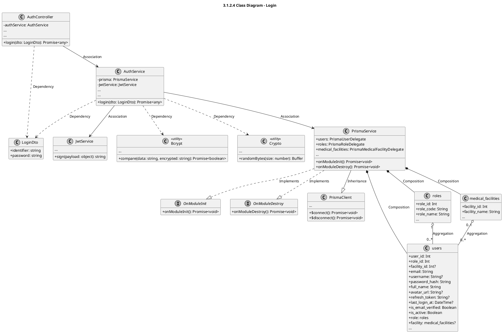
```plantuml
@startuml
title 3.1.2.4 Class Diagram - Login
skinparam classAttributeIconSize 0
skinparam monochrome true
skinparam shadowing false
skinparam defaultFontName Arial
hide empty members

class AuthController {
  -authService: AuthService
  ...
  +login(dto: LoginDto): Promise<any>
  ...
}

class LoginDto {
  +identifier: string
  +password: string
}

class AuthService {
  -prisma: PrismaService
  -jwtService: JwtService
  ...
  +login(dto: LoginDto): Promise<any>
  ...
}

class JwtService {
  +sign(payload: object): string
  ...
}

class Bcrypt <<utility>> {
  +compare(data: string, encrypted: string): Promise<boolean>
  ...
}

class Crypto <<utility>> {
  +randomBytes(size: number): Buffer
  ...
}

interface OnModuleInit {
  +onModuleInit(): Promise<void>
}

interface OnModuleDestroy {
  +onModuleDestroy(): Promise<void>
}

class PrismaClient {
  +$connect(): Promise<void>
  +$disconnect(): Promise<void>
  ...
}

class PrismaService {
  +users: PrismaUserDelegate
  +roles: PrismaRoleDelegate
  +medical_facilities: PrismaMedicalFacilityDelegate
  ...
  +onModuleInit(): Promise<void>
  +onModuleDestroy(): Promise<void>
}

class users {
  +user_id: Int
  +role_id: Int
  +facility_id: Int?
  +email: String
  +username: String?
  +password_hash: String
  +full_name: String
  +avatar_url: String?
  +refresh_token: String?
  +last_login_at: DateTime?
  +is_email_verified: Boolean
  +is_active: Boolean
  +role: roles
  +facility: medical_facilities?
  ...
}

class roles {
  +role_id: Int
  +role_code: String
  +role_name: String
  ...
}

class medical_facilities {
  +facility_id: Int
  +facility_name: String
  ...
}

AuthController --> AuthService : Association
AuthController ..> LoginDto : Dependency
AuthService --> PrismaService : Association
AuthService --> JwtService : Association
AuthService ..> LoginDto : Dependency
AuthService ..> Bcrypt : Dependency
AuthService ..> Crypto : Dependency
PrismaService --|> PrismaClient : Inheritance
PrismaService ..|> OnModuleInit : Implements
PrismaService ..|> OnModuleDestroy : Implements
PrismaService *-- users : Composition
PrismaService *-- roles : Composition
PrismaService *-- medical_facilities : Composition
roles "1" o-- "0..*" users : Aggregation
medical_facilities "0..1" o-- "0..*" users : Aggregation
@enduml
```

---

### 3.1.2.5 Class Diagram - Refresh Token (`auth_refresh_token`)

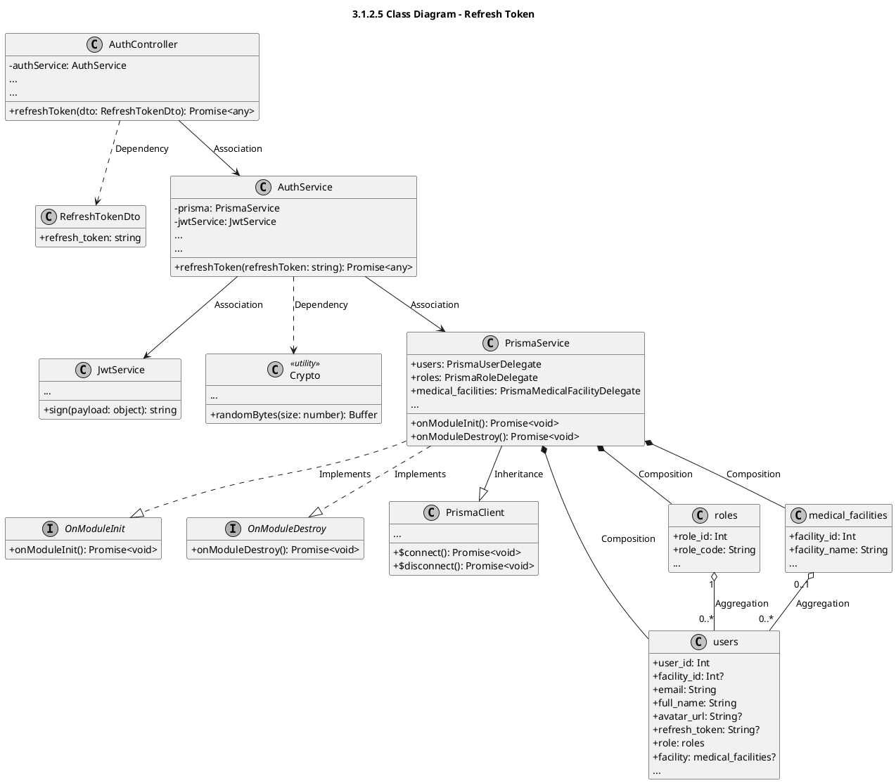
```plantuml
@startuml
title 3.1.2.5 Class Diagram - Refresh Token
skinparam classAttributeIconSize 0
skinparam monochrome true
skinparam shadowing false
skinparam defaultFontName Arial
hide empty members

class AuthController {
  -authService: AuthService
  ...
  +refreshToken(dto: RefreshTokenDto): Promise<any>
  ...
}

class RefreshTokenDto {
  +refresh_token: string
}

class AuthService {
  -prisma: PrismaService
  -jwtService: JwtService
  ...
  +refreshToken(refreshToken: string): Promise<any>
  ...
}

class JwtService {
  +sign(payload: object): string
  ...
}

class Crypto <<utility>> {
  +randomBytes(size: number): Buffer
  ...
}

interface OnModuleInit {
  +onModuleInit(): Promise<void>
}

interface OnModuleDestroy {
  +onModuleDestroy(): Promise<void>
}

class PrismaClient {
  +$connect(): Promise<void>
  +$disconnect(): Promise<void>
  ...
}

class PrismaService {
  +users: PrismaUserDelegate
  +roles: PrismaRoleDelegate
  +medical_facilities: PrismaMedicalFacilityDelegate
  ...
  +onModuleInit(): Promise<void>
  +onModuleDestroy(): Promise<void>
}

class users {
  +user_id: Int
  +facility_id: Int?
  +email: String
  +full_name: String
  +avatar_url: String?
  +refresh_token: String?
  +role: roles
  +facility: medical_facilities?
  ...
}

class roles {
  +role_id: Int
  +role_code: String
  ...
}

class medical_facilities {
  +facility_id: Int
  +facility_name: String
  ...
}

AuthController --> AuthService : Association
AuthController ..> RefreshTokenDto : Dependency
AuthService --> PrismaService : Association
AuthService --> JwtService : Association
AuthService ..> Crypto : Dependency
PrismaService --|> PrismaClient : Inheritance
PrismaService ..|> OnModuleInit : Implements
PrismaService ..|> OnModuleDestroy : Implements
PrismaService *-- users : Composition
PrismaService *-- roles : Composition
PrismaService *-- medical_facilities : Composition
roles "1" o-- "0..*" users : Aggregation
medical_facilities "0..1" o-- "0..*" users : Aggregation
@enduml
```

---

### 3.1.2.6 Class Diagram - Forgot Password (`auth_forgot_password`)

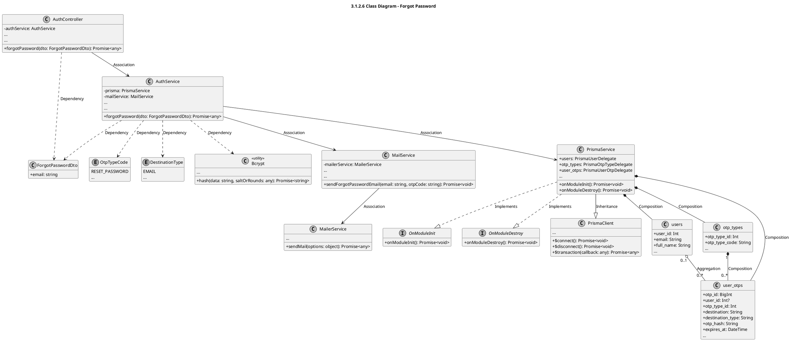
```plantuml
@startuml
title 3.1.2.6 Class Diagram - Forgot Password
skinparam classAttributeIconSize 0
skinparam monochrome true
skinparam shadowing false
skinparam defaultFontName Arial
hide empty members

class AuthController {
  -authService: AuthService
  ...
  +forgotPassword(dto: ForgotPasswordDto): Promise<any>
  ...
}

class ForgotPasswordDto {
  +email: string
}

enum OtpTypeCode {
  RESET_PASSWORD
  ...
}

enum DestinationType {
  EMAIL
  ...
}

class AuthService {
  -prisma: PrismaService
  -mailService: MailService
  ...
  +forgotPassword(dto: ForgotPasswordDto): Promise<any>
  ...
}

class Bcrypt <<utility>> {
  +hash(data: string, saltOrRounds: any): Promise<string>
  ...
}

class MailService {
  -mailerService: MailerService
  ...
  +sendForgotPasswordEmail(email: string, otpCode: string): Promise<void>
  ...
}

class MailerService {
  +sendMail(options: object): Promise<any>
  ...
}

interface OnModuleInit {
  +onModuleInit(): Promise<void>
}

interface OnModuleDestroy {
  +onModuleDestroy(): Promise<void>
}

class PrismaClient {
  +$connect(): Promise<void>
  +$disconnect(): Promise<void>
  +$transaction(callback: any): Promise<any>
  ...
}

class PrismaService {
  +users: PrismaUserDelegate
  +otp_types: PrismaOtpTypeDelegate
  +user_otps: PrismaUserOtpDelegate
  ...
  +onModuleInit(): Promise<void>
  +onModuleDestroy(): Promise<void>
}

class users {
  +user_id: Int
  +email: String
  +full_name: String
  ...
}

class otp_types {
  +otp_type_id: Int
  +otp_type_code: String
  ...
}

class user_otps {
  +otp_id: BigInt
  +user_id: Int?
  +otp_type_id: Int
  +destination: String
  +destination_type: String
  +otp_hash: String
  +expires_at: DateTime
  ...
}

AuthController --> AuthService : Association
AuthController ..> ForgotPasswordDto : Dependency
AuthService --> PrismaService : Association
AuthService --> MailService : Association
AuthService ..> ForgotPasswordDto : Dependency
AuthService ..> OtpTypeCode : Dependency
AuthService ..> DestinationType : Dependency
AuthService ..> Bcrypt : Dependency
MailService --> MailerService : Association
PrismaService --|> PrismaClient : Inheritance
PrismaService ..|> OnModuleInit : Implements
PrismaService ..|> OnModuleDestroy : Implements
PrismaService *-- users : Composition
PrismaService *-- otp_types : Composition
PrismaService *-- user_otps : Composition
users "0..1" o-- "0..*" user_otps : Aggregation
otp_types "1" *-- "0..*" user_otps : Composition
@enduml
```

---

### 3.1.2.7 Class Diagram - Reset Password (`auth_reset_password`)

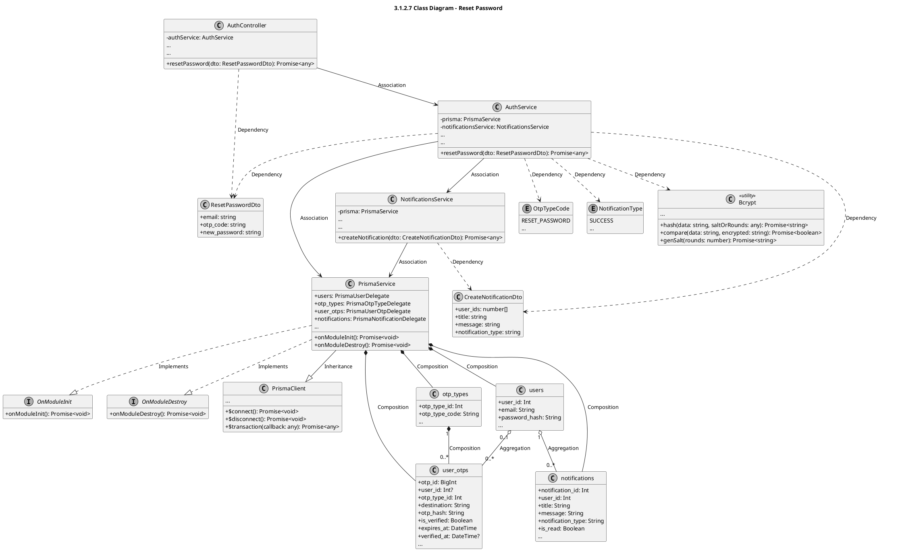
```plantuml
@startuml
title 3.1.2.7 Class Diagram - Reset Password
skinparam classAttributeIconSize 0
skinparam monochrome true
skinparam shadowing false
skinparam defaultFontName Arial
hide empty members

class AuthController {
  -authService: AuthService
  ...
  +resetPassword(dto: ResetPasswordDto): Promise<any>
  ...
}

class ResetPasswordDto {
  +email: string
  +otp_code: string
  +new_password: string
}

class CreateNotificationDto {
  +user_ids: number[]
  +title: string
  +message: string
  +notification_type: string
}

enum OtpTypeCode {
  RESET_PASSWORD
  ...
}

enum NotificationType {
  SUCCESS
  ...
}

class AuthService {
  -prisma: PrismaService
  -notificationsService: NotificationsService
  ...
  +resetPassword(dto: ResetPasswordDto): Promise<any>
  ...
}

class Bcrypt <<utility>> {
  +hash(data: string, saltOrRounds: any): Promise<string>
  +compare(data: string, encrypted: string): Promise<boolean>
  +genSalt(rounds: number): Promise<string>
  ...
}

class NotificationsService {
  -prisma: PrismaService
  ...
  +createNotification(dto: CreateNotificationDto): Promise<any>
  ...
}

interface OnModuleInit {
  +onModuleInit(): Promise<void>
}

interface OnModuleDestroy {
  +onModuleDestroy(): Promise<void>
}

class PrismaClient {
  +$connect(): Promise<void>
  +$disconnect(): Promise<void>
  +$transaction(callback: any): Promise<any>
  ...
}

class PrismaService {
  +users: PrismaUserDelegate
  +otp_types: PrismaOtpTypeDelegate
  +user_otps: PrismaUserOtpDelegate
  +notifications: PrismaNotificationDelegate
  ...
  +onModuleInit(): Promise<void>
  +onModuleDestroy(): Promise<void>
}

class users {
  +user_id: Int
  +email: String
  +password_hash: String
  ...
}

class otp_types {
  +otp_type_id: Int
  +otp_type_code: String
  ...
}

class user_otps {
  +otp_id: BigInt
  +user_id: Int?
  +otp_type_id: Int
  +destination: String
  +otp_hash: String
  +is_verified: Boolean
  +expires_at: DateTime
  +verified_at: DateTime?
  ...
}

class notifications {
  +notification_id: Int
  +user_id: Int
  +title: String
  +message: String
  +notification_type: String
  +is_read: Boolean
  ...
}

AuthController --> AuthService : Association
AuthController ..> ResetPasswordDto : Dependency
AuthService --> PrismaService : Association
AuthService --> NotificationsService : Association
AuthService ..> ResetPasswordDto : Dependency
AuthService ..> OtpTypeCode : Dependency
AuthService ..> NotificationType : Dependency
AuthService ..> CreateNotificationDto : Dependency
AuthService ..> Bcrypt : Dependency
NotificationsService --> PrismaService : Association
NotificationsService ..> CreateNotificationDto : Dependency
PrismaService --|> PrismaClient : Inheritance
PrismaService ..|> OnModuleInit : Implements
PrismaService ..|> OnModuleDestroy : Implements
PrismaService *-- users : Composition
PrismaService *-- otp_types : Composition
PrismaService *-- user_otps : Composition
PrismaService *-- notifications : Composition
users "0..1" o-- "0..*" user_otps : Aggregation
otp_types "1" *-- "0..*" user_otps : Composition
users "1" o-- "0..*" notifications : Aggregation
@enduml
```

---

## Module 3.2: User Profile and Account Administration Feature

### 3.2.1 Overview Class Diagram - User Profile and Account Administration Feature (`users_overview`)

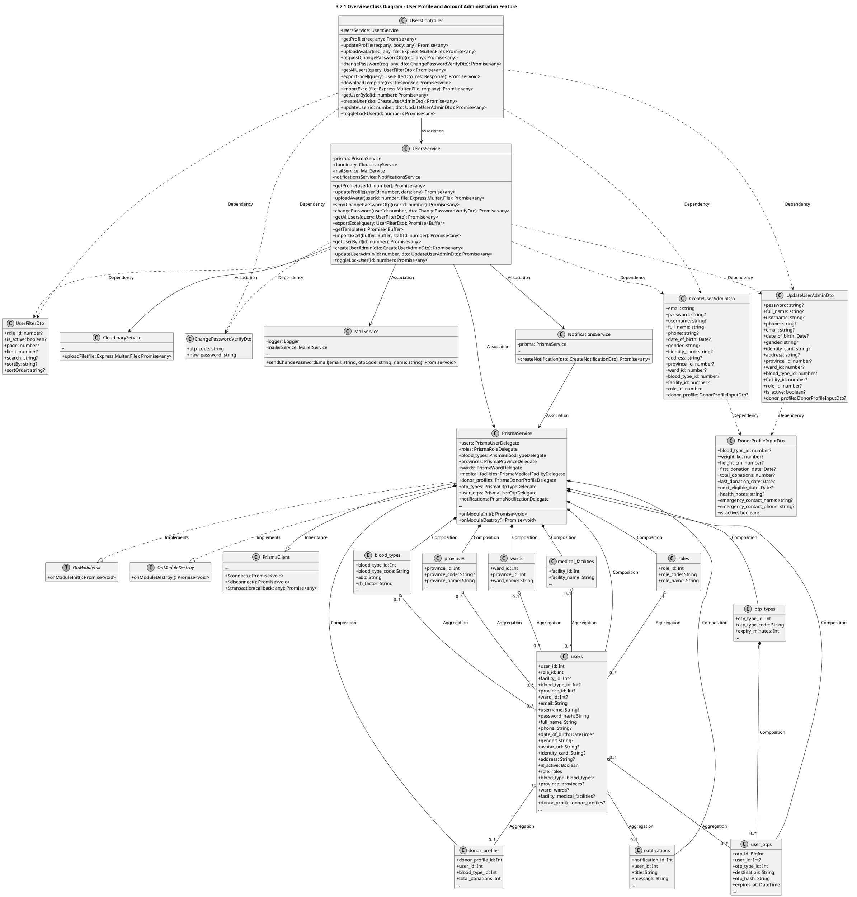
```plantuml
@startuml
title 3.2.1 Overview Class Diagram - User Profile and Account Administration Feature
skinparam classAttributeIconSize 0
skinparam monochrome true
skinparam shadowing false
skinparam defaultFontName Arial
hide empty members

class UsersController {
  -usersService: UsersService
  +getProfile(req: any): Promise<any>
  +updateProfile(req: any, body: any): Promise<any>
  +uploadAvatar(req: any, file: Express.Multer.File): Promise<any>
  +requestChangePasswordOtp(req: any): Promise<any>
  +changePassword(req: any, dto: ChangePasswordVerifyDto): Promise<any>
  +getAllUsers(query: UserFilterDto): Promise<any>
  +exportExcel(query: UserFilterDto, res: Response): Promise<void>
  +downloadTemplate(res: Response): Promise<void>
  +importExcel(file: Express.Multer.File, req: any): Promise<any>
  +getUserById(id: number): Promise<any>
  +createUser(dto: CreateUserAdminDto): Promise<any>
  +updateUser(id: number, dto: UpdateUserAdminDto): Promise<any>
  +toggleLockUser(id: number): Promise<any>
}

class UsersService {
  -prisma: PrismaService
  -cloudinary: CloudinaryService
  -mailService: MailService
  -notificationsService: NotificationsService
  +getProfile(userId: number): Promise<any>
  +updateProfile(userId: number, data: any): Promise<any>
  +uploadAvatar(userId: number, file: Express.Multer.File): Promise<any>
  +sendChangePasswordOtp(userId: number): Promise<any>
  +changePassword(userId: number, dto: ChangePasswordVerifyDto): Promise<any>
  +getAllUsers(query: UserFilterDto): Promise<any>
  +exportExcel(query: UserFilterDto): Promise<Buffer>
  +getTemplate(): Promise<Buffer>
  +importExcel(buffer: Buffer, staffId: number): Promise<any>
  +getUserById(id: number): Promise<any>
  +createUserAdmin(dto: CreateUserAdminDto): Promise<any>
  +updateUserAdmin(id: number, dto: UpdateUserAdminDto): Promise<any>
  +toggleLockUser(id: number): Promise<any>
}

class UserFilterDto {
  +role_id: number?
  +is_active: boolean?
  +page: number?
  +limit: number?
  +search: string?
  +sortBy: string?
  +sortOrder: string?
}

class ChangePasswordVerifyDto {
  +otp_code: string
  +new_password: string
}

class DonorProfileInputDto {
  +blood_type_id: number?
  +weight_kg: number?
  +height_cm: number?
  +first_donation_date: Date?
  +total_donations: number?
  +last_donation_date: Date?
  +next_eligible_date: Date?
  +health_notes: string?
  +emergency_contact_name: string?
  +emergency_contact_phone: string?
  +is_active: boolean?
}

class CreateUserAdminDto {
  +email: string
  +password: string?
  +username: string?
  +full_name: string
  +phone: string?
  +date_of_birth: Date?
  +gender: string?
  +identity_card: string?
  +address: string?
  +province_id: number?
  +ward_id: number?
  +blood_type_id: number?
  +facility_id: number?
  +role_id: number
  +donor_profile: DonorProfileInputDto?
}

class UpdateUserAdminDto {
  +password: string?
  +full_name: string?
  +username: string?
  +phone: string?
  +email: string?
  +date_of_birth: Date?
  +gender: string?
  +identity_card: string?
  +address: string?
  +province_id: number?
  +ward_id: number?
  +blood_type_id: number?
  +facility_id: number?
  +role_id: number?
  +is_active: boolean?
  +donor_profile: DonorProfileInputDto?
}

class CloudinaryService {
  +uploadFile(file: Express.Multer.File): Promise<any>
  ...
}

class MailService {
  -logger: Logger
  -mailerService: MailerService
  +sendChangePasswordEmail(email: string, otpCode: string, name: string): Promise<void>
  ...
}

class NotificationsService {
  -prisma: PrismaService
  +createNotification(dto: CreateNotificationDto): Promise<any>
  ...
}

interface OnModuleInit {
  +onModuleInit(): Promise<void>
}

interface OnModuleDestroy {
  +onModuleDestroy(): Promise<void>
}

class PrismaClient {
  +$connect(): Promise<void>
  +$disconnect(): Promise<void>
  +$transaction(callback: any): Promise<any>
  ...
}

class PrismaService {
  +users: PrismaUserDelegate
  +roles: PrismaRoleDelegate
  +blood_types: PrismaBloodTypeDelegate
  +provinces: PrismaProvinceDelegate
  +wards: PrismaWardDelegate
  +medical_facilities: PrismaMedicalFacilityDelegate
  +donor_profiles: PrismaDonorProfileDelegate
  +otp_types: PrismaOtpTypeDelegate
  +user_otps: PrismaUserOtpDelegate
  +notifications: PrismaNotificationDelegate
  ...
  +onModuleInit(): Promise<void>
  +onModuleDestroy(): Promise<void>
}

class users {
  +user_id: Int
  +role_id: Int
  +facility_id: Int?
  +blood_type_id: Int?
  +province_id: Int?
  +ward_id: Int?
  +email: String
  +username: String?
  +password_hash: String
  +full_name: String
  +phone: String?
  +date_of_birth: DateTime?
  +gender: String?
  +avatar_url: String?
  +identity_card: String?
  +address: String?
  +is_active: Boolean
  +role: roles
  +blood_type: blood_types?
  +province: provinces?
  +ward: wards?
  +facility: medical_facilities?
  +donor_profile: donor_profiles?
  ...
}

class roles {
  +role_id: Int
  +role_code: String
  +role_name: String
  ...
}

class blood_types {
  +blood_type_id: Int
  +blood_type_code: String
  +abo: String
  +rh_factor: String
  ...
}

class provinces {
  +province_id: Int
  +province_code: String?
  +province_name: String
  ...
}

class wards {
  +ward_id: Int
  +province_id: Int
  +ward_name: String
  ...
}

class medical_facilities {
  +facility_id: Int
  +facility_name: String
  ...
}

class donor_profiles {
  +donor_profile_id: Int
  +user_id: Int
  +blood_type_id: Int
  +total_donations: Int
  ...
}

class otp_types {
  +otp_type_id: Int
  +otp_type_code: String
  +expiry_minutes: Int
  ...
}

class user_otps {
  +otp_id: BigInt
  +user_id: Int?
  +otp_type_id: Int
  +destination: String
  +otp_hash: String
  +expires_at: DateTime
  ...
}

class notifications {
  +notification_id: Int
  +user_id: Int
  +title: String
  +message: String
  ...
}

UsersController --> UsersService : Association
UsersController ..> UserFilterDto : Dependency
UsersController ..> ChangePasswordVerifyDto : Dependency
UsersController ..> CreateUserAdminDto : Dependency
UsersController ..> UpdateUserAdminDto : Dependency
UsersService --> PrismaService : Association
UsersService --> CloudinaryService : Association
UsersService --> MailService : Association
UsersService --> NotificationsService : Association
UsersService ..> UserFilterDto : Dependency
UsersService ..> ChangePasswordVerifyDto : Dependency
UsersService ..> CreateUserAdminDto : Dependency
UsersService ..> UpdateUserAdminDto : Dependency
CreateUserAdminDto ..> DonorProfileInputDto : Dependency
UpdateUserAdminDto ..> DonorProfileInputDto : Dependency
NotificationsService --> PrismaService : Association
PrismaService --|> PrismaClient : Inheritance
PrismaService ..|> OnModuleInit : Implements
PrismaService ..|> OnModuleDestroy : Implements
PrismaService *-- users : Composition
PrismaService *-- roles : Composition
PrismaService *-- blood_types : Composition
PrismaService *-- provinces : Composition
PrismaService *-- wards : Composition
PrismaService *-- medical_facilities : Composition
PrismaService *-- donor_profiles : Composition
PrismaService *-- otp_types : Composition
PrismaService *-- user_otps : Composition
PrismaService *-- notifications : Composition
roles "1" o-- "0..*" users : Aggregation
blood_types "0..1" o-- "0..*" users : Aggregation
provinces "0..1" o-- "0..*" users : Aggregation
wards "0..1" o-- "0..*" users : Aggregation
medical_facilities "0..1" o-- "0..*" users : Aggregation
users "1" o-- "0..1" donor_profiles : Aggregation
users "0..1" o-- "0..*" user_otps : Aggregation
otp_types "1" *-- "0..*" user_otps : Composition
users "1" o-- "0..*" notifications : Aggregation
@enduml
```

---

### 3.2.2.1 Class Diagram - View and Update Profile (`users_profile`)

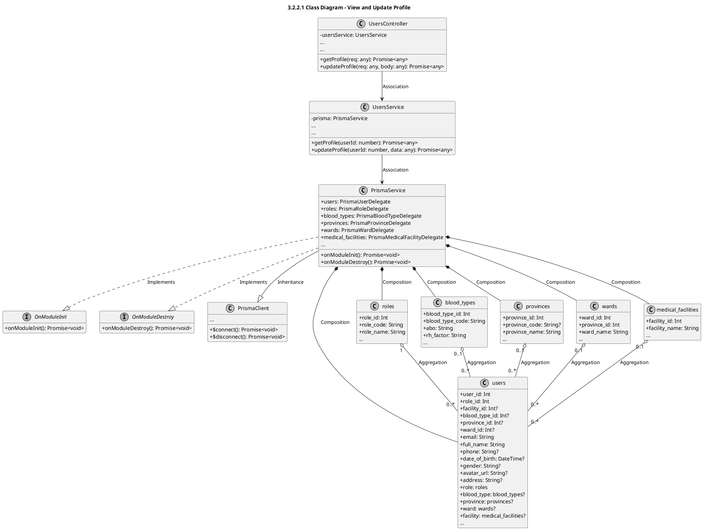
```plantuml
@startuml
title 3.2.2.1 Class Diagram - View and Update Profile
skinparam classAttributeIconSize 0
skinparam monochrome true
skinparam shadowing false
skinparam defaultFontName Arial
hide empty members

class UsersController {
  -usersService: UsersService
  ...
  +getProfile(req: any): Promise<any>
  +updateProfile(req: any, body: any): Promise<any>
  ...
}

class UsersService {
  -prisma: PrismaService
  ...
  +getProfile(userId: number): Promise<any>
  +updateProfile(userId: number, data: any): Promise<any>
  ...
}

interface OnModuleInit {
  +onModuleInit(): Promise<void>
}

interface OnModuleDestroy {
  +onModuleDestroy(): Promise<void>
}

class PrismaClient {
  +$connect(): Promise<void>
  +$disconnect(): Promise<void>
  ...
}

class PrismaService {
  +users: PrismaUserDelegate
  +roles: PrismaRoleDelegate
  +blood_types: PrismaBloodTypeDelegate
  +provinces: PrismaProvinceDelegate
  +wards: PrismaWardDelegate
  +medical_facilities: PrismaMedicalFacilityDelegate
  ...
  +onModuleInit(): Promise<void>
  +onModuleDestroy(): Promise<void>
}

class users {
  +user_id: Int
  +role_id: Int
  +facility_id: Int?
  +blood_type_id: Int?
  +province_id: Int?
  +ward_id: Int?
  +email: String
  +full_name: String
  +phone: String?
  +date_of_birth: DateTime?
  +gender: String?
  +avatar_url: String?
  +address: String?
  +role: roles
  +blood_type: blood_types?
  +province: provinces?
  +ward: wards?
  +facility: medical_facilities?
  ...
}

class roles {
  +role_id: Int
  +role_code: String
  +role_name: String
  ...
}

class blood_types {
  +blood_type_id: Int
  +blood_type_code: String
  +abo: String
  +rh_factor: String
  ...
}

class provinces {
  +province_id: Int
  +province_code: String?
  +province_name: String
  ...
}

class wards {
  +ward_id: Int
  +province_id: Int
  +ward_name: String
  ...
}

class medical_facilities {
  +facility_id: Int
  +facility_name: String
  ...
}

UsersController --> UsersService : Association
UsersService --> PrismaService : Association
PrismaService --|> PrismaClient : Inheritance
PrismaService ..|> OnModuleInit : Implements
PrismaService ..|> OnModuleDestroy : Implements
PrismaService *-- users : Composition
PrismaService *-- roles : Composition
PrismaService *-- blood_types : Composition
PrismaService *-- provinces : Composition
PrismaService *-- wards : Composition
PrismaService *-- medical_facilities : Composition
roles "1" o-- "0..*" users : Aggregation
blood_types "0..1" o-- "0..*" users : Aggregation
provinces "0..1" o-- "0..*" users : Aggregation
wards "0..1" o-- "0..*" users : Aggregation
medical_facilities "0..1" o-- "0..*" users : Aggregation
@enduml
```

---

### 3.2.2.2 Class Diagram - Upload Profile Avatar (`users_avatar`)

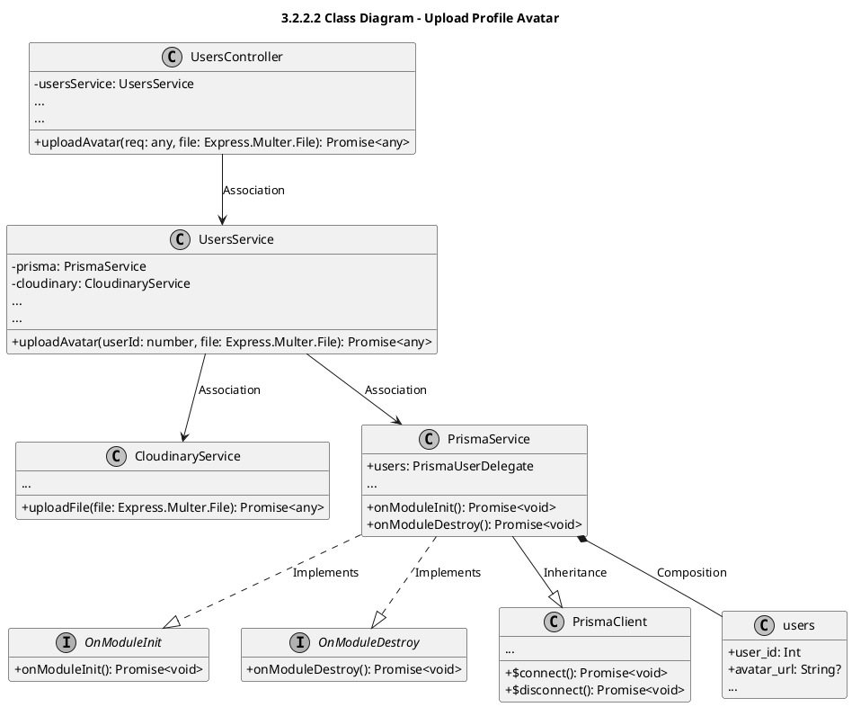
```plantuml
@startuml
title 3.2.2.2 Class Diagram - Upload Profile Avatar
skinparam classAttributeIconSize 0
skinparam monochrome true
skinparam shadowing false
skinparam defaultFontName Arial
hide empty members

class UsersController {
  -usersService: UsersService
  ...
  +uploadAvatar(req: any, file: Express.Multer.File): Promise<any>
  ...
}

class UsersService {
  -prisma: PrismaService
  -cloudinary: CloudinaryService
  ...
  +uploadAvatar(userId: number, file: Express.Multer.File): Promise<any>
  ...
}

class CloudinaryService {
  +uploadFile(file: Express.Multer.File): Promise<any>
  ...
}

interface OnModuleInit {
  +onModuleInit(): Promise<void>
}

interface OnModuleDestroy {
  +onModuleDestroy(): Promise<void>
}

class PrismaClient {
  +$connect(): Promise<void>
  +$disconnect(): Promise<void>
  ...
}

class PrismaService {
  +users: PrismaUserDelegate
  ...
  +onModuleInit(): Promise<void>
  +onModuleDestroy(): Promise<void>
}

class users {
  +user_id: Int
  +avatar_url: String?
  ...
}

UsersController --> UsersService : Association
UsersService --> PrismaService : Association
UsersService --> CloudinaryService : Association
PrismaService --|> PrismaClient : Inheritance
PrismaService ..|> OnModuleInit : Implements
PrismaService ..|> OnModuleDestroy : Implements
PrismaService *-- users : Composition
@enduml
```

---

### 3.2.2.3 Class Diagram - Change Password with OTP (`users_change_password`)

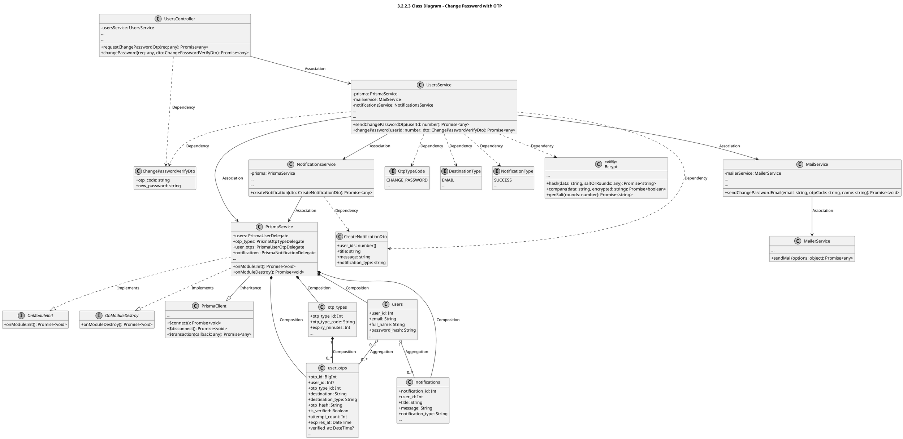
```plantuml
@startuml
title 3.2.2.3 Class Diagram - Change Password with OTP
skinparam classAttributeIconSize 0
skinparam monochrome true
skinparam shadowing false
skinparam defaultFontName Arial
hide empty members

class UsersController {
  -usersService: UsersService
  ...
  +requestChangePasswordOtp(req: any): Promise<any>
  +changePassword(req: any, dto: ChangePasswordVerifyDto): Promise<any>
  ...
}

class ChangePasswordVerifyDto {
  +otp_code: string
  +new_password: string
}

class CreateNotificationDto {
  +user_ids: number[]
  +title: string
  +message: string
  +notification_type: string
}

enum OtpTypeCode {
  CHANGE_PASSWORD
  ...
}

enum DestinationType {
  EMAIL
  ...
}

enum NotificationType {
  SUCCESS
  ...
}

class UsersService {
  -prisma: PrismaService
  -mailService: MailService
  -notificationsService: NotificationsService
  ...
  +sendChangePasswordOtp(userId: number): Promise<any>
  +changePassword(userId: number, dto: ChangePasswordVerifyDto): Promise<any>
  ...
}

class Bcrypt <<utility>> {
  +hash(data: string, saltOrRounds: any): Promise<string>
  +compare(data: string, encrypted: string): Promise<boolean>
  +genSalt(rounds: number): Promise<string>
  ...
}

class MailService {
  -mailerService: MailerService
  ...
  +sendChangePasswordEmail(email: string, otpCode: string, name: string): Promise<void>
  ...
}

class MailerService {
  +sendMail(options: object): Promise<any>
  ...
}

class NotificationsService {
  -prisma: PrismaService
  ...
  +createNotification(dto: CreateNotificationDto): Promise<any>
  ...
}

interface OnModuleInit {
  +onModuleInit(): Promise<void>
}

interface OnModuleDestroy {
  +onModuleDestroy(): Promise<void>
}

class PrismaClient {
  +$connect(): Promise<void>
  +$disconnect(): Promise<void>
  +$transaction(callback: any): Promise<any>
  ...
}

class PrismaService {
  +users: PrismaUserDelegate
  +otp_types: PrismaOtpTypeDelegate
  +user_otps: PrismaUserOtpDelegate
  +notifications: PrismaNotificationDelegate
  ...
  +onModuleInit(): Promise<void>
  +onModuleDestroy(): Promise<void>
}

class users {
  +user_id: Int
  +email: String
  +full_name: String
  +password_hash: String
  ...
}

class otp_types {
  +otp_type_id: Int
  +otp_type_code: String
  +expiry_minutes: Int
  ...
}

class user_otps {
  +otp_id: BigInt
  +user_id: Int?
  +otp_type_id: Int
  +destination: String
  +destination_type: String
  +otp_hash: String
  +is_verified: Boolean
  +attempt_count: Int
  +expires_at: DateTime
  +verified_at: DateTime?
  ...
}

class notifications {
  +notification_id: Int
  +user_id: Int
  +title: String
  +message: String
  +notification_type: String
  ...
}

UsersController --> UsersService : Association
UsersController ..> ChangePasswordVerifyDto : Dependency
UsersService --> PrismaService : Association
UsersService --> MailService : Association
UsersService --> NotificationsService : Association
UsersService ..> ChangePasswordVerifyDto : Dependency
UsersService ..> OtpTypeCode : Dependency
UsersService ..> DestinationType : Dependency
UsersService ..> NotificationType : Dependency
UsersService ..> CreateNotificationDto : Dependency
UsersService ..> Bcrypt : Dependency
MailService --> MailerService : Association
NotificationsService --> PrismaService : Association
NotificationsService ..> CreateNotificationDto : Dependency
PrismaService --|> PrismaClient : Inheritance
PrismaService ..|> OnModuleInit : Implements
PrismaService ..|> OnModuleDestroy : Implements
PrismaService *-- users : Composition
PrismaService *-- otp_types : Composition
PrismaService *-- user_otps : Composition
PrismaService *-- notifications : Composition
users "0..1" o-- "0..*" user_otps : Aggregation
otp_types "1" *-- "0..*" user_otps : Composition
users "1" o-- "0..*" notifications : Aggregation
@enduml
```

---

### 3.2.2.4 Class Diagram - Admin Manage Users (`users_admin_manage`)

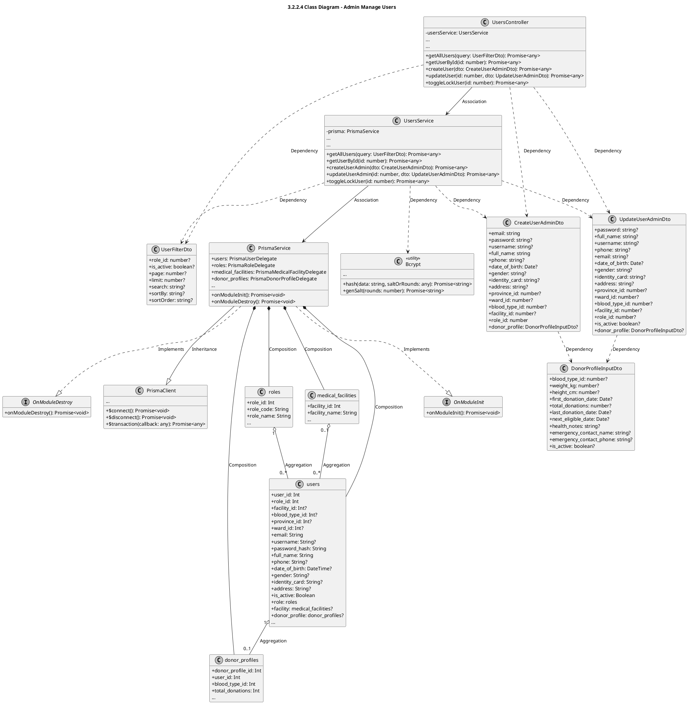
```plantuml
@startuml
title 3.2.2.4 Class Diagram - Admin Manage Users
skinparam classAttributeIconSize 0
skinparam monochrome true
skinparam shadowing false
skinparam defaultFontName Arial
hide empty members

class UsersController {
  -usersService: UsersService
  ...
  +getAllUsers(query: UserFilterDto): Promise<any>
  +getUserById(id: number): Promise<any>
  +createUser(dto: CreateUserAdminDto): Promise<any>
  +updateUser(id: number, dto: UpdateUserAdminDto): Promise<any>
  +toggleLockUser(id: number): Promise<any>
  ...
}

class UserFilterDto {
  +role_id: number?
  +is_active: boolean?
  +page: number?
  +limit: number?
  +search: string?
  +sortBy: string?
  +sortOrder: string?
}

class DonorProfileInputDto {
  +blood_type_id: number?
  +weight_kg: number?
  +height_cm: number?
  +first_donation_date: Date?
  +total_donations: number?
  +last_donation_date: Date?
  +next_eligible_date: Date?
  +health_notes: string?
  +emergency_contact_name: string?
  +emergency_contact_phone: string?
  +is_active: boolean?
}

class CreateUserAdminDto {
  +email: string
  +password: string?
  +username: string?
  +full_name: string
  +phone: string?
  +date_of_birth: Date?
  +gender: string?
  +identity_card: string?
  +address: string?
  +province_id: number?
  +ward_id: number?
  +blood_type_id: number?
  +facility_id: number?
  +role_id: number
  +donor_profile: DonorProfileInputDto?
}

class UpdateUserAdminDto {
  +password: string?
  +full_name: string?
  +username: string?
  +phone: string?
  +email: string?
  +date_of_birth: Date?
  +gender: string?
  +identity_card: string?
  +address: string?
  +province_id: number?
  +ward_id: number?
  +blood_type_id: number?
  +facility_id: number?
  +role_id: number?
  +is_active: boolean?
  +donor_profile: DonorProfileInputDto?
}

class UsersService {
  -prisma: PrismaService
  ...
  +getAllUsers(query: UserFilterDto): Promise<any>
  +getUserById(id: number): Promise<any>
  +createUserAdmin(dto: CreateUserAdminDto): Promise<any>
  +updateUserAdmin(id: number, dto: UpdateUserAdminDto): Promise<any>
  +toggleLockUser(id: number): Promise<any>
  ...
}

class Bcrypt <<utility>> {
  +hash(data: string, saltOrRounds: any): Promise<string>
  +genSalt(rounds: number): Promise<string>
  ...
}

interface OnModuleInit {
  +onModuleInit(): Promise<void>
}

interface OnModuleDestroy {
  +onModuleDestroy(): Promise<void>
}

class PrismaClient {
  +$connect(): Promise<void>
  +$disconnect(): Promise<void>
  +$transaction(callback: any): Promise<any>
  ...
}

class PrismaService {
  +users: PrismaUserDelegate
  +roles: PrismaRoleDelegate
  +medical_facilities: PrismaMedicalFacilityDelegate
  +donor_profiles: PrismaDonorProfileDelegate
  ...
  +onModuleInit(): Promise<void>
  +onModuleDestroy(): Promise<void>
}

class users {
  +user_id: Int
  +role_id: Int
  +facility_id: Int?
  +blood_type_id: Int?
  +province_id: Int?
  +ward_id: Int?
  +email: String
  +username: String?
  +password_hash: String
  +full_name: String
  +phone: String?
  +date_of_birth: DateTime?
  +gender: String?
  +identity_card: String?
  +address: String?
  +is_active: Boolean
  +role: roles
  +facility: medical_facilities?
  +donor_profile: donor_profiles?
  ...
}

class roles {
  +role_id: Int
  +role_code: String
  +role_name: String
  ...
}

class medical_facilities {
  +facility_id: Int
  +facility_name: String
  ...
}

class donor_profiles {
  +donor_profile_id: Int
  +user_id: Int
  +blood_type_id: Int
  +total_donations: Int
  ...
}

UsersController --> UsersService : Association
UsersController ..> UserFilterDto : Dependency
UsersController ..> CreateUserAdminDto : Dependency
UsersController ..> UpdateUserAdminDto : Dependency
UsersService --> PrismaService : Association
UsersService ..> UserFilterDto : Dependency
UsersService ..> CreateUserAdminDto : Dependency
UsersService ..> UpdateUserAdminDto : Dependency
UsersService ..> Bcrypt : Dependency
CreateUserAdminDto ..> DonorProfileInputDto : Dependency
UpdateUserAdminDto ..> DonorProfileInputDto : Dependency
PrismaService --|> PrismaClient : Inheritance
PrismaService ..|> OnModuleInit : Implements
PrismaService ..|> OnModuleDestroy : Implements
PrismaService *-- users : Composition
PrismaService *-- roles : Composition
PrismaService *-- medical_facilities : Composition
PrismaService *-- donor_profiles : Composition
roles "1" o-- "0..*" users : Aggregation
medical_facilities "0..1" o-- "0..*" users : Aggregation
users "1" o-- "0..1" donor_profiles : Aggregation
@enduml
```

---

### 3.2.2.5 Class Diagram - Import and Export Users Excel (`users_excel`)

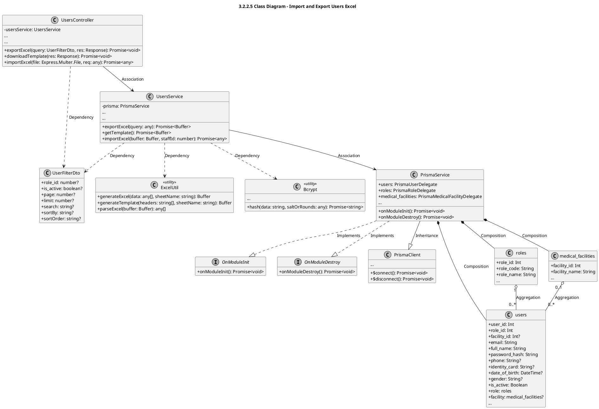
```plantuml
@startuml
title 3.2.2.5 Class Diagram - Import and Export Users Excel
skinparam classAttributeIconSize 0
skinparam monochrome true
skinparam shadowing false
skinparam defaultFontName Arial
hide empty members

class UsersController {
  -usersService: UsersService
  ...
  +exportExcel(query: UserFilterDto, res: Response): Promise<void>
  +downloadTemplate(res: Response): Promise<void>
  +importExcel(file: Express.Multer.File, req: any): Promise<any>
  ...
}

class UserFilterDto {
  +role_id: number?
  +is_active: boolean?
  +page: number?
  +limit: number?
  +search: string?
  +sortBy: string?
  +sortOrder: string?
}

class UsersService {
  -prisma: PrismaService
  ...
  +exportExcel(query: any): Promise<Buffer>
  +getTemplate(): Promise<Buffer>
  +importExcel(buffer: Buffer, staffId: number): Promise<any>
  ...
}

class ExcelUtil <<utility>> {
  +generateExcel(data: any[], sheetName: string): Buffer
  +generateTemplate(headers: string[], sheetName: string): Buffer
  +parseExcel(buffer: Buffer): any[]
}

class Bcrypt <<utility>> {
  +hash(data: string, saltOrRounds: any): Promise<string>
  ...
}

interface OnModuleInit {
  +onModuleInit(): Promise<void>
}

interface OnModuleDestroy {
  +onModuleDestroy(): Promise<void>
}

class PrismaClient {
  +$connect(): Promise<void>
  +$disconnect(): Promise<void>
  ...
}

class PrismaService {
  +users: PrismaUserDelegate
  +roles: PrismaRoleDelegate
  +medical_facilities: PrismaMedicalFacilityDelegate
  ...
  +onModuleInit(): Promise<void>
  +onModuleDestroy(): Promise<void>
}

class users {
  +user_id: Int
  +role_id: Int
  +facility_id: Int?
  +email: String
  +full_name: String
  +password_hash: String
  +phone: String?
  +identity_card: String?
  +date_of_birth: DateTime?
  +gender: String?
  +is_active: Boolean
  +role: roles
  +facility: medical_facilities?
  ...
}

class roles {
  +role_id: Int
  +role_code: String
  +role_name: String
  ...
}

class medical_facilities {
  +facility_id: Int
  +facility_name: String
  ...
}

UsersController --> UsersService : Association
UsersController ..> UserFilterDto : Dependency
UsersService --> PrismaService : Association
UsersService ..> UserFilterDto : Dependency
UsersService ..> ExcelUtil : Dependency
UsersService ..> Bcrypt : Dependency
PrismaService --|> PrismaClient : Inheritance
PrismaService ..|> OnModuleInit : Implements
PrismaService ..|> OnModuleDestroy : Implements
PrismaService *-- users : Composition
PrismaService *-- roles : Composition
PrismaService *-- medical_facilities : Composition
roles "1" o-- "0..*" users : Aggregation
medical_facilities "0..1" o-- "0..*" users : Aggregation
@enduml
```

---

## Module 3.3: Donor Profile, Appointment and Donation Feature

### 3.3.1 Overview Class Diagram - Donor Profile, Appointment and Donation Feature (`donor_overview`)

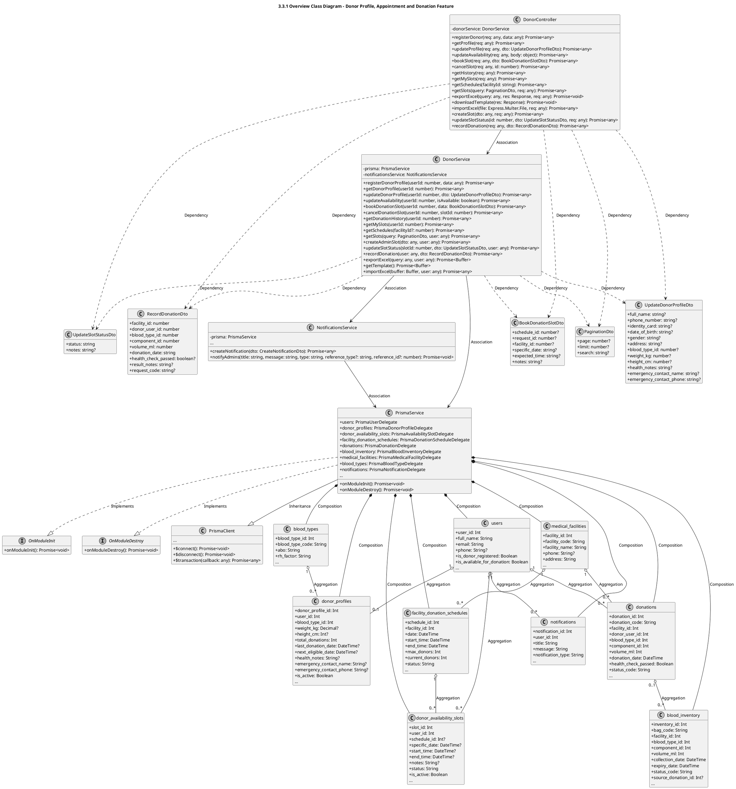
```plantuml
@startuml
title 3.3.1 Overview Class Diagram - Donor Profile, Appointment and Donation Feature
skinparam classAttributeIconSize 0
skinparam monochrome true
skinparam shadowing false
skinparam defaultFontName Arial
hide empty members

class DonorController {
  -donorService: DonorService
  +registerDonor(req: any, data: any): Promise<any>
  +getProfile(req: any): Promise<any>
  +updateProfile(req: any, dto: UpdateDonorProfileDto): Promise<any>
  +updateAvailability(req: any, body: object): Promise<any>
  +bookSlot(req: any, dto: BookDonationSlotDto): Promise<any>
  +cancelSlot(req: any, id: number): Promise<any>
  +getHistory(req: any): Promise<any>
  +getMySlots(req: any): Promise<any>
  +getSchedules(facilityId: string): Promise<any>
  +getSlots(query: PaginationDto, req: any): Promise<any>
  +exportExcel(query: any, res: Response, req: any): Promise<void>
  +downloadTemplate(res: Response): Promise<void>
  +importExcel(file: Express.Multer.File, req: any): Promise<any>
  +createSlot(dto: any, req: any): Promise<any>
  +updateSlotStatus(id: number, dto: UpdateSlotStatusDto, req: any): Promise<any>
  +recordDonation(req: any, dto: RecordDonationDto): Promise<any>
}

class BookDonationSlotDto {
  +schedule_id: number?
  +request_id: number?
  +facility_id: number?
  +specific_date: string?
  +expected_time: string?
  +notes: string?
}

class UpdateSlotStatusDto {
  +status: string
  +notes: string?
}

class RecordDonationDto {
  +facility_id: number
  +donor_user_id: number
  +blood_type_id: number
  +component_id: number
  +volume_ml: number
  +donation_date: string
  +health_check_passed: boolean?
  +result_notes: string?
  +request_code: string?
}

class UpdateDonorProfileDto {
  +full_name: string?
  +phone_number: string?
  +identity_card: string?
  +date_of_birth: string?
  +gender: string?
  +address: string?
  +blood_type_id: number?
  +weight_kg: number?
  +height_cm: number?
  +health_notes: string?
  +emergency_contact_name: string?
  +emergency_contact_phone: string?
}

class PaginationDto {
  +page: number?
  +limit: number?
  +search: string?
}

class DonorService {
  -prisma: PrismaService
  -notificationsService: NotificationsService
  +registerDonorProfile(userId: number, data: any): Promise<any>
  +getDonorProfile(userId: number): Promise<any>
  +updateDonorProfile(userId: number, dto: UpdateDonorProfileDto): Promise<any>
  +updateAvailability(userId: number, isAvailable: boolean): Promise<any>
  +bookDonationSlot(userId: number, data: BookDonationSlotDto): Promise<any>
  +cancelDonationSlot(userId: number, slotId: number): Promise<any>
  +getDonationHistory(userId: number): Promise<any>
  +getMySlots(userId: number): Promise<any>
  +getSchedules(facilityId?: number): Promise<any>
  +getSlots(query: PaginationDto, user: any): Promise<any>
  +createAdminSlot(dto: any, user: any): Promise<any>
  +updateSlotStatus(slotId: number, dto: UpdateSlotStatusDto, user: any): Promise<any>
  +recordDonation(user: any, dto: RecordDonationDto): Promise<any>
  +exportExcel(query: any, user: any): Promise<Buffer>
  +getTemplate(): Promise<Buffer>
  +importExcel(buffer: Buffer, user: any): Promise<any>
}

class NotificationsService {
  -prisma: PrismaService
  +createNotification(dto: CreateNotificationDto): Promise<any>
  +notifyAdmins(title: string, message: string, type: string, reference_type?: string, reference_id?: number): Promise<void>
  ...
}

interface OnModuleInit {
  +onModuleInit(): Promise<void>
}

interface OnModuleDestroy {
  +onModuleDestroy(): Promise<void>
}

class PrismaClient {
  +$connect(): Promise<void>
  +$disconnect(): Promise<void>
  +$transaction(callback: any): Promise<any>
  ...
}

class PrismaService {
  +users: PrismaUserDelegate
  +donor_profiles: PrismaDonorProfileDelegate
  +donor_availability_slots: PrismaAvailabilitySlotDelegate
  +facility_donation_schedules: PrismaDonationScheduleDelegate
  +donations: PrismaDonationDelegate
  +blood_inventory: PrismaBloodInventoryDelegate
  +medical_facilities: PrismaMedicalFacilityDelegate
  +blood_types: PrismaBloodTypeDelegate
  +notifications: PrismaNotificationDelegate
  ...
  +onModuleInit(): Promise<void>
  +onModuleDestroy(): Promise<void>
}

class users {
  +user_id: Int
  +full_name: String
  +email: String
  +phone: String?
  +is_donor_registered: Boolean
  +is_available_for_donation: Boolean
  ...
}

class donor_profiles {
  +donor_profile_id: Int
  +user_id: Int
  +blood_type_id: Int
  +weight_kg: Decimal?
  +height_cm: Int?
  +total_donations: Int
  +last_donation_date: DateTime?
  +next_eligible_date: DateTime?
  +health_notes: String?
  +emergency_contact_name: String?
  +emergency_contact_phone: String?
  +is_active: Boolean
  ...
}

class donor_availability_slots {
  +slot_id: Int
  +user_id: Int
  +schedule_id: Int?
  +specific_date: DateTime?
  +start_time: DateTime?
  +end_time: DateTime?
  +notes: String?
  +status: String
  +is_active: Boolean
  ...
}

class facility_donation_schedules {
  +schedule_id: Int
  +facility_id: Int
  +date: DateTime
  +start_time: DateTime
  +end_time: DateTime
  +max_donors: Int
  +current_donors: Int
  +status: String
  ...
}

class donations {
  +donation_id: Int
  +donation_code: String
  +facility_id: Int
  +donor_user_id: Int
  +blood_type_id: Int
  +component_id: Int
  +volume_ml: Int
  +donation_date: DateTime
  +health_check_passed: Boolean
  +status_code: String
  ...
}

class blood_inventory {
  +inventory_id: Int
  +bag_code: String
  +facility_id: Int
  +blood_type_id: Int
  +component_id: Int
  +volume_ml: Int
  +collection_date: DateTime
  +expiry_date: DateTime
  +status_code: String
  +source_donation_id: Int?
  ...
}

class medical_facilities {
  +facility_id: Int
  +facility_code: String
  +facility_name: String
  +phone: String?
  +address: String
  ...
}

class blood_types {
  +blood_type_id: Int
  +blood_type_code: String
  +abo: String
  +rh_factor: String
  ...
}

class notifications {
  +notification_id: Int
  +user_id: Int
  +title: String
  +message: String
  +notification_type: String
  ...
}

DonorController --> DonorService : Association
DonorController ..> BookDonationSlotDto : Dependency
DonorController ..> UpdateSlotStatusDto : Dependency
DonorController ..> RecordDonationDto : Dependency
DonorController ..> UpdateDonorProfileDto : Dependency
DonorController ..> PaginationDto : Dependency
DonorService --> PrismaService : Association
DonorService --> NotificationsService : Association
DonorService ..> BookDonationSlotDto : Dependency
DonorService ..> UpdateSlotStatusDto : Dependency
DonorService ..> RecordDonationDto : Dependency
DonorService ..> UpdateDonorProfileDto : Dependency
DonorService ..> PaginationDto : Dependency
NotificationsService --> PrismaService : Association
PrismaService --|> PrismaClient : Inheritance
PrismaService ..|> OnModuleInit : Implements
PrismaService ..|> OnModuleDestroy : Implements
PrismaService *-- users : Composition
PrismaService *-- donor_profiles : Composition
PrismaService *-- donor_availability_slots : Composition
PrismaService *-- facility_donation_schedules : Composition
PrismaService *-- donations : Composition
PrismaService *-- blood_inventory : Composition
PrismaService *-- medical_facilities : Composition
PrismaService *-- blood_types : Composition
PrismaService *-- notifications : Composition
users "1" o-- "0..1" donor_profiles : Aggregation
blood_types "1" o-- "0..*" donor_profiles : Aggregation
users "1" o-- "0..*" donor_availability_slots : Aggregation
facility_donation_schedules "1" o-- "0..*" donor_availability_slots : Aggregation
medical_facilities "1" o-- "0..*" facility_donation_schedules : Aggregation
users "1" o-- "0..*" donations : Aggregation
medical_facilities "1" o-- "0..*" donations : Aggregation
donations "0..1" o-- "0..*" blood_inventory : Aggregation
users "1" o-- "0..*" notifications : Aggregation
@enduml
```

---

### 3.3.2.1 Class Diagram - Register and Update Donor Profile (`donor_profile`)

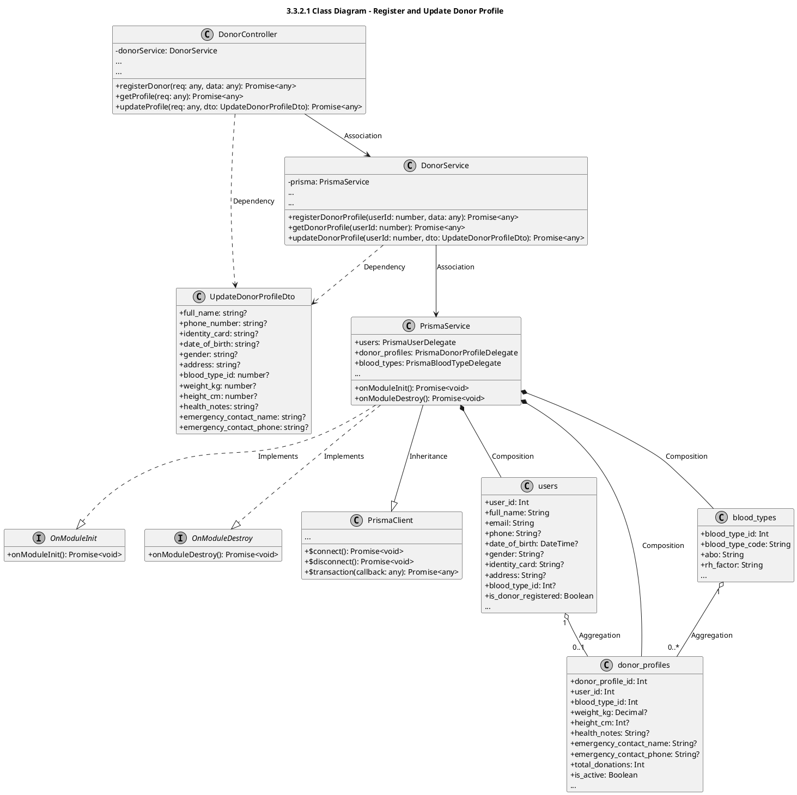
```plantuml
@startuml
title 3.3.2.1 Class Diagram - Register and Update Donor Profile
skinparam classAttributeIconSize 0
skinparam monochrome true
skinparam shadowing false
skinparam defaultFontName Arial
hide empty members

class DonorController {
  -donorService: DonorService
  ...
  +registerDonor(req: any, data: any): Promise<any>
  +getProfile(req: any): Promise<any>
  +updateProfile(req: any, dto: UpdateDonorProfileDto): Promise<any>
  ...
}

class UpdateDonorProfileDto {
  +full_name: string?
  +phone_number: string?
  +identity_card: string?
  +date_of_birth: string?
  +gender: string?
  +address: string?
  +blood_type_id: number?
  +weight_kg: number?
  +height_cm: number?
  +health_notes: string?
  +emergency_contact_name: string?
  +emergency_contact_phone: string?
}

class DonorService {
  -prisma: PrismaService
  ...
  +registerDonorProfile(userId: number, data: any): Promise<any>
  +getDonorProfile(userId: number): Promise<any>
  +updateDonorProfile(userId: number, dto: UpdateDonorProfileDto): Promise<any>
  ...
}

interface OnModuleInit {
  +onModuleInit(): Promise<void>
}

interface OnModuleDestroy {
  +onModuleDestroy(): Promise<void>
}

class PrismaClient {
  +$connect(): Promise<void>
  +$disconnect(): Promise<void>
  +$transaction(callback: any): Promise<any>
  ...
}

class PrismaService {
  +users: PrismaUserDelegate
  +donor_profiles: PrismaDonorProfileDelegate
  +blood_types: PrismaBloodTypeDelegate
  ...
  +onModuleInit(): Promise<void>
  +onModuleDestroy(): Promise<void>
}

class users {
  +user_id: Int
  +full_name: String
  +email: String
  +phone: String?
  +date_of_birth: DateTime?
  +gender: String?
  +identity_card: String?
  +address: String?
  +blood_type_id: Int?
  +is_donor_registered: Boolean
  ...
}

class donor_profiles {
  +donor_profile_id: Int
  +user_id: Int
  +blood_type_id: Int
  +weight_kg: Decimal?
  +height_cm: Int?
  +health_notes: String?
  +emergency_contact_name: String?
  +emergency_contact_phone: String?
  +total_donations: Int
  +is_active: Boolean
  ...
}

class blood_types {
  +blood_type_id: Int
  +blood_type_code: String
  +abo: String
  +rh_factor: String
  ...
}

DonorController --> DonorService : Association
DonorController ..> UpdateDonorProfileDto : Dependency
DonorService --> PrismaService : Association
DonorService ..> UpdateDonorProfileDto : Dependency
PrismaService --|> PrismaClient : Inheritance
PrismaService ..|> OnModuleInit : Implements
PrismaService ..|> OnModuleDestroy : Implements
PrismaService *-- users : Composition
PrismaService *-- donor_profiles : Composition
PrismaService *-- blood_types : Composition
users "1" o-- "0..1" donor_profiles : Aggregation
blood_types "1" o-- "0..*" donor_profiles : Aggregation
@enduml
```

---

### 3.3.2.2 Class Diagram - Update Donor Availability (`donor_availability`)

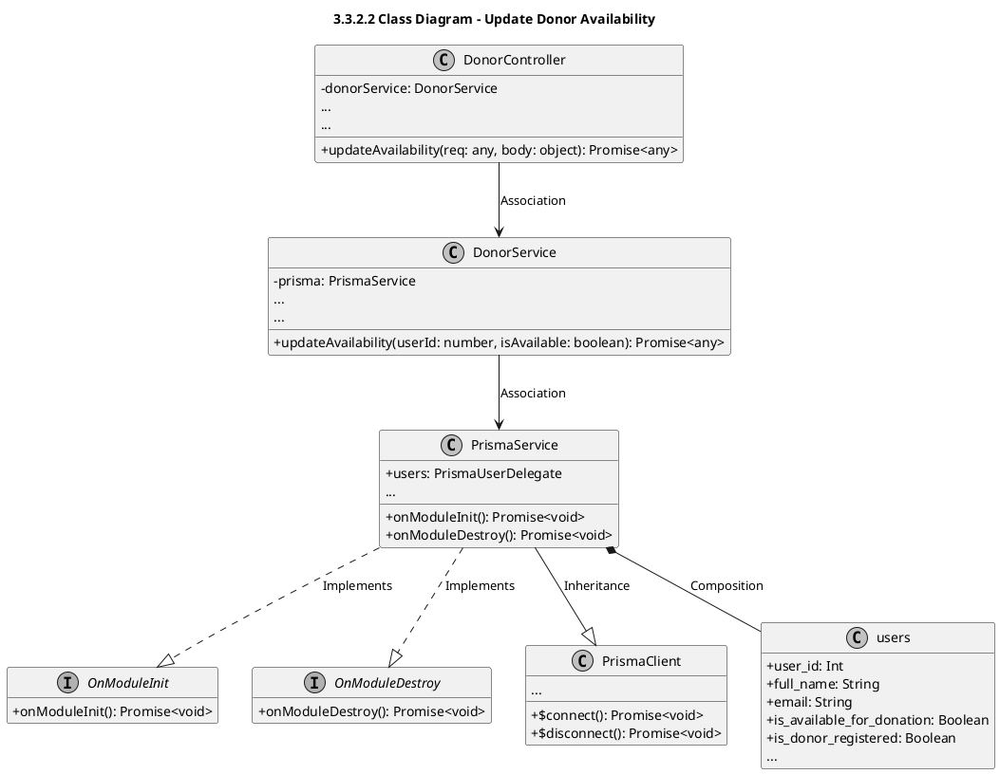
```plantuml
@startuml
title 3.3.2.2 Class Diagram - Update Donor Availability
skinparam classAttributeIconSize 0
skinparam monochrome true
skinparam shadowing false
skinparam defaultFontName Arial
hide empty members

class DonorController {
  -donorService: DonorService
  ...
  +updateAvailability(req: any, body: object): Promise<any>
  ...
}

class DonorService {
  -prisma: PrismaService
  ...
  +updateAvailability(userId: number, isAvailable: boolean): Promise<any>
  ...
}

interface OnModuleInit {
  +onModuleInit(): Promise<void>
}

interface OnModuleDestroy {
  +onModuleDestroy(): Promise<void>
}

class PrismaClient {
  +$connect(): Promise<void>
  +$disconnect(): Promise<void>
  ...
}

class PrismaService {
  +users: PrismaUserDelegate
  ...
  +onModuleInit(): Promise<void>
  +onModuleDestroy(): Promise<void>
}

class users {
  +user_id: Int
  +full_name: String
  +email: String
  +is_available_for_donation: Boolean
  +is_donor_registered: Boolean
  ...
}

DonorController --> DonorService : Association
DonorService --> PrismaService : Association
PrismaService --|> PrismaClient : Inheritance
PrismaService ..|> OnModuleInit : Implements
PrismaService ..|> OnModuleDestroy : Implements
PrismaService *-- users : Composition
@enduml
```

---

### 3.3.2.3 Class Diagram - Book and Cancel Donation Slot (`donor_booking`)

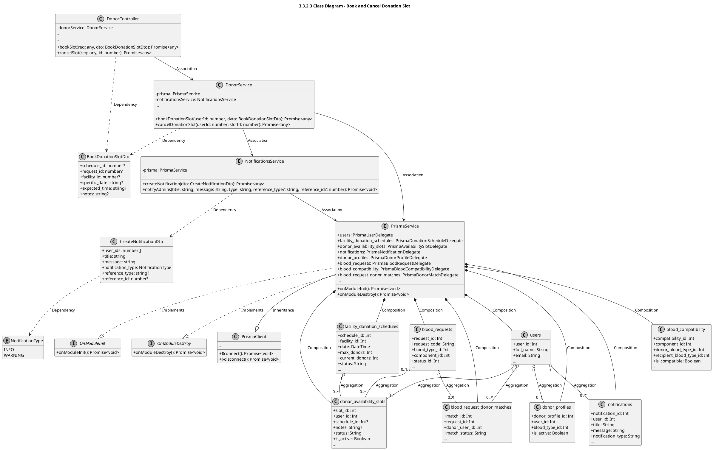
```plantuml
@startuml
title 3.3.2.3 Class Diagram - Book and Cancel Donation Slot
skinparam classAttributeIconSize 0
skinparam monochrome true
skinparam shadowing false
skinparam defaultFontName Arial
hide empty members

class DonorController {
  -donorService: DonorService
  ...
  +bookSlot(req: any, dto: BookDonationSlotDto): Promise<any>
  +cancelSlot(req: any, id: number): Promise<any>
  ...
}

class BookDonationSlotDto {
  +schedule_id: number?
  +request_id: number?
  +facility_id: number?
  +specific_date: string?
  +expected_time: string?
  +notes: string?
}

class CreateNotificationDto {
  +user_ids: number[]
  +title: string
  +message: string
  +notification_type: NotificationType
  +reference_type: string?
  +reference_id: number?
}

enum NotificationType {
  INFO
  WARNING
}

class DonorService {
  -prisma: PrismaService
  -notificationsService: NotificationsService
  ...
  +bookDonationSlot(userId: number, data: BookDonationSlotDto): Promise<any>
  +cancelDonationSlot(userId: number, slotId: number): Promise<any>
  ...
}

class NotificationsService {
  -prisma: PrismaService
  +createNotification(dto: CreateNotificationDto): Promise<any>
  +notifyAdmins(title: string, message: string, type: string, reference_type?: string, reference_id?: number): Promise<void>
  ...
}

interface OnModuleInit {
  +onModuleInit(): Promise<void>
}

interface OnModuleDestroy {
  +onModuleDestroy(): Promise<void>
}

class PrismaClient {
  +$connect(): Promise<void>
  +$disconnect(): Promise<void>
  ...
}

class PrismaService {
  +users: PrismaUserDelegate
  +facility_donation_schedules: PrismaDonationScheduleDelegate
  +donor_availability_slots: PrismaAvailabilitySlotDelegate
  +notifications: PrismaNotificationDelegate
  +donor_profiles: PrismaDonorProfileDelegate
  +blood_requests: PrismaBloodRequestDelegate
  +blood_compatibility: PrismaBloodCompatibilityDelegate
  +blood_request_donor_matches: PrismaDonorMatchDelegate
  ...
  +onModuleInit(): Promise<void>
  +onModuleDestroy(): Promise<void>
}

class users {
  +user_id: Int
  +full_name: String
  +email: String
  ...
}

class facility_donation_schedules {
  +schedule_id: Int
  +facility_id: Int
  +date: DateTime
  +max_donors: Int
  +current_donors: Int
  +status: String
  ...
}

class donor_availability_slots {
  +slot_id: Int
  +user_id: Int
  +schedule_id: Int?
  +notes: String?
  +status: String
  +is_active: Boolean
  ...
}

class donor_profiles {
  +donor_profile_id: Int
  +user_id: Int
  +blood_type_id: Int
  +is_active: Boolean
  ...
}

class blood_requests {
  +request_id: Int
  +request_code: String
  +blood_type_id: Int
  +component_id: Int
  +status_id: Int
  ...
}

class blood_compatibility {
  +compatibility_id: Int
  +component_id: Int
  +donor_blood_type_id: Int
  +recipient_blood_type_id: Int
  +is_compatible: Boolean
  ...
}

class blood_request_donor_matches {
  +match_id: Int
  +request_id: Int
  +donor_user_id: Int
  +match_status: String
  ...
}

class notifications {
  +notification_id: Int
  +user_id: Int
  +title: String
  +message: String
  +notification_type: String
  ...
}

DonorController --> DonorService : Association
DonorController ..> BookDonationSlotDto : Dependency
DonorService --> PrismaService : Association
DonorService --> NotificationsService : Association
DonorService ..> BookDonationSlotDto : Dependency
NotificationsService --> PrismaService : Association
NotificationsService ..> CreateNotificationDto : Dependency
CreateNotificationDto ..> NotificationType : Dependency
PrismaService --|> PrismaClient : Inheritance
PrismaService ..|> OnModuleInit : Implements
PrismaService ..|> OnModuleDestroy : Implements
PrismaService *-- users : Composition
PrismaService *-- facility_donation_schedules : Composition
PrismaService *-- donor_availability_slots : Composition
PrismaService *-- notifications : Composition
users "1" o-- "0..*" donor_availability_slots : Aggregation
facility_donation_schedules "1" o-- "0..*" donor_availability_slots : Aggregation
users "1" o-- "0..*" notifications : Aggregation
PrismaService *-- donor_profiles : Composition
PrismaService *-- blood_requests : Composition
PrismaService *-- blood_compatibility : Composition
PrismaService *-- blood_request_donor_matches : Composition
users "1" o-- "0..1" donor_profiles : Aggregation
blood_requests "1" o-- "0..*" blood_request_donor_matches : Aggregation
users "1" o-- "0..*" blood_request_donor_matches : Aggregation
blood_requests "0..1" o-- "0..*" donor_availability_slots : Aggregation
@enduml
```

---

### 3.3.2.4 Class Diagram - View My Slots and History (`donor_history_slots`)

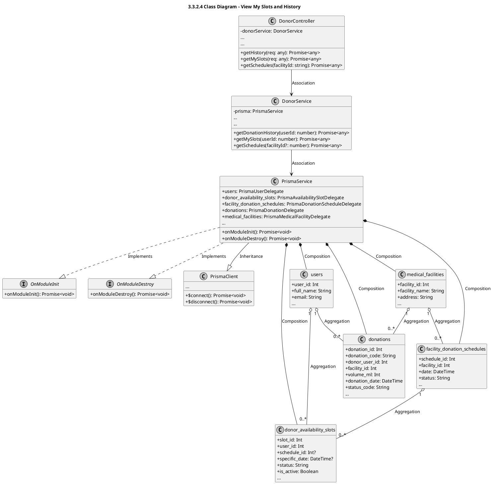
```plantuml
@startuml
title 3.3.2.4 Class Diagram - View My Slots and History
skinparam classAttributeIconSize 0
skinparam monochrome true
skinparam shadowing false
skinparam defaultFontName Arial
hide empty members

class DonorController {
  -donorService: DonorService
  ...
  +getHistory(req: any): Promise<any>
  +getMySlots(req: any): Promise<any>
  +getSchedules(facilityId: string): Promise<any>
  ...
}

class DonorService {
  -prisma: PrismaService
  ...
  +getDonationHistory(userId: number): Promise<any>
  +getMySlots(userId: number): Promise<any>
  +getSchedules(facilityId?: number): Promise<any>
  ...
}

interface OnModuleInit {
  +onModuleInit(): Promise<void>
}

interface OnModuleDestroy {
  +onModuleDestroy(): Promise<void>
}

class PrismaClient {
  +$connect(): Promise<void>
  +$disconnect(): Promise<void>
  ...
}

class PrismaService {
  +users: PrismaUserDelegate
  +donor_availability_slots: PrismaAvailabilitySlotDelegate
  +facility_donation_schedules: PrismaDonationScheduleDelegate
  +donations: PrismaDonationDelegate
  +medical_facilities: PrismaMedicalFacilityDelegate
  ...
  +onModuleInit(): Promise<void>
  +onModuleDestroy(): Promise<void>
}

class users {
  +user_id: Int
  +full_name: String
  +email: String
  ...
}

class donor_availability_slots {
  +slot_id: Int
  +user_id: Int
  +schedule_id: Int?
  +specific_date: DateTime?
  +status: String
  +is_active: Boolean
  ...
}

class facility_donation_schedules {
  +schedule_id: Int
  +facility_id: Int
  +date: DateTime
  +status: String
  ...
}

class donations {
  +donation_id: Int
  +donation_code: String
  +donor_user_id: Int
  +facility_id: Int
  +volume_ml: Int
  +donation_date: DateTime
  +status_code: String
  ...
}

class medical_facilities {
  +facility_id: Int
  +facility_name: String
  +address: String
  ...
}

DonorController --> DonorService : Association
DonorService --> PrismaService : Association
PrismaService --|> PrismaClient : Inheritance
PrismaService ..|> OnModuleInit : Implements
PrismaService ..|> OnModuleDestroy : Implements
PrismaService *-- users : Composition
PrismaService *-- donor_availability_slots : Composition
PrismaService *-- facility_donation_schedules : Composition
PrismaService *-- donations : Composition
PrismaService *-- medical_facilities : Composition
users "1" o-- "0..*" donor_availability_slots : Aggregation
facility_donation_schedules "1" o-- "0..*" donor_availability_slots : Aggregation
medical_facilities "1" o-- "0..*" facility_donation_schedules : Aggregation
users "1" o-- "0..*" donations : Aggregation
medical_facilities "1" o-- "0..*" donations : Aggregation
@enduml
```

---

### 3.3.2.5 Class Diagram - Admin Manage Slots and Excel (`donor_admin_slots_excel`)

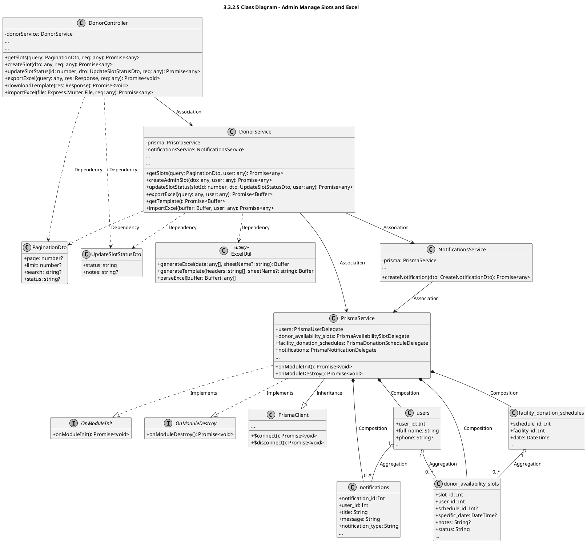
```plantuml
@startuml
title 3.3.2.5 Class Diagram - Admin Manage Slots and Excel
skinparam classAttributeIconSize 0
skinparam monochrome true
skinparam shadowing false
skinparam defaultFontName Arial
hide empty members

class DonorController {
  -donorService: DonorService
  ...
  +getSlots(query: PaginationDto, req: any): Promise<any>
  +createSlot(dto: any, req: any): Promise<any>
  +updateSlotStatus(id: number, dto: UpdateSlotStatusDto, req: any): Promise<any>
  +exportExcel(query: any, res: Response, req: any): Promise<void>
  +downloadTemplate(res: Response): Promise<void>
  +importExcel(file: Express.Multer.File, req: any): Promise<any>
  ...
}

class PaginationDto {
  +page: number?
  +limit: number?
  +search: string?
  +status: string?
}

class UpdateSlotStatusDto {
  +status: string
  +notes: string?
}

class DonorService {
  -prisma: PrismaService
  -notificationsService: NotificationsService
  ...
  +getSlots(query: PaginationDto, user: any): Promise<any>
  +createAdminSlot(dto: any, user: any): Promise<any>
  +updateSlotStatus(slotId: number, dto: UpdateSlotStatusDto, user: any): Promise<any>
  +exportExcel(query: any, user: any): Promise<Buffer>
  +getTemplate(): Promise<Buffer>
  +importExcel(buffer: Buffer, user: any): Promise<any>
  ...
}

class ExcelUtil <<utility>> {
  +generateExcel(data: any[], sheetName?: string): Buffer
  +generateTemplate(headers: string[], sheetName?: string): Buffer
  +parseExcel(buffer: Buffer): any[]
}

class NotificationsService {
  -prisma: PrismaService
  +createNotification(dto: CreateNotificationDto): Promise<any>
  ...
}

interface OnModuleInit {
  +onModuleInit(): Promise<void>
}

interface OnModuleDestroy {
  +onModuleDestroy(): Promise<void>
}

class PrismaClient {
  +$connect(): Promise<void>
  +$disconnect(): Promise<void>
  ...
}

class PrismaService {
  +users: PrismaUserDelegate
  +donor_availability_slots: PrismaAvailabilitySlotDelegate
  +facility_donation_schedules: PrismaDonationScheduleDelegate
  +notifications: PrismaNotificationDelegate
  ...
  +onModuleInit(): Promise<void>
  +onModuleDestroy(): Promise<void>
}

class notifications {
  +notification_id: Int
  +user_id: Int
  +title: String
  +message: String
  +notification_type: String
  ...
}

class users {
  +user_id: Int
  +full_name: String
  +phone: String?
  ...
}

class donor_availability_slots {
  +slot_id: Int
  +user_id: Int
  +schedule_id: Int?
  +specific_date: DateTime?
  +notes: String?
  +status: String
  ...
}

class facility_donation_schedules {
  +schedule_id: Int
  +facility_id: Int
  +date: DateTime
  ...
}

DonorController --> DonorService : Association
DonorController ..> PaginationDto : Dependency
DonorController ..> UpdateSlotStatusDto : Dependency
DonorService --> PrismaService : Association
DonorService --> NotificationsService : Association
NotificationsService --> PrismaService : Association
DonorService ..> PaginationDto : Dependency
DonorService ..> UpdateSlotStatusDto : Dependency
DonorService ..> ExcelUtil : Dependency
PrismaService --|> PrismaClient : Inheritance
PrismaService ..|> OnModuleInit : Implements
PrismaService ..|> OnModuleDestroy : Implements
PrismaService *-- users : Composition
PrismaService *-- donor_availability_slots : Composition
PrismaService *-- facility_donation_schedules : Composition
PrismaService *-- notifications : Composition
users "1" o-- "0..*" donor_availability_slots : Aggregation
facility_donation_schedules "1" o-- "0..*" donor_availability_slots : Aggregation
users "1" o-- "0..*" notifications : Aggregation
@enduml
```

---

### 3.3.2.6 Class Diagram - Record Blood Donation (`donor_record_donation`)

```plantuml
@startuml
title 3.3.2.6 Class Diagram - Record Blood Donation
skinparam classAttributeIconSize 0
skinparam monochrome true
skinparam shadowing false
skinparam defaultFontName Arial
hide empty members

class DonorController {
  -donorService: DonorService
  ...
  +recordDonation(req: any, dto: RecordDonationDto): Promise<any>
  ...
}

class RecordDonationDto {
  +facility_id: number
  +donor_user_id: number
  +blood_type_id: number
  +component_id: number
  +volume_ml: number
  +donation_date: string
  +health_check_passed: boolean?
  +result_notes: string?
  +request_code: string?
}

class DonorService {
  -prisma: PrismaService
  ...
  +recordDonation(user: any, dto: RecordDonationDto): Promise<any>
  ...
}

interface OnModuleInit {
  +onModuleInit(): Promise<void>
}

interface OnModuleDestroy {
  +onModuleDestroy(): Promise<void>
}

class PrismaClient {
  +$connect(): Promise<void>
  +$disconnect(): Promise<void>
  +$transaction(callback: any): Promise<any>
  ...
}

class PrismaService {
  +users: PrismaUserDelegate
  +donations: PrismaDonationDelegate
  +blood_inventory: PrismaBloodInventoryDelegate
  +inventory_transactions: PrismaInventoryTransactionDelegate
  +donor_profiles: PrismaDonorProfileDelegate
  +blood_requests: PrismaBloodRequestDelegate
  +blood_request_statuses: PrismaBloodRequestStatusDelegate
  +blood_request_inventory_allocations: PrismaInventoryAllocationDelegate
  +donation_interval_rules: PrismaDonationIntervalRuleDelegate
  ...
  +onModuleInit(): Promise<void>
  +onModuleDestroy(): Promise<void>
}

class blood_requests {
  +request_id: Int
  +request_code: String
  +blood_type_id: Int
  +component_id: Int
  +status_id: Int
  ...
}

class blood_request_statuses {
  +status_id: Int
  +status_code: String
  +status_name: String
  ...
}

class blood_request_inventory_allocations {
  +allocation_id: Int
  +request_id: Int
  +inventory_id: Int
  +units_allocated: Int
  ...
}

class donation_interval_rules {
  +rule_id: Int
  +component_id: Int
  +min_interval_days: Int
  ...
}

class users {
  +user_id: Int
  +full_name: String
  ...
}

class donor_profiles {
  +donor_profile_id: Int
  +user_id: Int
  +total_donations: Int
  +last_donation_date: DateTime?
  +next_eligible_date: DateTime?
  ...
}

class donations {
  +donation_id: Int
  +donation_code: String
  +facility_id: Int
  +donor_user_id: Int
  +blood_type_id: Int
  +component_id: Int
  +volume_ml: Int
  +donation_date: DateTime
  +health_check_passed: Boolean
  +result_notes: String?
  +status_code: String
  ...
}

class blood_inventory {
  +inventory_id: Int
  +bag_code: String
  +facility_id: Int
  +blood_type_id: Int
  +component_id: Int
  +volume_ml: Int
  +collection_date: DateTime
  +expiry_date: DateTime
  +status_code: String
  +source_donation_id: Int?
  ...
}

class inventory_transactions {
  +transaction_id: Int
  +inventory_id: Int
  +transaction_type: String
  +reference_type: String?
  +reference_id: Int?
  +performed_by: Int?
  ...
}

DonorController --> DonorService : Association
DonorController ..> RecordDonationDto : Dependency
DonorService --> PrismaService : Association
DonorService ..> RecordDonationDto : Dependency
PrismaService --|> PrismaClient : Inheritance
PrismaService ..|> OnModuleInit : Implements
PrismaService ..|> OnModuleDestroy : Implements
PrismaService *-- users : Composition
PrismaService *-- donor_profiles : Composition
PrismaService *-- donations : Composition
PrismaService *-- blood_inventory : Composition
PrismaService *-- inventory_transactions : Composition
users "1" o-- "0..*" donations : Aggregation
donations "0..1" o-- "0..*" blood_inventory : Aggregation
blood_inventory "1" o-- "0..*" inventory_transactions : Aggregation
users "1" o-- "0..1" donor_profiles : Aggregation
PrismaService *-- blood_requests : Composition
PrismaService *-- blood_request_statuses : Composition
PrismaService *-- blood_request_inventory_allocations : Composition
PrismaService *-- donation_interval_rules : Composition
blood_request_statuses "1" o-- "0..*" blood_requests : Aggregation
blood_requests "1" o-- "0..*" blood_request_inventory_allocations : Aggregation
blood_inventory "1" o-- "0..*" blood_request_inventory_allocations : Aggregation
@enduml
```

---

## Module 3.4: Blood Request and Matching Feature

### 3.4.1 Overview Class Diagram - Blood Request and Matching Feature (`request_overview`)

```plantuml
@startuml
title 3.4.1 Overview Class Diagram - Blood Request and Matching Feature
skinparam classAttributeIconSize 0
skinparam monochrome true
skinparam shadowing false
skinparam defaultFontName Arial
hide empty members

class RequestController {
  -requestService: RequestService
  +createRequest(req: any, dto: CreateRequestDto): Promise<any>
  +createPublicRequest(req: any, dto: CreateRequestDto): Promise<any>
  +getPublicRequests(query: any): Promise<any>
  +getPublicRequestByCode(code: string): Promise<any>
  +processRequest(req: any, id: number): Promise<any>
  +getMyRequests(req: any, query: any): Promise<any>
  +getMyRequestDetail(req: any, id: number): Promise<any>
  +getRequests(query: any, req: any): Promise<any>
  +exportExcel(query: any, res: Response, req: any): Promise<void>
  +downloadTemplate(res: Response): Promise<void>
  +importExcel(file: Express.Multer.File, req: any): Promise<any>
  +updateRequest(req: any, id: number, dto: Partial<CreateRequestDto>): Promise<any>
  +deleteRequest(req: any, id: number): Promise<any>
  +cancelRequest(req: any, id: number): Promise<any>
  +getMatches(req: any, id: number): Promise<any>
  +findDonorMatches(req: any, id: number): Promise<any>
  +updateMatchStatus(req: any, matchId: number, dto: UpdateMatchStatusDto): Promise<any>
  +getAllocations(req: any, id: number): Promise<any>
  +allocateInventory(req: any, id: number, dto: AllocateInventoryDto): Promise<any>
  +releaseAllocation(req: any, allocationId: number): Promise<any>
}

class CreateRequestDto {
  +facility_id: number
  +patient_name: string
  +blood_type_id: number
  +component_id: number
  +units_needed: number
  +urgency_id: number
  +is_emergency: boolean
  +clinical_notes: string?
  +patient_phone: string?
  +hospital_name: string?
  +ward_room: string?
  +province_id: number?
  +ward_id: number?
  +address: string?
  +latitude: number?
  +longitude: number?
  +required_before: string?
}

class UpdateMatchStatusDto {
  +status: string
}

class AllocateInventoryDto {
  +inventory_ids: number[]
}

class RequestService {
  -prisma: PrismaService
  -eventEmitter: EventEmitter2
  -notificationsService: NotificationsService
  +createRequest(dto: CreateRequestDto, user: any): Promise<any>
  +createPublicRequest(dto: CreateRequestDto, userId?: number): Promise<any>
  +processRequest(requestId: number, user: any): Promise<any>
  +getRequestByCode(code: string): Promise<any>
  +getRequests(query: any, user?: any): Promise<any>
  +exportExcel(query: any, user?: any): Promise<Buffer>
  +getTemplate(): Promise<Buffer>
  +importExcel(buffer: Buffer, user: any): Promise<any>
  +updateRequest(requestId: number, dto: Partial<CreateRequestDto>, user: any): Promise<any>
  +deleteRequest(requestId: number, user: any): Promise<any>
  +cancelRequest(requestId: number, user: any): Promise<any>
  +getRequestById(requestId: number, userId: number): Promise<any>
  +getMatches(requestId: number, user?: any): Promise<any>
  +findDonorMatches(requestId: number, user?: any): Promise<any>
  +updateMatchStatus(matchId: number, status: string, user?: any): Promise<any>
  +getAllocations(requestId: number, user?: any): Promise<any>
  +allocateInventory(requestId: number, inventoryIds: number[], user: any): Promise<any>
  +releaseAllocation(allocationId: number, user: any): Promise<any>
  +handleMatchDonorsEvent(payload: any): Promise<void>
}

class EventEmitter2 {
  +emit(event: string, payload: any): boolean
}

class NotificationsService {
  -prisma: PrismaService
  +createNotification(dto: CreateNotificationDto): Promise<any>
  +notifyAdmins(title: string, message: string, type: string, reference_type?: string, reference_id?: number): Promise<void>
  ...
}

interface OnModuleInit {
  +onModuleInit(): Promise<void>
}

interface OnModuleDestroy {
  +onModuleDestroy(): Promise<void>
}

class PrismaClient {
  +$connect(): Promise<void>
  +$disconnect(): Promise<void>
  +$transaction(callback: any): Promise<any>
  ...
}

class PrismaService {
  +blood_requests: PrismaBloodRequestDelegate
  +blood_request_status_history: PrismaStatusHistoryDelegate
  +blood_request_donor_matches: PrismaDonorMatchDelegate
  +blood_request_inventory_allocations: PrismaAllocationDelegate
  +blood_inventory: PrismaBloodInventoryDelegate
  +inventory_transactions: PrismaInventoryTransactionDelegate
  +medical_facilities: PrismaMedicalFacilityDelegate
  +blood_types: PrismaBloodTypeDelegate
  +blood_components: PrismaBloodComponentDelegate
  +urgency_levels: PrismaUrgencyLevelDelegate
  +blood_request_statuses: PrismaRequestStatusDelegate
  +users: PrismaUserDelegate
  +notifications: PrismaNotificationDelegate
  ...
  +onModuleInit(): Promise<void>
  +onModuleDestroy(): Promise<void>
}

class blood_requests {
  +request_id: Int
  +request_code: String
  +facility_id: Int
  +requester_user_id: Int?
  +patient_name: String
  +patient_phone: String?
  +blood_type_id: Int
  +component_id: Int
  +units_needed: Int
  +units_fulfilled: Int
  +urgency_id: Int
  +status_id: Int
  +is_emergency: Boolean
  +hospital_name: String?
  +ward_room: String?
  +clinical_notes: String?
  +fulfilled_from_stock: Boolean
  +needs_donor_match: Boolean
  +assigned_staff_id: Int?
  +created_at: DateTime
  ...
}

class blood_request_status_history {
  +history_id: Int
  +request_id: Int
  +from_status_id: Int?
  +to_status_id: Int
  +changed_by: Int?
  +change_reason: String?
  +created_at: DateTime
  ...
}

class blood_request_donor_matches {
  +match_id: Int
  +request_id: Int
  +donor_user_id: Int
  +match_score: Decimal?
  +match_status: String
  +contacted_at: DateTime?
  +responded_at: DateTime?
  ...
}

class blood_request_inventory_allocations {
  +allocation_id: Int
  +request_id: Int
  +inventory_id: Int
  +allocated_by: Int?
  +is_active: Boolean
  +allocated_at: DateTime
  +released_at: DateTime?
  ...
}

class blood_inventory {
  +inventory_id: Int
  +facility_id: Int
  +blood_type_id: Int
  +component_id: Int
  +bag_code: String
  +volume_ml: Int
  +status_code: String
  ...
}

class inventory_transactions {
  +transaction_id: Int
  +inventory_id: Int
  +transaction_type: String
  +reference_type: String?
  +reference_id: Int?
  +performed_by: Int?
  ...
}

class medical_facilities {
  +facility_id: Int
  +facility_code: String
  +facility_name: String
  +phone: String?
  +address: String
  ...
}

class blood_types {
  +blood_type_id: Int
  +blood_type_code: String
  +abo: String
  +rh_factor: String
  ...
}

class blood_components {
  +component_id: Int
  +component_code: String
  +component_name: String
  ...
}

class urgency_levels {
  +urgency_id: Int
  +urgency_code: String
  +urgency_name: String
  ...
}

class blood_request_statuses {
  +status_id: Int
  +status_code: String
  +status_name: String
  ...
}

class users {
  +user_id: Int
  +full_name: String
  +email: String
  +phone: String?
  +is_available_for_donation: Boolean
  ...
}

class notifications {
  +notification_id: Int
  +user_id: Int
  +title: String
  +message: String
  +notification_type: String
  ...
}

RequestController --> RequestService : Association
RequestController ..> CreateRequestDto : Dependency
RequestController ..> UpdateMatchStatusDto : Dependency
RequestController ..> AllocateInventoryDto : Dependency
RequestService --> PrismaService : Association
RequestService --> NotificationsService : Association
RequestService --> EventEmitter2 : Association
RequestService ..> CreateRequestDto : Dependency
RequestService ..> UpdateMatchStatusDto : Dependency
RequestService ..> AllocateInventoryDto : Dependency
NotificationsService --> PrismaService : Association
PrismaService --|> PrismaClient : Inheritance
PrismaService ..|> OnModuleInit : Implements
PrismaService ..|> OnModuleDestroy : Implements
PrismaService *-- blood_requests : Composition
PrismaService *-- blood_request_status_history : Composition
PrismaService *-- blood_request_donor_matches : Composition
PrismaService *-- blood_request_inventory_allocations : Composition
PrismaService *-- blood_inventory : Composition
PrismaService *-- inventory_transactions : Composition
PrismaService *-- medical_facilities : Composition
PrismaService *-- blood_types : Composition
PrismaService *-- blood_components : Composition
PrismaService *-- urgency_levels : Composition
PrismaService *-- blood_request_statuses : Composition
PrismaService *-- users : Composition
PrismaService *-- notifications : Composition
users "0..1" o-- "0..*" blood_requests : Aggregation
medical_facilities "1" o-- "0..*" blood_requests : Aggregation
blood_types "1" o-- "0..*" blood_requests : Aggregation
blood_components "1" o-- "0..*" blood_requests : Aggregation
urgency_levels "1" o-- "0..*" blood_requests : Aggregation
blood_request_statuses "1" o-- "0..*" blood_requests : Aggregation
blood_requests "1" o-- "0..*" blood_request_status_history : Aggregation
blood_requests "1" o-- "0..*" blood_request_donor_matches : Aggregation
users "1" o-- "0..*" blood_request_donor_matches : Aggregation
blood_requests "1" o-- "0..*" blood_request_inventory_allocations : Aggregation
blood_inventory "1" o-- "0..*" blood_request_inventory_allocations : Aggregation
blood_inventory "1" o-- "0..*" inventory_transactions : Aggregation
users "1" o-- "0..*" notifications : Aggregation
@enduml
```

---

### 3.4.2.1 Class Diagram - Create Blood Request (`request_create`)

```plantuml
@startuml
title 3.4.2.1 Class Diagram - Create Blood Request
skinparam classAttributeIconSize 0
skinparam monochrome true
skinparam shadowing false
skinparam defaultFontName Arial
hide empty members

class RequestController {
  -requestService: RequestService
  ...
  +createRequest(req: any, dto: CreateRequestDto): Promise<any>
  +createPublicRequest(req: any, dto: CreateRequestDto): Promise<any>
  ...
}

class CreateRequestDto {
  +facility_id: number
  +patient_name: string
  +blood_type_id: number
  +component_id: number
  +units_needed: number
  +urgency_id: number
  +is_emergency: boolean
  +clinical_notes: string?
  +patient_phone: string?
  +hospital_name: string?
  +ward_room: string?
  +province_id: number?
  +ward_id: number?
  +address: string?
  +latitude: number?
  +longitude: number?
  +required_before: string?
}

enum NotificationType {
  WARNING
  INFO
}

class RequestService {
  -prisma: PrismaService
  -notificationsService: NotificationsService
  ...
  +createRequest(dto: CreateRequestDto, user: any): Promise<any>
  +createPublicRequest(dto: CreateRequestDto, userId?: number): Promise<any>
  ...
}

class NotificationsService {
  -prisma: PrismaService
  +notifyAdmins(title: string, message: string, type: string, reference_type?: string, reference_id?: number): Promise<void>
  ...
}

interface OnModuleInit {
  +onModuleInit(): Promise<void>
}

interface OnModuleDestroy {
  +onModuleDestroy(): Promise<void>
}

class PrismaClient {
  +$connect(): Promise<void>
  +$disconnect(): Promise<void>
  +$transaction(callback: any): Promise<any>
  ...
}

class PrismaService {
  +users: PrismaUserDelegate
  +blood_requests: PrismaBloodRequestDelegate
  +blood_request_status_history: PrismaStatusHistoryDelegate
  +medical_facilities: PrismaMedicalFacilityDelegate
  +blood_types: PrismaBloodTypeDelegate
  +blood_components: PrismaBloodComponentDelegate
  +urgency_levels: PrismaUrgencyLevelDelegate
  +blood_request_statuses: PrismaRequestStatusDelegate
  ...
  +onModuleInit(): Promise<void>
  +onModuleDestroy(): Promise<void>
}

class blood_requests {
  +request_id: Int
  +request_code: String
  +facility_id: Int
  +requester_user_id: Int?
  +patient_name: String
  +patient_phone: String?
  +blood_type_id: Int
  +component_id: Int
  +units_needed: Int
  +urgency_id: Int
  +status_id: Int
  +is_emergency: Boolean
  +clinical_notes: String?
  ...
}

class blood_request_status_history {
  +history_id: Int
  +request_id: Int
  +to_status_id: Int
  +changed_by: Int?
  +change_reason: String?
  ...
}

class users {
  +user_id: Int
  +full_name: String
  +email: String
  ...
}

class medical_facilities {
  +facility_id: Int
  +facility_name: String
  ...
}

class blood_types {
  +blood_type_id: Int
  +blood_type_code: String
  ...
}

class blood_components {
  +component_id: Int
  +component_name: String
  ...
}

class urgency_levels {
  +urgency_id: Int
  +urgency_name: String
  ...
}

class blood_request_statuses {
  +status_id: Int
  +status_code: String
  ...
}

RequestController --> RequestService : Association
RequestController ..> CreateRequestDto : Dependency
RequestService --> PrismaService : Association
RequestService --> NotificationsService : Association
RequestService ..> CreateRequestDto : Dependency
NotificationsService --> PrismaService : Association
NotificationsService ..> NotificationType : Dependency
PrismaService --|> PrismaClient : Inheritance
PrismaService ..|> OnModuleInit : Implements
PrismaService ..|> OnModuleDestroy : Implements
PrismaService *-- blood_requests : Composition
PrismaService *-- blood_request_status_history : Composition
PrismaService *-- users : Composition
PrismaService *-- medical_facilities : Composition
PrismaService *-- blood_types : Composition
PrismaService *-- blood_components : Composition
PrismaService *-- urgency_levels : Composition
PrismaService *-- blood_request_statuses : Composition
users "0..1" o-- "0..*" blood_requests : Aggregation
medical_facilities "1" o-- "0..*" blood_requests : Aggregation
blood_types "1" o-- "0..*" blood_requests : Aggregation
blood_components "1" o-- "0..*" blood_requests : Aggregation
urgency_levels "1" o-- "0..*" blood_requests : Aggregation
blood_request_statuses "1" o-- "0..*" blood_requests : Aggregation
blood_requests "1" o-- "0..*" blood_request_status_history : Aggregation
@enduml
```

---

### 3.4.2.2 Class Diagram - View and Track Requests (`request_view_track`)

```plantuml
@startuml
title 3.4.2.2 Class Diagram - View and Track Requests
skinparam classAttributeIconSize 0
skinparam monochrome true
skinparam shadowing false
skinparam defaultFontName Arial
hide empty members

class RequestController {
  -requestService: RequestService
  ...
  +getPublicRequests(query: any): Promise<any>
  +getPublicRequestByCode(code: string): Promise<any>
  +getMyRequests(req: any, query: any): Promise<any>
  +getMyRequestDetail(req: any, id: number): Promise<any>
  +getRequests(query: any, req: any): Promise<any>
  ...
}

class RequestService {
  -prisma: PrismaService
  ...
  +getRequests(query: any, user?: any): Promise<any>
  +getRequestByCode(code: string): Promise<any>
  +getRequestById(requestId: number, userId: number): Promise<any>
  ...
}

interface OnModuleInit {
  +onModuleInit(): Promise<void>
}

interface OnModuleDestroy {
  +onModuleDestroy(): Promise<void>
}

class PrismaClient {
  +$connect(): Promise<void>
  +$disconnect(): Promise<void>
  ...
}

class PrismaService {
  +blood_requests: PrismaBloodRequestDelegate
  +medical_facilities: PrismaMedicalFacilityDelegate
  +blood_types: PrismaBloodTypeDelegate
  +blood_components: PrismaBloodComponentDelegate
  +urgency_levels: PrismaUrgencyLevelDelegate
  +blood_request_statuses: PrismaRequestStatusDelegate
  +blood_request_status_history: PrismaStatusHistoryDelegate
  +donor_availability_slots: PrismaAvailabilitySlotDelegate
  ...
  +onModuleInit(): Promise<void>
  +onModuleDestroy(): Promise<void>
}

class blood_requests {
  +request_id: Int
  +request_code: String
  +facility_id: Int
  +requester_user_id: Int?
  +patient_name: String
  +blood_type_id: Int
  +component_id: Int
  +units_needed: Int
  +units_fulfilled: Int
  +urgency_id: Int
  +status_id: Int
  +is_emergency: Boolean
  ...
}

class medical_facilities {
  +facility_id: Int
  +facility_name: String
  ...
}

class blood_types {
  +blood_type_id: Int
  +blood_type_code: String
  ...
}

class blood_components {
  +component_id: Int
  +component_name: String
  ...
}

class urgency_levels {
  +urgency_id: Int
  +urgency_name: String
  ...
}

class blood_request_statuses {
  +status_id: Int
  +status_name: String
  ...
}

class blood_request_status_history {
  +history_id: Int
  +request_id: Int
  +from_status_id: Int?
  +to_status_id: Int
  +changed_by: Int?
  +change_reason: String?
  ...
}

class donor_availability_slots {
  +slot_id: Int
  +user_id: Int
  +notes: String?
  +status: String
  ...
}

RequestController --> RequestService : Association
RequestService --> PrismaService : Association
PrismaService --|> PrismaClient : Inheritance
PrismaService ..|> OnModuleInit : Implements
PrismaService ..|> OnModuleDestroy : Implements
PrismaService *-- blood_requests : Composition
PrismaService *-- medical_facilities : Composition
PrismaService *-- blood_types : Composition
PrismaService *-- blood_components : Composition
PrismaService *-- urgency_levels : Composition
PrismaService *-- blood_request_statuses : Composition
PrismaService *-- blood_request_status_history : Composition
PrismaService *-- donor_availability_slots : Composition
medical_facilities "1" o-- "0..*" blood_requests : Aggregation
blood_types "1" o-- "0..*" blood_requests : Aggregation
blood_components "1" o-- "0..*" blood_requests : Aggregation
urgency_levels "1" o-- "0..*" blood_requests : Aggregation
blood_request_statuses "1" o-- "0..*" blood_requests : Aggregation
blood_requests "1" o-- "0..*" blood_request_status_history : Aggregation
@enduml
```

---

### 3.4.2.3 Class Diagram - Update, Cancel and Delete Request (`request_crud`)

```plantuml
@startuml
title 3.4.2.3 Class Diagram - Update, Cancel and Delete Request
skinparam classAttributeIconSize 0
skinparam monochrome true
skinparam shadowing false
skinparam defaultFontName Arial
hide empty members

class RequestController {
  -requestService: RequestService
  ...
  +updateRequest(req: any, id: number, dto: Partial<CreateRequestDto>): Promise<any>
  +deleteRequest(req: any, id: number): Promise<any>
  +cancelRequest(req: any, id: number): Promise<any>
  ...
}

class CreateRequestDto {
  +facility_id: number
  +patient_name: string
  +blood_type_id: number
  +component_id: number
  +units_needed: number
  +urgency_id: number
  +is_emergency: boolean
  +clinical_notes: string?
}

class RequestService {
  -prisma: PrismaService
  ...
  +updateRequest(requestId: number, dto: Partial<CreateRequestDto>, user: any): Promise<any>
  +deleteRequest(requestId: number, user: any): Promise<any>
  +cancelRequest(requestId: number, user: any): Promise<any>
  ...
}

interface OnModuleInit {
  +onModuleInit(): Promise<void>
}

interface OnModuleDestroy {
  +onModuleDestroy(): Promise<void>
}

class PrismaClient {
  +$connect(): Promise<void>
  +$disconnect(): Promise<void>
  ...
}

class PrismaService {
  +blood_requests: PrismaBloodRequestDelegate
  +blood_request_status_history: PrismaStatusHistoryDelegate
  +blood_request_statuses: PrismaRequestStatusDelegate
  ...
  +onModuleInit(): Promise<void>
  +onModuleDestroy(): Promise<void>
}

class blood_requests {
  +request_id: Int
  +request_code: String
  +facility_id: Int
  +patient_name: String
  +units_needed: Int
  +status_id: Int
  ...
}

class blood_request_status_history {
  +history_id: Int
  +request_id: Int
  +from_status_id: Int?
  +to_status_id: Int
  +changed_by: Int?
  +change_reason: String?
  ...
}

class blood_request_statuses {
  +status_id: Int
  +status_code: String
  ...
}

RequestController --> RequestService : Association
RequestController ..> CreateRequestDto : Dependency
RequestService --> PrismaService : Association
RequestService ..> CreateRequestDto : Dependency
PrismaService --|> PrismaClient : Inheritance
PrismaService ..|> OnModuleInit : Implements
PrismaService ..|> OnModuleDestroy : Implements
PrismaService *-- blood_requests : Composition
PrismaService *-- blood_request_status_history : Composition
PrismaService *-- blood_request_statuses : Composition
blood_requests "1" o-- "0..*" blood_request_status_history : Aggregation
blood_request_statuses "1" o-- "0..*" blood_requests : Aggregation
@enduml
```

---

### 3.4.2.4 Class Diagram - Process Blood Request (`request_process`)

```plantuml
@startuml
title 3.4.2.4 Class Diagram - Process Blood Request
skinparam classAttributeIconSize 0
skinparam monochrome true
skinparam shadowing false
skinparam defaultFontName Arial
hide empty members

class RequestController {
  -requestService: RequestService
  ...
  +processRequest(req: any, id: number): Promise<any>
  ...
}

class EventEmitter2 {
  +emit(event: string, payload: any): boolean
}

class CreateNotificationDto {
  +user_ids: number[]
  +title: string
  +message: string
  +notification_type: NotificationType
  +reference_type: string?
  +reference_id: number?
}

enum NotificationType {
  INFO
  WARNING
}

class RequestService {
  -prisma: PrismaService
  -eventEmitter: EventEmitter2
  -notificationsService: NotificationsService
  ...
  +processRequest(requestId: number, user: any): Promise<any>
  +handleMatchDonorsEvent(payload: any): Promise<void>
  ...
}

class NotificationsService {
  -prisma: PrismaService
  +createNotification(dto: CreateNotificationDto): Promise<any>
  ...
}

interface OnModuleInit {
  +onModuleInit(): Promise<void>
}

interface OnModuleDestroy {
  +onModuleDestroy(): Promise<void>
}

class PrismaClient {
  +$connect(): Promise<void>
  +$disconnect(): Promise<void>
  +$transaction(callback: any): Promise<any>
  ...
}

class PrismaService {
  +users: PrismaUserDelegate
  +blood_requests: PrismaBloodRequestDelegate
  +blood_inventory: PrismaBloodInventoryDelegate
  +blood_request_inventory_allocations: PrismaAllocationDelegate
  +inventory_transactions: PrismaInventoryTransactionDelegate
  +blood_request_status_history: PrismaStatusHistoryDelegate
  +notifications: PrismaNotificationDelegate
  ...
  +onModuleInit(): Promise<void>
  +onModuleDestroy(): Promise<void>
}

class users {
  +user_id: Int
  +full_name: String
  +email: String
  ...
}

class blood_requests {
  +request_id: Int
  +request_code: String
  +facility_id: Int
  +blood_type_id: Int
  +component_id: Int
  +units_needed: Int
  +status_id: Int
  +fulfilled_from_stock: Boolean
  +needs_donor_match: Boolean
  +assigned_staff_id: Int?
  ...
}

class blood_inventory {
  +inventory_id: Int
  +facility_id: Int
  +blood_type_id: Int
  +component_id: Int
  +status_code: String
  ...
}

class blood_request_inventory_allocations {
  +allocation_id: Int
  +request_id: Int
  +inventory_id: Int
  +allocated_by: Int?
  ...
}

class inventory_transactions {
  +transaction_id: Int
  +inventory_id: Int
  +transaction_type: String
  +reference_type: String?
  +reference_id: Int?
  +performed_by: Int?
  ...
}

class blood_request_status_history {
  +history_id: Int
  +request_id: Int
  +from_status_id: Int?
  +to_status_id: Int
  +changed_by: Int?
  +change_reason: String?
  ...
}

class notifications {
  +notification_id: Int
  +user_id: Int
  +title: String
  +message: String
  +notification_type: String
  ...
}

RequestController --> RequestService : Association
RequestService --> PrismaService : Association
RequestService --> NotificationsService : Association
RequestService --> EventEmitter2 : Association
NotificationsService --> PrismaService : Association
NotificationsService ..> CreateNotificationDto : Dependency
CreateNotificationDto ..> NotificationType : Dependency
PrismaService --|> PrismaClient : Inheritance
PrismaService ..|> OnModuleInit : Implements
PrismaService ..|> OnModuleDestroy : Implements
PrismaService *-- users : Composition
PrismaService *-- blood_requests : Composition
PrismaService *-- blood_inventory : Composition
PrismaService *-- blood_request_inventory_allocations : Composition
PrismaService *-- inventory_transactions : Composition
PrismaService *-- blood_request_status_history : Composition
PrismaService *-- notifications : Composition
blood_requests "1" o-- "0..*" blood_request_status_history : Aggregation
blood_requests "1" o-- "0..*" blood_request_inventory_allocations : Aggregation
blood_inventory "1" o-- "0..*" blood_request_inventory_allocations : Aggregation
blood_inventory "1" o-- "0..*" inventory_transactions : Aggregation
users "1" o-- "0..*" notifications : Aggregation
@enduml
```

---

### 3.4.2.5 Class Diagram - Inventory Allocation and Release (`request_allocations`)

```plantuml
@startuml
title 3.4.2.5 Class Diagram - Inventory Allocation and Release
skinparam classAttributeIconSize 0
skinparam monochrome true
skinparam shadowing false
skinparam defaultFontName Arial
hide empty members

class RequestController {
  -requestService: RequestService
  ...
  +getAllocations(req: any, id: number): Promise<any>
  +allocateInventory(req: any, id: number, dto: AllocateInventoryDto): Promise<any>
  +releaseAllocation(req: any, allocationId: number): Promise<any>
  ...
}

class AllocateInventoryDto {
  +inventory_ids: number[]
}

class RequestService {
  -prisma: PrismaService
  ...
  +getAllocations(requestId: number, user?: any): Promise<any>
  +allocateInventory(requestId: number, inventoryIds: number[], user: any): Promise<any>
  +releaseAllocation(allocationId: number, user: any): Promise<any>
  ...
}

interface OnModuleInit {
  +onModuleInit(): Promise<void>
}

interface OnModuleDestroy {
  +onModuleDestroy(): Promise<void>
}

class PrismaClient {
  +$connect(): Promise<void>
  +$disconnect(): Promise<void>
  +$transaction(callback: any): Promise<any>
  ...
}

class PrismaService {
  +blood_requests: PrismaBloodRequestDelegate
  +blood_request_inventory_allocations: PrismaAllocationDelegate
  +blood_inventory: PrismaBloodInventoryDelegate
  +inventory_transactions: PrismaInventoryTransactionDelegate
  +blood_request_status_history: PrismaStatusHistoryDelegate
  ...
  +onModuleInit(): Promise<void>
  +onModuleDestroy(): Promise<void>
}

class blood_requests {
  +request_id: Int
  +request_code: String
  +units_needed: Int
  +units_fulfilled: Int
  +status_id: Int
  +completed_at: DateTime?
  ...
}

class blood_inventory {
  +inventory_id: Int
  +bag_code: String
  +status_code: String
  ...
}

class blood_request_inventory_allocations {
  +allocation_id: Int
  +request_id: Int
  +inventory_id: Int
  +allocated_by: Int?
  +is_active: Boolean
  +allocated_at: DateTime
  +released_at: DateTime?
  ...
}

class inventory_transactions {
  +transaction_id: Int
  +inventory_id: Int
  +transaction_type: String
  +reference_type: String?
  +reference_id: Int?
  +performed_by: Int?
  ...
}

class blood_request_status_history {
  +history_id: Int
  +request_id: Int
  +from_status_id: Int?
  +to_status_id: Int
  +changed_by: Int?
  +change_reason: String?
  ...
}

RequestController --> RequestService : Association
RequestController ..> AllocateInventoryDto : Dependency
RequestService --> PrismaService : Association
RequestService ..> AllocateInventoryDto : Dependency
PrismaService --|> PrismaClient : Inheritance
PrismaService ..|> OnModuleInit : Implements
PrismaService ..|> OnModuleDestroy : Implements
PrismaService *-- blood_requests : Composition
PrismaService *-- blood_inventory : Composition
PrismaService *-- blood_request_inventory_allocations : Composition
PrismaService *-- inventory_transactions : Composition
PrismaService *-- blood_request_status_history : Composition
blood_requests "1" o-- "0..*" blood_request_inventory_allocations : Aggregation
blood_inventory "1" o-- "0..*" blood_request_inventory_allocations : Aggregation
blood_inventory "1" o-- "0..*" inventory_transactions : Aggregation
blood_requests "1" o-- "0..*" blood_request_status_history : Aggregation
@enduml
```

---

### 3.4.2.6 Class Diagram - Find and Manage Donor Matches (`request_matches`)

```plantuml
@startuml
title 3.4.2.6 Class Diagram - Find and Manage Donor Matches
skinparam classAttributeIconSize 0
skinparam monochrome true
skinparam shadowing false
skinparam defaultFontName Arial
hide empty members

class RequestController {
  -requestService: RequestService
  ...
  +getMatches(req: any, id: number): Promise<any>
  +findDonorMatches(req: any, id: number): Promise<any>
  +updateMatchStatus(req: any, matchId: number, dto: UpdateMatchStatusDto): Promise<any>
  ...
}

class UpdateMatchStatusDto {
  +status: string
}

class RequestService {
  -prisma: PrismaService
  ...
  +getMatches(requestId: number, user?: any): Promise<any>
  +findDonorMatches(requestId: number, user?: any): Promise<any>
  +updateMatchStatus(matchId: number, status: string, user?: any): Promise<any>
  ...
}

interface OnModuleInit {
  +onModuleInit(): Promise<void>
}

interface OnModuleDestroy {
  +onModuleDestroy(): Promise<void>
}

class PrismaClient {
  +$connect(): Promise<void>
  +$disconnect(): Promise<void>
  ...
}

class PrismaService {
  +blood_requests: PrismaBloodRequestDelegate
  +blood_request_donor_matches: PrismaDonorMatchDelegate
  +users: PrismaUserDelegate
  ...
  +onModuleInit(): Promise<void>
  +onModuleDestroy(): Promise<void>
}

class blood_requests {
  +request_id: Int
  +request_code: String
  +blood_type_id: Int
  +facility_id: Int
  ...
}

class blood_request_donor_matches {
  +match_id: Int
  +request_id: Int
  +donor_user_id: Int
  +match_score: Decimal?
  +match_status: String
  +contacted_at: DateTime?
  +responded_at: DateTime?
  ...
}

class users {
  +user_id: Int
  +full_name: String
  +email: String
  +phone: String?
  +blood_type_id: Int?
  +is_available_for_donation: Boolean
  ...
}

RequestController --> RequestService : Association
RequestController ..> UpdateMatchStatusDto : Dependency
RequestService --> PrismaService : Association
RequestService ..> UpdateMatchStatusDto : Dependency
PrismaService --|> PrismaClient : Inheritance
PrismaService ..|> OnModuleInit : Implements
PrismaService ..|> OnModuleDestroy : Implements
PrismaService *-- blood_requests : Composition
PrismaService *-- blood_request_donor_matches : Composition
PrismaService *-- users : Composition
blood_requests "1" o-- "0..*" blood_request_donor_matches : Aggregation
users "1" o-- "0..*" blood_request_donor_matches : Aggregation
@enduml
```

---

### 3.4.2.7 Class Diagram - Import and Export Requests Excel (`request_excel`)

```plantuml
@startuml
title 3.4.2.7 Class Diagram - Import and Export Requests Excel
skinparam classAttributeIconSize 0
skinparam monochrome true
skinparam shadowing false
skinparam defaultFontName Arial
hide empty members

class RequestController {
  -requestService: RequestService
  ...
  +exportExcel(query: any, res: Response, req: any): Promise<void>
  +downloadTemplate(res: Response): Promise<void>
  +importExcel(file: Express.Multer.File, req: any): Promise<any>
  ...
}

class RequestService {
  -prisma: PrismaService
  ...
  +exportExcel(query: any, user?: any): Promise<Buffer>
  +getTemplate(): Promise<Buffer>
  +importExcel(buffer: Buffer, user: any): Promise<any>
  ...
}

class ExcelUtil <<utility>> {
  +generateExcel(data: any[], sheetName?: string): Buffer
  +generateTemplate(headers: string[], sheetName?: string): Buffer
  +parseExcel(buffer: Buffer): any[]
}

interface OnModuleInit {
  +onModuleInit(): Promise<void>
}

interface OnModuleDestroy {
  +onModuleDestroy(): Promise<void>
}

class PrismaClient {
  +$connect(): Promise<void>
  +$disconnect(): Promise<void>
  ...
}

class PrismaService {
  +blood_requests: PrismaBloodRequestDelegate
  +blood_request_status_history: PrismaStatusHistoryDelegate
  +blood_request_statuses: PrismaRequestStatusDelegate
  +urgency_levels: PrismaUrgencyLevelDelegate
  ...
  +onModuleInit(): Promise<void>
  +onModuleDestroy(): Promise<void>
}

class blood_requests {
  +request_id: Int
  +request_code: String
  +facility_id: Int
  +patient_name: String
  +blood_type_id: Int
  +component_id: Int
  +urgency_id: Int
  +units_needed: Int
  +units_fulfilled: Int
  +status_id: Int
  +is_emergency: Boolean
  +clinical_notes: String?
  ...
}

class blood_request_status_history {
  +history_id: Int
  +request_id: Int
  +to_status_id: Int
  +changed_by: Int?
  +change_reason: String?
  ...
}

class blood_request_statuses {
  +status_id: Int
  +status_code: String
  +status_name: String
  ...
}

class urgency_levels {
  +urgency_id: Int
  +urgency_code: String
  ...
}

RequestController --> RequestService : Association
RequestService --> PrismaService : Association
RequestService ..> ExcelUtil : Dependency
PrismaService --|> PrismaClient : Inheritance
PrismaService ..|> OnModuleInit : Implements
PrismaService ..|> OnModuleDestroy : Implements
PrismaService *-- blood_requests : Composition
PrismaService *-- blood_request_status_history : Composition
PrismaService *-- blood_request_statuses : Composition
PrismaService *-- urgency_levels : Composition
blood_requests "1" o-- "0..*" blood_request_status_history : Aggregation
blood_request_statuses "1" o-- "0..*" blood_requests : Aggregation
urgency_levels "1" o-- "0..*" blood_requests : Aggregation
@enduml
```

---

## Module 3.5: Blood Inventory Feature

### 3.5.1 Overview Class Diagram - Blood Inventory Feature (`inventory_overview`)

```plantuml
@startuml
title 3.5.1 Overview Class Diagram - Blood Inventory Feature
skinparam classAttributeIconSize 0
skinparam monochrome true
skinparam shadowing false
skinparam defaultFontName Arial
hide empty members

class InventoryController {
  -inventoryService: InventoryService
  +receiveBlood(req: any, dto: ReceiveBloodDto): Promise<any>
  +updateBlood(req: any, inventoryId: number, dto: Partial<ReceiveBloodDto>): Promise<any>
  +discardBlood(req: any, inventoryId: number, dto: DiscardBloodDto): Promise<any>
  +getStats(req: any): Promise<any>
  +getInventoryList(query: any, req: any): Promise<any>
  +exportExcel(query: any, res: Response, req: any): Promise<void>
  +downloadTemplate(res: Response): Promise<void>
  +importExcel(file: Express.Multer.File, req: any): Promise<any>
}

class ReceiveBloodDto {
  +facility_id: number
  +blood_type_id: number
  +component_id: number
  +bag_code: string
  +volume_ml: number
  +collection_date: string
  +expiry_date: string
  +source_donation_id: number?
  +notes: string?
}

class DiscardBloodDto {
  +reason: string
}

class InventoryService {
  -prisma: PrismaService
  +receiveBlood(dto: any, user: any): Promise<any>
  +updateBlood(inventoryId: number, dto: any, user: any): Promise<any>
  +discardBlood(inventoryId: number, user: any, reason: string): Promise<any>
  +getInventoryStats(user: any): Promise<any>
  +getInventoryList(query: any, user: any): Promise<any>
  +exportExcel(query: any, user: any): Promise<Buffer>
  +getTemplate(): Promise<Buffer>
  +importExcel(buffer: Buffer, staffId: number): Promise<any>
}

interface OnModuleInit {
  +onModuleInit(): Promise<void>
}

interface OnModuleDestroy {
  +onModuleDestroy(): Promise<void>
}

class PrismaClient {
  +$connect(): Promise<void>
  +$disconnect(): Promise<void>
  +$transaction(callback: any): Promise<any>
  ...
}

class PrismaService {
  +blood_inventory: PrismaBloodInventoryDelegate
  +inventory_transactions: PrismaInventoryTransactionDelegate
  +medical_facilities: PrismaMedicalFacilityDelegate
  +blood_types: PrismaBloodTypeDelegate
  +blood_components: PrismaBloodComponentDelegate
  +users: PrismaUserDelegate
  +donations: PrismaDonationDelegate
  ...
  +onModuleInit(): Promise<void>
  +onModuleDestroy(): Promise<void>
}

class blood_inventory {
  +inventory_id: Int
  +bag_code: String
  +facility_id: Int
  +blood_type_id: Int
  +component_id: Int
  +volume_ml: Int
  +collection_date: DateTime
  +expiry_date: DateTime
  +status_code: String
  +source_donation_id: Int?
  +notes: String?
  ...
}

class inventory_transactions {
  +transaction_id: Int
  +inventory_id: Int
  +transaction_type: String
  +quantity: Int
  +reference_type: String?
  +reference_id: Int?
  +performed_by: Int?
  +notes: String?
  +created_at: DateTime
  ...
}

class medical_facilities {
  +facility_id: Int
  +facility_code: String
  +facility_name: String
  +phone: String?
  +address: String
  ...
}

class blood_types {
  +blood_type_id: Int
  +blood_type_code: String
  +abo: String
  +rh_factor: String
  ...
}

class blood_components {
  +component_id: Int
  +component_code: String
  +component_name: String
  ...
}

class users {
  +user_id: Int
  +full_name: String
  +email: String
  ...
}

class donations {
  +donation_id: Int
  +donation_code: String
  ...
}

InventoryController --> InventoryService : Association
InventoryController ..> ReceiveBloodDto : Dependency
InventoryController ..> DiscardBloodDto : Dependency
InventoryService --> PrismaService : Association
InventoryService ..> ReceiveBloodDto : Dependency
InventoryService ..> DiscardBloodDto : Dependency
PrismaService --|> PrismaClient : Inheritance
PrismaService ..|> OnModuleInit : Implements
PrismaService ..|> OnModuleDestroy : Implements
PrismaService *-- blood_inventory : Composition
PrismaService *-- inventory_transactions : Composition
PrismaService *-- medical_facilities : Composition
PrismaService *-- blood_types : Composition
PrismaService *-- blood_components : Composition
PrismaService *-- users : Composition
PrismaService *-- donations : Composition
medical_facilities "1" o-- "0..*" blood_inventory : Aggregation
blood_types "1" o-- "0..*" blood_inventory : Aggregation
blood_components "1" o-- "0..*" blood_inventory : Aggregation
donations "0..1" o-- "0..*" blood_inventory : Aggregation
blood_inventory "1" o-- "0..*" inventory_transactions : Aggregation
users "1" o-- "0..*" inventory_transactions : Aggregation
@enduml
```

---

### 3.5.2.1 Class Diagram - View Inventory List and Statistics (`inventory_list_stats`)

```plantuml
@startuml
title 3.5.2.1 Class Diagram - View Inventory List and Statistics
skinparam classAttributeIconSize 0
skinparam monochrome true
skinparam shadowing false
skinparam defaultFontName Arial
hide empty members

class InventoryController {
  -inventoryService: InventoryService
  ...
  +getInventoryList(query: any, req: any): Promise<any>
  +getStats(req: any): Promise<any>
  ...
}

class InventoryService {
  -prisma: PrismaService
  ...
  +getInventoryList(query: any, user: any): Promise<any>
  +getInventoryStats(user: any): Promise<any>
  ...
}

interface OnModuleInit {
  +onModuleInit(): Promise<void>
}

interface OnModuleDestroy {
  +onModuleDestroy(): Promise<void>
}

class PrismaClient {
  +$connect(): Promise<void>
  +$disconnect(): Promise<void>
  ...
}

class PrismaService {
  +blood_inventory: PrismaBloodInventoryDelegate
  +medical_facilities: PrismaMedicalFacilityDelegate
  +blood_types: PrismaBloodTypeDelegate
  +blood_components: PrismaBloodComponentDelegate
  ...
  +onModuleInit(): Promise<void>
  +onModuleDestroy(): Promise<void>
}

class blood_inventory {
  +inventory_id: Int
  +bag_code: String
  +facility_id: Int
  +blood_type_id: Int
  +component_id: Int
  +volume_ml: Int
  +collection_date: DateTime
  +expiry_date: DateTime
  +status_code: String
  ...
}

class medical_facilities {
  +facility_id: Int
  +facility_name: String
  ...
}

class blood_types {
  +blood_type_id: Int
  +blood_type_code: String
  ...
}

class blood_components {
  +component_id: Int
  +component_name: String
  ...
}

InventoryController --> InventoryService : Association
InventoryService --> PrismaService : Association
PrismaService --|> PrismaClient : Inheritance
PrismaService ..|> OnModuleInit : Implements
PrismaService ..|> OnModuleDestroy : Implements
PrismaService *-- blood_inventory : Composition
PrismaService *-- medical_facilities : Composition
PrismaService *-- blood_types : Composition
PrismaService *-- blood_components : Composition
medical_facilities "1" o-- "0..*" blood_inventory : Aggregation
blood_types "1" o-- "0..*" blood_inventory : Aggregation
blood_components "1" o-- "0..*" blood_inventory : Aggregation
@enduml
```

---

### 3.5.2.2 Class Diagram - Receive Blood Unit (`inventory_receive`)

```plantuml
@startuml
title 3.5.2.2 Class Diagram - Receive Blood Unit
skinparam classAttributeIconSize 0
skinparam monochrome true
skinparam shadowing false
skinparam defaultFontName Arial
hide empty members

class InventoryController {
  -inventoryService: InventoryService
  ...
  +receiveBlood(req: any, dto: ReceiveBloodDto): Promise<any>
  ...
}

class ReceiveBloodDto {
  +facility_id: number
  +blood_type_id: number
  +component_id: number
  +bag_code: string
  +volume_ml: number
  +collection_date: string
  +expiry_date: string
  +source_donation_id: number?
  +notes: string?
}

class InventoryService {
  -prisma: PrismaService
  ...
  +receiveBlood(dto: any, user: any): Promise<any>
  ...
}

interface OnModuleInit {
  +onModuleInit(): Promise<void>
}

interface OnModuleDestroy {
  +onModuleDestroy(): Promise<void>
}

class PrismaClient {
  +$connect(): Promise<void>
  +$disconnect(): Promise<void>
  +$transaction(callback: any): Promise<any>
  ...
}

class PrismaService {
  +blood_inventory: PrismaBloodInventoryDelegate
  +inventory_transactions: PrismaInventoryTransactionDelegate
  ...
  +onModuleInit(): Promise<void>
  +onModuleDestroy(): Promise<void>
}

class blood_inventory {
  +inventory_id: Int
  +bag_code: String
  +facility_id: Int
  +blood_type_id: Int
  +component_id: Int
  +volume_ml: Int
  +collection_date: DateTime
  +expiry_date: DateTime
  +status_code: String
  +source_donation_id: Int?
  ...
}

class inventory_transactions {
  +transaction_id: Int
  +inventory_id: Int
  +transaction_type: String
  +quantity: Int
  +reference_type: String?
  +reference_id: Int?
  +performed_by: Int?
  ...
}

InventoryController --> InventoryService : Association
InventoryController ..> ReceiveBloodDto : Dependency
InventoryService --> PrismaService : Association
InventoryService ..> ReceiveBloodDto : Dependency
PrismaService --|> PrismaClient : Inheritance
PrismaService ..|> OnModuleInit : Implements
PrismaService ..|> OnModuleDestroy : Implements
PrismaService *-- blood_inventory : Composition
PrismaService *-- inventory_transactions : Composition
blood_inventory "1" o-- "0..*" inventory_transactions : Aggregation
@enduml
```

---

### 3.5.2.3 Class Diagram - Update Blood Unit (`inventory_update`)

```plantuml
@startuml
title 3.5.2.3 Class Diagram - Update Blood Unit
skinparam classAttributeIconSize 0
skinparam monochrome true
skinparam shadowing false
skinparam defaultFontName Arial
hide empty members

class InventoryController {
  -inventoryService: InventoryService
  ...
  +updateBlood(req: any, inventoryId: number, dto: UpdateBloodDto): Promise<any>
  ...
}

class UpdateBloodDto {
  +facility_id: number?
  +blood_type_id: number?
  +component_id: number?
  +bag_code: string?
  +volume_ml: number?
  +collection_date: string?
  +expiry_date: string?
  +notes: string?
}

class InventoryService {
  -prisma: PrismaService
  ...
  +updateBlood(inventoryId: number, dto: any, user: any): Promise<any>
  ...
}

interface OnModuleInit {
  +onModuleInit(): Promise<void>
}

interface OnModuleDestroy {
  +onModuleDestroy(): Promise<void>
}

class PrismaClient {
  +$connect(): Promise<void>
  +$disconnect(): Promise<void>
  ...
}

class PrismaService {
  +blood_inventory: PrismaBloodInventoryDelegate
  ...
  +onModuleInit(): Promise<void>
  +onModuleDestroy(): Promise<void>
}

class blood_inventory {
  +inventory_id: Int
  +bag_code: String
  +volume_ml: Int
  +collection_date: DateTime
  +expiry_date: DateTime
  +status_code: String
  +notes: String?
  ...
}

InventoryController --> InventoryService : Association
InventoryController ..> UpdateBloodDto : Dependency
InventoryService --> PrismaService : Association
InventoryService ..> UpdateBloodDto : Dependency
PrismaService --|> PrismaClient : Inheritance
PrismaService ..|> OnModuleInit : Implements
PrismaService ..|> OnModuleDestroy : Implements
PrismaService *-- blood_inventory : Composition
@enduml
```

---

### 3.5.2.4 Class Diagram - Discard Blood Unit (`inventory_discard`)

```plantuml
@startuml
title 3.5.2.4 Class Diagram - Discard Blood Unit
skinparam classAttributeIconSize 0
skinparam monochrome true
skinparam shadowing false
skinparam defaultFontName Arial
hide empty members

class InventoryController {
  -inventoryService: InventoryService
  ...
  +discardBlood(req: any, inventoryId: number, dto: DiscardBloodDto): Promise<any>
  ...
}

class DiscardBloodDto {
  +reason: string
}

class InventoryService {
  -prisma: PrismaService
  ...
  +discardBlood(inventoryId: number, user: any, reason: string): Promise<any>
  ...
}

interface OnModuleInit {
  +onModuleInit(): Promise<void>
}

interface OnModuleDestroy {
  +onModuleDestroy(): Promise<void>
}

class PrismaClient {
  +$connect(): Promise<void>
  +$disconnect(): Promise<void>
  +$transaction(callback: any): Promise<any>
  ...
}

class PrismaService {
  +blood_inventory: PrismaBloodInventoryDelegate
  +inventory_transactions: PrismaInventoryTransactionDelegate
  ...
  +onModuleInit(): Promise<void>
  +onModuleDestroy(): Promise<void>
}

class blood_inventory {
  +inventory_id: Int
  +bag_code: String
  +status_code: String
  ...
}

class inventory_transactions {
  +transaction_id: Int
  +inventory_id: Int
  +transaction_type: String
  +quantity: Int
  +reference_type: String?
  +performed_by: Int?
  +notes: String?
  ...
}

InventoryController --> InventoryService : Association
InventoryController ..> DiscardBloodDto : Dependency
InventoryService --> PrismaService : Association
InventoryService ..> DiscardBloodDto : Dependency
PrismaService --|> PrismaClient : Inheritance
PrismaService ..|> OnModuleInit : Implements
PrismaService ..|> OnModuleDestroy : Implements
PrismaService *-- blood_inventory : Composition
PrismaService *-- inventory_transactions : Composition
blood_inventory "1" o-- "0..*" inventory_transactions : Aggregation
@enduml
```

---

### 3.5.2.5 Class Diagram - Import and Export Inventory Excel (`inventory_excel`)

```plantuml
@startuml
title 3.5.2.5 Class Diagram - Import and Export Inventory Excel
skinparam classAttributeIconSize 0
skinparam monochrome true
skinparam shadowing false
skinparam defaultFontName Arial
hide empty members

class InventoryController {
  -inventoryService: InventoryService
  ...
  +exportExcel(query: any, res: Response, req: any): Promise<void>
  +downloadTemplate(res: Response): Promise<void>
  +importExcel(file: Express.Multer.File, req: any): Promise<any>
  ...
}

class InventoryService {
  -prisma: PrismaService
  ...
  +exportExcel(query: any, user: any): Promise<Buffer>
  +getTemplate(): Promise<Buffer>
  +importExcel(buffer: Buffer, staffId: number): Promise<any>
  ...
}

class ExcelUtil <<utility>> {
  +generateExcel(data: any[], sheetName?: string): Buffer
  +generateTemplate(headers: string[], sheetName?: string): Buffer
  +parseExcel(buffer: Buffer): any[]
}

interface OnModuleInit {
  +onModuleInit(): Promise<void>
}

interface OnModuleDestroy {
  +onModuleDestroy(): Promise<void>
}

class PrismaClient {
  +$connect(): Promise<void>
  +$disconnect(): Promise<void>
  ...
}

class PrismaService {
  +blood_inventory: PrismaBloodInventoryDelegate
  +inventory_transactions: PrismaInventoryTransactionDelegate
  +users: PrismaUserDelegate
  ...
  +onModuleInit(): Promise<void>
  +onModuleDestroy(): Promise<void>
}

class blood_inventory {
  +inventory_id: Int
  +bag_code: String
  +facility_id: Int
  +blood_type_id: Int
  +component_id: Int
  +volume_ml: Int
  +collection_date: DateTime
  +expiry_date: DateTime
  +status_code: String
  ...
}

class inventory_transactions {
  +transaction_id: Int
  +inventory_id: Int
  +transaction_type: String
  +quantity: Int
  +performed_by: Int?
  ...
}

class users {
  +user_id: Int
  +full_name: String
  ...
}

InventoryController --> InventoryService : Association
InventoryService --> PrismaService : Association
InventoryService ..> ExcelUtil : Dependency
PrismaService --|> PrismaClient : Inheritance
PrismaService ..|> OnModuleInit : Implements
PrismaService ..|> OnModuleDestroy : Implements
PrismaService *-- blood_inventory : Composition
PrismaService *-- inventory_transactions : Composition
PrismaService *-- users : Composition
blood_inventory "1" o-- "0..*" inventory_transactions : Aggregation
users "1" o-- "0..*" inventory_transactions : Aggregation
@enduml
```

---

## Module 3.6: Donation Schedule Administration Feature

### 3.6.1 Overview Class Diagram - Donation Schedule Administration Feature (`schedules_overview`)

```plantuml
@startuml
title 3.6.1 Overview Class Diagram - Donation Schedule Administration Feature
skinparam classAttributeIconSize 0
skinparam monochrome true
skinparam shadowing false
skinparam defaultFontName Arial
hide empty members

class SchedulesController {
  -schedulesService: SchedulesService
  +getAllSchedules(query: ScheduleFilterDto, user: any): Promise<any>
  +getScheduleById(id: number, user: any): Promise<any>
  +createSchedule(dto: CreateScheduleDto, user: any): Promise<any>
  +updateSchedule(id: number, dto: UpdateScheduleDto, user: any): Promise<any>
  +deleteSchedule(id: number, user: any): Promise<any>
  +getScheduleDonors(id: number, query: any, user: any): Promise<any>
  +updateDonorStatus(id: number, slotId: number, status: string, user: any): Promise<any>
  +exportScheduleDonors(id: number, res: Response, user: any): Promise<any>
}

class CreateScheduleDto {
  +facility_id: number
  +date: string
  +start_time: string
  +end_time: string
  +max_donors: number?
  +status: string?
  +terms_html: string?
}

class UpdateScheduleDto {
  +facility_id: number?
  +date: string?
  +start_time: string?
  +end_time: string?
  +max_donors: number?
  +status: string?
  +terms_html: string?
}

class ScheduleFilterDto {
  +facility_id: number?
  +date: string?
  +status: string?
  +page: number?
  +limit: number?
}

class SchedulesService {
  -prisma: PrismaService
  -notificationsService: NotificationsService
  +onModuleInit(): Promise<void>
  +handleCronClosePastSchedules(): Promise<void>
  +getAllSchedules(query: ScheduleFilterDto, user: any): Promise<any>
  +getScheduleById(id: number, user: any): Promise<any>
  +createSchedule(dto: CreateScheduleDto, user: any): Promise<any>
  +updateSchedule(id: number, dto: UpdateScheduleDto, user: any): Promise<any>
  +deleteSchedule(id: number, user: any): Promise<any>
  +getScheduleDonors(scheduleId: number, query: any, user: any): Promise<any>
  +updateDonorStatus(scheduleId: number, slotId: number, status: string, user: any): Promise<any>
  +exportScheduleDonors(scheduleId: number, user: any): Promise<object>
}

class NotificationsService {
  -prisma: PrismaService
  +createNotification(dto: CreateNotificationDto): Promise<any>
  ...
}

interface OnModuleInit {
  +onModuleInit(): Promise<void>
}

interface OnModuleDestroy {
  +onModuleDestroy(): Promise<void>
}

class PrismaClient {
  +$connect(): Promise<void>
  +$disconnect(): Promise<void>
  ...
}

class PrismaService {
  +facility_donation_schedules: PrismaDonationScheduleDelegate
  +donor_availability_slots: PrismaAvailabilitySlotDelegate
  +medical_facilities: PrismaMedicalFacilityDelegate
  +users: PrismaUserDelegate
  +notifications: PrismaNotificationDelegate
  ...
  +onModuleInit(): Promise<void>
  +onModuleDestroy(): Promise<void>
}

class facility_donation_schedules {
  +schedule_id: Int
  +facility_id: Int
  +date: DateTime
  +start_time: DateTime
  +end_time: DateTime
  +max_donors: Int
  +current_donors: Int
  +status: String
  +terms_html: String?
  ...
}

class donor_availability_slots {
  +slot_id: Int
  +user_id: Int
  +schedule_id: Int?
  +status: String
  +created_at: DateTime
  ...
}

class medical_facilities {
  +facility_id: Int
  +facility_code: String
  +facility_name: String
  +phone: String?
  +address: String
  ...
}

class users {
  +user_id: Int
  +full_name: String
  +email: String
  +phone: String?
  +gender: String?
  +blood_type_id: Int?
  ...
}

class notifications {
  +notification_id: Int
  +user_id: Int
  +title: String
  +message: String
  +notification_type: String
  ...
}

SchedulesController --> SchedulesService : Association
SchedulesController ..> ScheduleFilterDto : Dependency
SchedulesController ..> CreateScheduleDto : Dependency
SchedulesController ..> UpdateScheduleDto : Dependency
SchedulesService --> PrismaService : Association
SchedulesService --> NotificationsService : Association
SchedulesService ..|> OnModuleInit : Implements
SchedulesService ..> ScheduleFilterDto : Dependency
SchedulesService ..> CreateScheduleDto : Dependency
SchedulesService ..> UpdateScheduleDto : Dependency
NotificationsService --> PrismaService : Association
PrismaService --|> PrismaClient : Inheritance
PrismaService ..|> OnModuleInit : Implements
PrismaService ..|> OnModuleDestroy : Implements
PrismaService *-- facility_donation_schedules : Composition
PrismaService *-- donor_availability_slots : Composition
PrismaService *-- medical_facilities : Composition
PrismaService *-- users : Composition
PrismaService *-- notifications : Composition
medical_facilities "1" o-- "0..*" facility_donation_schedules : Aggregation
facility_donation_schedules "1" o-- "0..*" donor_availability_slots : Aggregation
users "1" o-- "0..*" donor_availability_slots : Aggregation
users "1" o-- "0..*" notifications : Aggregation
@enduml
```

---

### 3.6.2.1 Class Diagram - View and Manage Donation Schedules (`schedules_crud`)

```plantuml
@startuml
title 3.6.2.1 Class Diagram - View and Manage Donation Schedules
skinparam classAttributeIconSize 0
skinparam monochrome true
skinparam shadowing false
skinparam defaultFontName Arial
hide empty members

class SchedulesController {
  -schedulesService: SchedulesService
  ...
  +getAllSchedules(query: ScheduleFilterDto, user: any): Promise<any>
  +getScheduleById(id: number, user: any): Promise<any>
  +createSchedule(dto: CreateScheduleDto, user: any): Promise<any>
  +updateSchedule(id: number, dto: UpdateScheduleDto, user: any): Promise<any>
  +deleteSchedule(id: number, user: any): Promise<any>
  ...
}

class CreateScheduleDto {
  +facility_id: number
  +date: string
  +start_time: string
  +end_time: string
  +max_donors: number?
  +status: string?
  +terms_html: string?
}

class UpdateScheduleDto {
  +facility_id: number?
  +date: string?
  +start_time: string?
  +end_time: string?
  +max_donors: number?
  +status: string?
  +terms_html: string?
}

class ScheduleFilterDto {
  +facility_id: number?
  +date: string?
  +status: string?
  +page: number?
  +limit: number?
}

class SchedulesService {
  -prisma: PrismaService
  ...
  +onModuleInit(): Promise<void>
  +handleCronClosePastSchedules(): Promise<void>
  +getAllSchedules(query: ScheduleFilterDto, user: any): Promise<any>
  +getScheduleById(id: number, user: any): Promise<any>
  +createSchedule(dto: CreateScheduleDto, user: any): Promise<any>
  +updateSchedule(id: number, dto: UpdateScheduleDto, user: any): Promise<any>
  +deleteSchedule(id: number, user: any): Promise<any>
  ...
}

interface OnModuleInit {
  +onModuleInit(): Promise<void>
}

interface OnModuleDestroy {
  +onModuleDestroy(): Promise<void>
}

class PrismaClient {
  +$connect(): Promise<void>
  +$disconnect(): Promise<void>
  ...
}

class PrismaService {
  +facility_donation_schedules: PrismaDonationScheduleDelegate
  +medical_facilities: PrismaMedicalFacilityDelegate
  +donor_availability_slots: PrismaAvailabilitySlotDelegate
  ...
  +onModuleInit(): Promise<void>
  +onModuleDestroy(): Promise<void>
}

class facility_donation_schedules {
  +schedule_id: Int
  +facility_id: Int
  +date: DateTime
  +start_time: DateTime
  +end_time: DateTime
  +max_donors: Int
  +current_donors: Int
  +status: String
  +terms_html: String?
  ...
}

class medical_facilities {
  +facility_id: Int
  +facility_name: String
  +address: String
  ...
}

class donor_availability_slots {
  +slot_id: Int
  +schedule_id: Int?
  +status: String
  ...
}

SchedulesController --> SchedulesService : Association
SchedulesController ..> ScheduleFilterDto : Dependency
SchedulesController ..> CreateScheduleDto : Dependency
SchedulesController ..> UpdateScheduleDto : Dependency
SchedulesService --> PrismaService : Association
SchedulesService ..|> OnModuleInit : Implements
SchedulesService ..> ScheduleFilterDto : Dependency
SchedulesService ..> CreateScheduleDto : Dependency
SchedulesService ..> UpdateScheduleDto : Dependency
PrismaService --|> PrismaClient : Inheritance
PrismaService ..|> OnModuleInit : Implements
PrismaService ..|> OnModuleDestroy : Implements
PrismaService *-- facility_donation_schedules : Composition
PrismaService *-- medical_facilities : Composition
PrismaService *-- donor_availability_slots : Composition
medical_facilities "1" o-- "0..*" facility_donation_schedules : Aggregation
facility_donation_schedules "1" o-- "0..*" donor_availability_slots : Aggregation
@enduml
```

---

### 3.6.2.2 Class Diagram - Track Schedule Donors and Excel Export (`schedules_donors_excel`)

```plantuml
@startuml
title 3.6.2.2 Class Diagram - Track Schedule Donors and Excel Export
skinparam classAttributeIconSize 0
skinparam monochrome true
skinparam shadowing false
skinparam defaultFontName Arial
hide empty members

class SchedulesController {
  -schedulesService: SchedulesService
  ...
  +getScheduleDonors(id: number, query: any, user: any): Promise<any>
  +updateDonorStatus(id: number, slotId: number, status: string, user: any): Promise<any>
  +exportScheduleDonors(id: number, res: Response, user: any): Promise<any>
  ...
}

class CreateNotificationDto {
  +user_ids: number[]
  +title: string
  +message: string
  +notification_type: NotificationType
  +reference_type: string?
  +reference_id: number?
}

enum NotificationType {
  INFO
}

class SchedulesService {
  -prisma: PrismaService
  -notificationsService: NotificationsService
  ...
  +getScheduleDonors(scheduleId: number, query: any, user: any): Promise<any>
  +updateDonorStatus(scheduleId: number, slotId: number, status: string, user: any): Promise<any>
  +exportScheduleDonors(scheduleId: number, user: any): Promise<object>
  ...
}

class NotificationsService {
  -prisma: PrismaService
  +createNotification(dto: CreateNotificationDto): Promise<any>
  ...
}

class ExcelUtil <<utility>> {
  +generateExcel(data: any[], sheetName?: string): Buffer
}

interface OnModuleInit {
  +onModuleInit(): Promise<void>
}

interface OnModuleDestroy {
  +onModuleDestroy(): Promise<void>
}

class PrismaClient {
  +$connect(): Promise<void>
  +$disconnect(): Promise<void>
  ...
}

class PrismaService {
  +facility_donation_schedules: PrismaDonationScheduleDelegate
  +donor_availability_slots: PrismaAvailabilitySlotDelegate
  +users: PrismaUserDelegate
  +blood_types: PrismaBloodTypeDelegate
  +notifications: PrismaNotificationDelegate
  ...
  +onModuleInit(): Promise<void>
  +onModuleDestroy(): Promise<void>
}

class facility_donation_schedules {
  +schedule_id: Int
  +facility_id: Int
  +date: DateTime
  ...
}

class donor_availability_slots {
  +slot_id: Int
  +user_id: Int
  +schedule_id: Int?
  +status: String
  +created_at: DateTime
  ...
}

class users {
  +user_id: Int
  +full_name: String
  +email: String
  +phone: String?
  +gender: String?
  +blood_type_id: Int?
  ...
}

class blood_types {
  +blood_type_id: Int
  +blood_type_code: String
  ...
}

class notifications {
  +notification_id: Int
  +user_id: Int
  +title: String
  +message: String
  ...
}

SchedulesController --> SchedulesService : Association
SchedulesService --> PrismaService : Association
SchedulesService --> NotificationsService : Association
SchedulesService ..> ExcelUtil : Dependency
NotificationsService --> PrismaService : Association
NotificationsService ..> CreateNotificationDto : Dependency
CreateNotificationDto ..> NotificationType : Dependency
PrismaService --|> PrismaClient : Inheritance
PrismaService ..|> OnModuleInit : Implements
PrismaService ..|> OnModuleDestroy : Implements
PrismaService *-- facility_donation_schedules : Composition
PrismaService *-- donor_availability_slots : Composition
PrismaService *-- users : Composition
PrismaService *-- blood_types : Composition
PrismaService *-- notifications : Composition
facility_donation_schedules "1" o-- "0..*" donor_availability_slots : Aggregation
users "1" o-- "0..*" donor_availability_slots : Aggregation
blood_types "0..1" o-- "0..*" users : Aggregation
users "1" o-- "0..*" notifications : Aggregation
@enduml
```

---

## Module 3.7: Master Data and Facility Administration Feature

### 3.7.1 Overview Class Diagram - Master Data and Facility Administration Feature (`master_data_overview`)

```plantuml
@startuml
title 3.7.1 Overview Class Diagram - Master Data and Facility Administration Feature
skinparam classAttributeIconSize 0
skinparam monochrome true
skinparam shadowing false
skinparam defaultFontName Arial
hide empty members

class MasterDataController {
  -masterDataService: MasterDataService
  +getBloodComponents(query: MasterDataFilterDto): Promise<any>
  +getBloodCompatibilities(query: MasterDataFilterDto): Promise<any>
  +getDonationIntervalRules(query: MasterDataFilterDto): Promise<any>
  +getUrgencyLevels(): Promise<any>
  +getBloodTypes(query: MasterDataFilterDto): Promise<any>
  +getProvinces(): Promise<any>
  +getWards(id: number): Promise<any>
  +getFacilities(query: MasterDataFilterDto): Promise<any>
  +getRoles(): Promise<any>
  +createBloodType(dto: CreateBloodTypeDto): Promise<any>
  +updateBloodType(id: number, dto: UpdateBloodTypeDto): Promise<any>
  +deleteBloodType(id: number): Promise<any>
  +exportFacilitiesExcel(query: MasterDataFilterDto, res: Response): Promise<void>
  +downloadFacilitiesTemplate(res: Response): Promise<void>
  +importFacilitiesExcel(file: Express.Multer.File): Promise<any>
  +getFacilityById(id: number): Promise<any>
  +createFacility(dto: CreateFacilityDto): Promise<any>
  +updateFacility(id: number, dto: UpdateFacilityDto): Promise<any>
  +deleteFacility(id: number): Promise<any>
  +createBloodComponent(dto: CreateBloodComponentDto): Promise<any>
  +updateBloodComponent(id: number, dto: UpdateBloodComponentDto): Promise<any>
  +deleteBloodComponent(id: number): Promise<any>
  +createBloodCompatibility(dto: CreateBloodCompatibilityDto): Promise<any>
  +updateBloodCompatibility(id: number, dto: UpdateBloodCompatibilityDto): Promise<any>
  +deleteBloodCompatibility(id: number): Promise<any>
  +createDonationIntervalRule(dto: CreateDonationIntervalRuleDto): Promise<any>
  +updateDonationIntervalRule(id: number, dto: UpdateDonationIntervalRuleDto): Promise<any>
  +deleteDonationIntervalRule(id: number): Promise<any>
}

class MasterDataService {
  -prisma: PrismaService
  +getBloodComponents(query: MasterDataFilterDto): Promise<any>
  +createBloodComponent(dto: CreateBloodComponentDto): Promise<any>
  +updateBloodComponent(id: number, dto: UpdateBloodComponentDto): Promise<any>
  +deleteBloodComponent(id: number): Promise<any>
  +getUrgencyLevels(): Promise<any>
  +getBloodTypes(query: MasterDataFilterDto): Promise<any>
  +getProvinces(): Promise<any>
  +getWards(provinceId: number): Promise<any>
  +getFacilities(query: MasterDataFilterDto): Promise<any>
  +getRoles(): Promise<any>
  +createBloodType(dto: CreateBloodTypeDto): Promise<any>
  +updateBloodType(id: number, dto: UpdateBloodTypeDto): Promise<any>
  +getFacilityById(id: number): Promise<any>
  +createFacility(dto: CreateFacilityDto): Promise<any>
  +updateFacility(id: number, dto: UpdateFacilityDto): Promise<any>
  +deleteFacility(id: number): Promise<any>
  +exportFacilitiesExcel(query: any): Promise<Buffer>
  +getFacilitiesTemplate(): Promise<Buffer>
  +importFacilitiesExcel(buffer: Buffer): Promise<any>
  +deleteBloodType(id: number): Promise<any>
  +getBloodCompatibilities(query: MasterDataFilterDto): Promise<any>
  +createBloodCompatibility(dto: CreateBloodCompatibilityDto): Promise<any>
  +updateBloodCompatibility(id: number, dto: UpdateBloodCompatibilityDto): Promise<any>
  +deleteBloodCompatibility(id: number): Promise<any>
  +getDonationIntervalRules(query: MasterDataFilterDto): Promise<any>
  +createDonationIntervalRule(dto: CreateDonationIntervalRuleDto): Promise<any>
  +updateDonationIntervalRule(id: number, dto: UpdateDonationIntervalRuleDto): Promise<any>
  +deleteDonationIntervalRule(id: number): Promise<any>
}

class MasterDataFilterDto {
  +page: number?
  +limit: number?
  +search: string?
  +status: string?
  +sortBy: string?
  +sortOrder: string?
  +is_active: boolean?
}

class CreateFacilityDto {
  +facility_code: string?
  +facility_name: string
  +short_name: string?
  +address: string
  +province_id: number?
  +ward_id: number?
  +phone: string?
  +email: string?
  +website: string?
  +latitude: number?
  +longitude: number?
  +logo_url: string?
  +is_primary: boolean?
}

class UpdateFacilityDto {
  +facility_code: string?
  +facility_name: string?
  +short_name: string?
  +address: string?
  +province_id: number?
  +ward_id: number?
  +phone: string?
  +email: string?
  +website: string?
  +latitude: number?
  +longitude: number?
  +logo_url: string?
  +is_primary: boolean?
  +is_active: boolean?
}

class CreateBloodTypeDto {
  +blood_group: string
  +rh_factor: string
  +display_order: number?
}

class UpdateBloodTypeDto {
  +blood_group: string?
  +rh_factor: string?
  +display_order: number?
  +is_active: boolean?
}

class CreateBloodComponentDto {
  +component_code: string
  +component_name: string
  +description: string?
}

class UpdateBloodComponentDto {
  +component_code: string?
  +component_name: string?
  +description: string?
  +is_active: boolean?
}

class CreateBloodCompatibilityDto {
  +component_id: number
  +donor_blood_type_id: number
  +recipient_blood_type_id: number
  +is_compatible: boolean?
  +notes: string?
}

class UpdateBloodCompatibilityDto {
  +component_id: number
  +donor_blood_type_id: number
  +recipient_blood_type_id: number
  +is_compatible: boolean?
  +notes: string?
}

class CreateDonationIntervalRuleDto {
  +component_id: number
  +min_interval_days: number
  +max_donations_per_year: number?
  +description: string?
}

class UpdateDonationIntervalRuleDto {
  +component_id: number?
  +min_interval_days: number?
  +max_donations_per_year: number?
  +description: string?
  +is_active: boolean?
}

class ExcelUtil <<utility>> {
  +generateExcel(data: any[], sheetName: string): Buffer
  +generateTemplate(headers: string[], sheetName: string): Buffer
  +parseExcel(buffer: Buffer): any[]
}

interface OnModuleInit {
  +onModuleInit(): Promise<void>
}

interface OnModuleDestroy {
  +onModuleDestroy(): Promise<void>
}

class PrismaClient {
  +$connect(): Promise<void>
  +$disconnect(): Promise<void>
  ...
}

class PrismaService {
  +medical_facilities: PrismaMedicalFacilityDelegate
  +provinces: PrismaProvinceDelegate
  +wards: PrismaWardDelegate
  +blood_types: PrismaBloodTypeDelegate
  +blood_components: PrismaBloodComponentDelegate
  +blood_compatibility: PrismaCompatibilityDelegate
  +donation_interval_rules: PrismaIntervalRuleDelegate
  +urgency_levels: PrismaUrgencyLevelDelegate
  +roles: PrismaRoleDelegate
  ...
  +onModuleInit(): Promise<void>
  +onModuleDestroy(): Promise<void>
}

class medical_facilities {
  +facility_id: Int
  +facility_code: String
  +facility_name: String
  +short_name: String?
  +address: String
  +province_id: Int?
  +ward_id: Int?
  +phone: String?
  +email: String?
  +website: String?
  +latitude: Decimal?
  +longitude: Decimal?
  +logo_url: String?
  +is_primary: Boolean
  +is_active: Boolean
  +created_at: DateTime
  +updated_at: DateTime?
  ...
}

class provinces {
  +province_id: Int
  +province_code: String?
  +province_name: String
  ...
}

class wards {
  +ward_id: Int
  +province_id: Int
  +ward_name: String
  ...
}

class blood_types {
  +blood_type_id: Int
  +blood_type_code: String
  +abo: String
  +rh_factor: String
  +display_order: Int
  +is_active: Boolean
  ...
}

class blood_components {
  +component_id: Int
  +component_code: String
  +component_name: String
  +description: String?
  +is_active: Boolean
  ...
}

class blood_compatibility {
  +compatibility_id: Int
  +component_id: Int
  +donor_blood_type_id: Int
  +recipient_blood_type_id: Int
  +is_compatible: Boolean
  +notes: String?
  ...
}

class donation_interval_rules {
  +rule_id: Int
  +component_id: Int
  +min_interval_days: Int
  +max_donations_per_year: Int?
  +description: String?
  +is_active: Boolean
  ...
}

class urgency_levels {
  +urgency_id: Int
  +urgency_code: String
  +urgency_name: String
  +priority_level: Int
  ...
}

class roles {
  +role_id: Int
  +role_code: String
  +role_name: String
  +description: String?
  +is_active: Boolean
  +created_at: DateTime
  ...
}

MasterDataController --> MasterDataService : Association
MasterDataController ..> MasterDataFilterDto : Dependency
MasterDataController ..> CreateFacilityDto : Dependency
MasterDataController ..> UpdateFacilityDto : Dependency
MasterDataController ..> CreateBloodTypeDto : Dependency
MasterDataController ..> UpdateBloodTypeDto : Dependency
MasterDataController ..> CreateBloodComponentDto : Dependency
MasterDataController ..> UpdateBloodComponentDto : Dependency
MasterDataController ..> CreateBloodCompatibilityDto : Dependency
MasterDataController ..> UpdateBloodCompatibilityDto : Dependency
MasterDataController ..> CreateDonationIntervalRuleDto : Dependency
MasterDataController ..> UpdateDonationIntervalRuleDto : Dependency
MasterDataService ..> MasterDataFilterDto : Dependency
MasterDataService ..> CreateFacilityDto : Dependency
MasterDataService ..> UpdateFacilityDto : Dependency
MasterDataService ..> CreateBloodTypeDto : Dependency
MasterDataService ..> UpdateBloodTypeDto : Dependency
MasterDataService ..> CreateBloodComponentDto : Dependency
MasterDataService ..> UpdateBloodComponentDto : Dependency
MasterDataService ..> CreateBloodCompatibilityDto : Dependency
MasterDataService ..> UpdateBloodCompatibilityDto : Dependency
MasterDataService ..> CreateDonationIntervalRuleDto : Dependency
MasterDataService ..> UpdateDonationIntervalRuleDto : Dependency
MasterDataService ..> ExcelUtil : Dependency
MasterDataService --> PrismaService : Association
PrismaService --|> PrismaClient : Inheritance
PrismaService ..|> OnModuleInit : Implements
PrismaService ..|> OnModuleDestroy : Implements
PrismaService *-- medical_facilities : Composition
PrismaService *-- provinces : Composition
PrismaService *-- wards : Composition
PrismaService *-- blood_types : Composition
PrismaService *-- blood_components : Composition
PrismaService *-- blood_compatibility : Composition
PrismaService *-- donation_interval_rules : Composition
PrismaService *-- urgency_levels : Composition
PrismaService *-- roles : Composition
provinces "1" o-- "0..*" wards : Aggregation
provinces "0..1" o-- "0..*" medical_facilities : Aggregation
wards "0..1" o-- "0..*" medical_facilities : Aggregation
blood_components "1" o-- "0..*" blood_compatibility : Aggregation
blood_types "1" o-- "0..*" blood_compatibility : Aggregation
blood_components "1" o-- "0..1" donation_interval_rules : Aggregation
@enduml
```

---

### 3.7.2.1 Class Diagram - Manage Medical Facilities and Excel (`master_data_facilities`)

```plantuml
@startuml
title 3.7.2.1 Class Diagram - Manage Medical Facilities and Excel
skinparam classAttributeIconSize 0
skinparam monochrome true
skinparam shadowing false
skinparam defaultFontName Arial
hide empty members

class MasterDataController {
  -masterDataService: MasterDataService
  ...
  +getFacilities(query: MasterDataFilterDto): Promise<any>
  +getFacilityById(id: number): Promise<any>
  +createFacility(dto: CreateFacilityDto): Promise<any>
  +updateFacility(id: number, dto: UpdateFacilityDto): Promise<any>
  +deleteFacility(id: number): Promise<any>
  +exportFacilitiesExcel(query: MasterDataFilterDto, res: Response): Promise<void>
  +downloadFacilitiesTemplate(res: Response): Promise<void>
  +importFacilitiesExcel(file: Express.Multer.File): Promise<any>
  ...
}

class MasterDataFilterDto {
  +page: number?
  +limit: number?
  +search: string?
  +status: string?
  +sortBy: string?
  +sortOrder: SortOrder?
  +is_active: boolean?
}

class CreateFacilityDto {
  +facility_code: string?
  +facility_name: string
  +short_name: string?
  +address: string
  +province_id: number?
  +ward_id: number?
  +phone: string?
  +email: string?
  +website: string?
  +latitude: number?
  +longitude: number?
  +logo_url: string?
  +is_primary: boolean?
}

class UpdateFacilityDto {
  +facility_code: string?
  +facility_name: string?
  +short_name: string?
  +address: string?
  +province_id: number?
  +ward_id: number?
  +phone: string?
  +email: string?
  +website: string?
  +latitude: number?
  +longitude: number?
  +logo_url: string?
  +is_primary: boolean?
  +is_active: boolean?
}

class MasterDataService {
  -prisma: PrismaService
  ...
  +getFacilities(query: MasterDataFilterDto): Promise<any>
  +getFacilityById(id: number): Promise<any>
  +createFacility(dto: CreateFacilityDto): Promise<any>
  +updateFacility(id: number, dto: UpdateFacilityDto): Promise<any>
  +deleteFacility(id: number): Promise<any>
  +exportFacilitiesExcel(query: any): Promise<Buffer>
  +getFacilitiesTemplate(): Promise<Buffer>
  +importFacilitiesExcel(buffer: Buffer): Promise<any>
  ...
}

class ExcelUtil <<utility>> {
  +generateExcel(data: any[], sheetName: string): Buffer
  +generateTemplate(headers: string[], sheetName: string): Buffer
  +parseExcel(buffer: Buffer): any[]
}

interface OnModuleInit {
  +onModuleInit(): Promise<void>
}

interface OnModuleDestroy {
  +onModuleDestroy(): Promise<void>
}

class PrismaClient {
  +$connect(): Promise<void>
  +$disconnect(): Promise<void>
  ...
}

class PrismaService {
  +medical_facilities: PrismaMedicalFacilityDelegate
  +provinces: PrismaProvinceDelegate
  +wards: PrismaWardDelegate
  ...
  +onModuleInit(): Promise<void>
  +onModuleDestroy(): Promise<void>
}

class medical_facilities {
  +facility_id: Int
  +facility_code: String
  +facility_name: String
  +short_name: String?
  +address: String
  +province_id: Int?
  +ward_id: Int?
  +phone: String?
  +email: String?
  +website: String?
  +latitude: Decimal?
  +longitude: Decimal?
  +logo_url: String?
  +is_primary: Boolean
  +is_active: Boolean
  +created_at: DateTime
  +updated_at: DateTime?
  ...
}

class provinces {
  +province_id: Int
  +province_code: String?
  +province_name: String
  ...
}

class wards {
  +ward_id: Int
  +province_id: Int
  +ward_name: String
  ...
}

MasterDataController --> MasterDataService : Association
MasterDataController ..> MasterDataFilterDto : Dependency
MasterDataController ..> CreateFacilityDto : Dependency
MasterDataController ..> UpdateFacilityDto : Dependency
MasterDataService --> PrismaService : Association
MasterDataService ..> MasterDataFilterDto : Dependency
MasterDataService ..> CreateFacilityDto : Dependency
MasterDataService ..> UpdateFacilityDto : Dependency
MasterDataService ..> ExcelUtil : Dependency
PrismaService --|> PrismaClient : Inheritance
PrismaService ..|> OnModuleInit : Implements
PrismaService ..|> OnModuleDestroy : Implements
PrismaService *-- medical_facilities : Composition
PrismaService *-- provinces : Composition
PrismaService *-- wards : Composition
provinces "0..1" o-- "0..*" medical_facilities : Aggregation
wards "0..1" o-- "0..*" medical_facilities : Aggregation
@enduml
```

---

### 3.7.2.2 Class Diagram - Manage Blood Types and Components (`master_data_blood_types_components`)

```plantuml
@startuml
title 3.7.2.2 Class Diagram - Manage Blood Types and Components
skinparam classAttributeIconSize 0
skinparam monochrome true
skinparam shadowing false
skinparam defaultFontName Arial
hide empty members

class MasterDataController {
  -masterDataService: MasterDataService
  ...
  +getBloodTypes(query: MasterDataFilterDto): Promise<any>
  +createBloodType(dto: CreateBloodTypeDto): Promise<any>
  +updateBloodType(id: number, dto: UpdateBloodTypeDto): Promise<any>
  +deleteBloodType(id: number): Promise<any>
  +getBloodComponents(query: MasterDataFilterDto): Promise<any>
  +createBloodComponent(dto: CreateBloodComponentDto): Promise<any>
  +updateBloodComponent(id: number, dto: UpdateBloodComponentDto): Promise<any>
  +deleteBloodComponent(id: number): Promise<any>
  ...
}

class MasterDataFilterDto {
  +page: number?
  +limit: number?
  +search: string?
  +status: string?
  +sortBy: string?
  +sortOrder: SortOrder?
  +is_active: boolean?
}

class CreateBloodTypeDto {
  +blood_group: string
  +rh_factor: string
  +display_order: number?
}

class UpdateBloodTypeDto {
  +blood_group: string?
  +rh_factor: string?
  +display_order: number?
  +is_active: boolean?
}

class CreateBloodComponentDto {
  +component_code: string
  +component_name: string
  +description: string?
}

class UpdateBloodComponentDto {
  +component_code: string?
  +component_name: string?
  +description: string?
  +is_active: boolean?
}

class MasterDataService {
  -prisma: PrismaService
  ...
  +getBloodTypes(query: MasterDataFilterDto): Promise<any>
  +createBloodType(dto: CreateBloodTypeDto): Promise<any>
  +updateBloodType(id: number, dto: UpdateBloodTypeDto): Promise<any>
  +deleteBloodType(id: number): Promise<any>
  +getBloodComponents(query: MasterDataFilterDto): Promise<any>
  +createBloodComponent(dto: CreateBloodComponentDto): Promise<any>
  +updateBloodComponent(id: number, dto: UpdateBloodComponentDto): Promise<any>
  +deleteBloodComponent(id: number): Promise<any>
  ...
}

interface OnModuleInit {
  +onModuleInit(): Promise<void>
}

interface OnModuleDestroy {
  +onModuleDestroy(): Promise<void>
}

class PrismaClient {
  +$connect(): Promise<void>
  +$disconnect(): Promise<void>
  ...
}

class PrismaService {
  +blood_types: PrismaBloodTypeDelegate
  +blood_components: PrismaBloodComponentDelegate
  ...
  +onModuleInit(): Promise<void>
  +onModuleDestroy(): Promise<void>
}

class blood_types {
  +blood_type_id: Int
  +blood_type_code: String
  +abo: String
  +rh_factor: String
  +display_order: Int
  +is_active: Boolean
  ...
}

class blood_components {
  +component_id: Int
  +component_code: String
  +component_name: String
  +description: String?
  +is_active: Boolean
  ...
}

MasterDataController --> MasterDataService : Association
MasterDataController ..> MasterDataFilterDto : Dependency
MasterDataController ..> CreateBloodTypeDto : Dependency
MasterDataController ..> UpdateBloodTypeDto : Dependency
MasterDataController ..> CreateBloodComponentDto : Dependency
MasterDataController ..> UpdateBloodComponentDto : Dependency
MasterDataService --> PrismaService : Association
MasterDataService ..> MasterDataFilterDto : Dependency
MasterDataService ..> CreateBloodTypeDto : Dependency
MasterDataService ..> UpdateBloodTypeDto : Dependency
MasterDataService ..> CreateBloodComponentDto : Dependency
MasterDataService ..> UpdateBloodComponentDto : Dependency
PrismaService --|> PrismaClient : Inheritance
PrismaService ..|> OnModuleInit : Implements
PrismaService ..|> OnModuleDestroy : Implements
PrismaService *-- blood_types : Composition
PrismaService *-- blood_components : Composition
@enduml
```

---

### 3.7.2.3 Class Diagram - Manage Blood Compatibility Rules (`master_data_compatibility`)

```plantuml
@startuml
title 3.7.2.3 Class Diagram - Manage Blood Compatibility Rules
skinparam classAttributeIconSize 0
skinparam monochrome true
skinparam shadowing false
skinparam defaultFontName Arial
hide empty members

class MasterDataController {
  -masterDataService: MasterDataService
  ...
  +getBloodCompatibilities(query: MasterDataFilterDto): Promise<any>
  +createBloodCompatibility(dto: CreateBloodCompatibilityDto): Promise<any>
  +updateBloodCompatibility(id: number, dto: UpdateBloodCompatibilityDto): Promise<any>
  +deleteBloodCompatibility(id: number): Promise<any>
  ...
}

class MasterDataFilterDto {
  +page: number?
  +limit: number?
  +is_active: boolean?
}

class CreateBloodCompatibilityDto {
  +component_id: number
  +donor_blood_type_id: number
  +recipient_blood_type_id: number
  +is_compatible: boolean?
  +notes: string?
}

class UpdateBloodCompatibilityDto {
  +component_id: number
  +donor_blood_type_id: number
  +recipient_blood_type_id: number
  +is_compatible: boolean?
  +notes: string?
}

class MasterDataService {
  -prisma: PrismaService
  ...
  +getBloodCompatibilities(query: MasterDataFilterDto): Promise<any>
  +createBloodCompatibility(dto: CreateBloodCompatibilityDto): Promise<any>
  +updateBloodCompatibility(id: number, dto: UpdateBloodCompatibilityDto): Promise<any>
  +deleteBloodCompatibility(id: number): Promise<any>
  ...
}

interface OnModuleInit {
  +onModuleInit(): Promise<void>
}

interface OnModuleDestroy {
  +onModuleDestroy(): Promise<void>
}

class PrismaClient {
  +$connect(): Promise<void>
  +$disconnect(): Promise<void>
  ...
}

class PrismaService {
  +blood_types: PrismaBloodTypeDelegate
  +blood_components: PrismaBloodComponentDelegate
  +blood_compatibility: PrismaCompatibilityDelegate
  ...
  +onModuleInit(): Promise<void>
  +onModuleDestroy(): Promise<void>
}

class blood_types {
  +blood_type_id: Int
  +blood_type_code: String
  +abo: String
  +rh_factor: String
  +display_order: Int
  +is_active: Boolean
  ...
}

class blood_components {
  +component_id: Int
  +component_code: String
  +component_name: String
  +description: String?
  +is_active: Boolean
  ...
}

class blood_compatibility {
  +compatibility_id: Int
  +component_id: Int
  +donor_blood_type_id: Int
  +recipient_blood_type_id: Int
  +is_compatible: Boolean
  +notes: String?
  ...
}

MasterDataController --> MasterDataService : Association
MasterDataController ..> MasterDataFilterDto : Dependency
MasterDataController ..> CreateBloodCompatibilityDto : Dependency
MasterDataController ..> UpdateBloodCompatibilityDto : Dependency
MasterDataService --> PrismaService : Association
MasterDataService ..> MasterDataFilterDto : Dependency
MasterDataService ..> CreateBloodCompatibilityDto : Dependency
MasterDataService ..> UpdateBloodCompatibilityDto : Dependency
PrismaService --|> PrismaClient : Inheritance
PrismaService ..|> OnModuleInit : Implements
PrismaService ..|> OnModuleDestroy : Implements
PrismaService *-- blood_types : Composition
PrismaService *-- blood_components : Composition
PrismaService *-- blood_compatibility : Composition
blood_components "1" o-- "0..*" blood_compatibility : Aggregation
blood_types "1" o-- "0..*" blood_compatibility : Aggregation
@enduml
```

---

### 3.7.2.4 Class Diagram - Manage Donation Interval Rules (`master_data_interval_rules`)

```plantuml
@startuml
title 3.7.2.4 Class Diagram - Manage Donation Interval Rules
skinparam classAttributeIconSize 0
skinparam monochrome true
skinparam shadowing false
skinparam defaultFontName Arial
hide empty members

class MasterDataController {
  -masterDataService: MasterDataService
  ...
  +getDonationIntervalRules(query: MasterDataFilterDto): Promise<any>
  +createDonationIntervalRule(dto: CreateDonationIntervalRuleDto): Promise<any>
  +updateDonationIntervalRule(id: number, dto: UpdateDonationIntervalRuleDto): Promise<any>
  +deleteDonationIntervalRule(id: number): Promise<any>
  ...
}

class MasterDataFilterDto {
  +page: number?
  +limit: number?
  +is_active: boolean?
}

class CreateDonationIntervalRuleDto {
  +component_id: number
  +min_interval_days: number
  +max_donations_per_year: number?
  +description: string?
}

class UpdateDonationIntervalRuleDto {
  +component_id: number?
  +min_interval_days: number?
  +max_donations_per_year: number?
  +description: string?
  +is_active: boolean?
}

class MasterDataService {
  -prisma: PrismaService
  ...
  +getDonationIntervalRules(query: MasterDataFilterDto): Promise<any>
  +createDonationIntervalRule(dto: CreateDonationIntervalRuleDto): Promise<any>
  +updateDonationIntervalRule(id: number, dto: UpdateDonationIntervalRuleDto): Promise<any>
  +deleteDonationIntervalRule(id: number): Promise<any>
  ...
}

interface OnModuleInit {
  +onModuleInit(): Promise<void>
}

interface OnModuleDestroy {
  +onModuleDestroy(): Promise<void>
}

class PrismaClient {
  +$connect(): Promise<void>
  +$disconnect(): Promise<void>
  ...
}

class PrismaService {
  +blood_components: PrismaBloodComponentDelegate
  +donation_interval_rules: PrismaIntervalRuleDelegate
  ...
  +onModuleInit(): Promise<void>
  +onModuleDestroy(): Promise<void>
}

class blood_components {
  +component_id: Int
  +component_code: String
  +component_name: String
  +description: String?
  +is_active: Boolean
  ...
}

class donation_interval_rules {
  +rule_id: Int
  +component_id: Int
  +min_interval_days: Int
  +max_donations_per_year: Int?
  +description: String?
  +is_active: Boolean
  ...
}

MasterDataController --> MasterDataService : Association
MasterDataController ..> MasterDataFilterDto : Dependency
MasterDataController ..> CreateDonationIntervalRuleDto : Dependency
MasterDataController ..> UpdateDonationIntervalRuleDto : Dependency
MasterDataService --> PrismaService : Association
MasterDataService ..> MasterDataFilterDto : Dependency
MasterDataService ..> CreateDonationIntervalRuleDto : Dependency
MasterDataService ..> UpdateDonationIntervalRuleDto : Dependency
PrismaService --|> PrismaClient : Inheritance
PrismaService ..|> OnModuleInit : Implements
PrismaService ..|> OnModuleDestroy : Implements
PrismaService *-- blood_components : Composition
PrismaService *-- donation_interval_rules : Composition
blood_components "1" o-- "0..1" donation_interval_rules : Aggregation
@enduml
```

---

### 3.7.2.5 Class Diagram - Retrieve System Lookups (`master_data_lookups`)

```plantuml
@startuml
title 3.7.2.5 Class Diagram - Retrieve System Lookups
skinparam classAttributeIconSize 0
skinparam monochrome true
skinparam shadowing false
skinparam defaultFontName Arial
hide empty members

class MasterDataController {
  -masterDataService: MasterDataService
  ...
  +getProvinces(): Promise<any>
  +getWards(id: number): Promise<any>
  +getRoles(): Promise<any>
  +getUrgencyLevels(): Promise<any>
  ...
}

class MasterDataService {
  -prisma: PrismaService
  ...
  +getProvinces(): Promise<any>
  +getWards(provinceId: number): Promise<any>
  +getRoles(): Promise<any>
  +getUrgencyLevels(): Promise<any>
  ...
}

interface OnModuleInit {
  +onModuleInit(): Promise<void>
}

interface OnModuleDestroy {
  +onModuleDestroy(): Promise<void>
}

class PrismaClient {
  +$connect(): Promise<void>
  +$disconnect(): Promise<void>
  ...
}

class PrismaService {
  +provinces: PrismaProvinceDelegate
  +wards: PrismaWardDelegate
  +roles: PrismaRoleDelegate
  +urgency_levels: PrismaUrgencyLevelDelegate
  ...
  +onModuleInit(): Promise<void>
  +onModuleDestroy(): Promise<void>
}

class provinces {
  +province_id: Int
  +province_code: String?
  +province_name: String
  ...
}

class wards {
  +ward_id: Int
  +province_id: Int
  +ward_name: String
  ...
}

class roles {
  +role_id: Int
  +role_code: String
  +role_name: String
  +description: String?
  +is_active: Boolean
  +created_at: DateTime
  ...
}

class urgency_levels {
  +urgency_id: Int
  +urgency_code: String
  +urgency_name: String
  +priority_level: Int
  ...
}

MasterDataController --> MasterDataService : Association
MasterDataService --> PrismaService : Association
PrismaService --|> PrismaClient : Inheritance
PrismaService ..|> OnModuleInit : Implements
PrismaService ..|> OnModuleDestroy : Implements
PrismaService *-- provinces : Composition
PrismaService *-- wards : Composition
PrismaService *-- roles : Composition
PrismaService *-- urgency_levels : Composition
provinces "1" o-- "0..*" wards : Aggregation
@enduml
```

---

## Module 3.8: Blog Content Feature

### 3.8.1 Overview Class Diagram - Blog Content Feature (`blog_overview`)

```plantuml
@startuml
title 3.8.1 Overview Class Diagram - Blog Content Feature
skinparam classAttributeIconSize 0
skinparam monochrome true
skinparam shadowing false
skinparam defaultFontName Arial
hide empty members

class BlogController {
  -blogService: BlogService
  +getCategories(): Promise<any>
  +getAllPosts(query: BlogFilterDto): Promise<any>
  +getPostBySlug(slug: string): Promise<any>
  +getRelatedPosts(slug: string): Promise<any>
  +getComments(id: string, query: any): Promise<any>
  +addComment(id: number, req: any, body: AddCommentDto): Promise<any>
  +editMyComment(id: number, req: any, content: string): Promise<any>
  +deleteMyComment(id: number, req: any): Promise<any>
  +createCategory(dto: CreateCategoryDto): Promise<any>
  +updateCategory(id: number, dto: UpdateCategoryDto): Promise<any>
  +deleteCategory(id: number): Promise<any>
  +createPost(req: any, dto: CreatePostDto): Promise<any>
  +updatePost(id: number, dto: UpdatePostDto): Promise<any>
  +deletePost(id: number): Promise<any>
  +getAdminComments(query: any): Promise<any>
  +approveComment(id: number, isApproved: boolean): Promise<any>
  +deleteAdminComment(id: number): Promise<any>
}

class BlogService {
  -prisma: PrismaService
  +getCategories(): Promise<any>
  +createCategory(dto: CreateCategoryDto): Promise<any>
  +updateCategory(id: number, dto: UpdateCategoryDto): Promise<any>
  +deleteCategory(id: number): Promise<any>
  +getAllPosts(query: BlogFilterDto): Promise<any>
  +getPostBySlug(slug: string): Promise<any>
  +getRelatedPosts(slug: string): Promise<any>
  +createPost(authorId: number, dto: CreatePostDto): Promise<any>
  +updatePost(id: number, dto: UpdatePostDto): Promise<any>
  +deletePost(id: number): Promise<any>
  +getComments(postId: number, query: any): Promise<any>
  +addComment(postId: number, userId: number, body: AddCommentDto): Promise<any>
  +editComment(commentId: number, userId: number, content: string): Promise<any>
  +deleteMyComment(commentId: number, userId: number): Promise<any>
  +getAdminComments(query: any): Promise<any>
  +approveComment(commentId: number, isApproved: boolean): Promise<any>
  +deleteAdminComment(commentId: number): Promise<any>
}

class BlogFilterDto {
  +category_id: number?
  +search: string?
  +page: number?
  +limit: number?
}

class CreateCategoryDto {
  +category_name: string
  +slug: string
}

class UpdateCategoryDto {
  +category_name: string?
  +slug: string?
}

class CreatePostDto {
  +blog_category_id: number
  +title: string
  +slug: string
  +content: string
  +summary: string?
  +thumbnail_url: string?
  +is_published: boolean?
}

class UpdatePostDto {
  +blog_category_id: number?
  +title: string?
  +slug: string?
  +content: string?
  +summary: string?
  +thumbnail_url: string?
  +is_published: boolean?
}

class AddCommentDto {
  +content: string
  +guest_name: string?
  +parent_comment_id: number?
}

interface OnModuleInit {
  +onModuleInit(): Promise<void>
}

interface OnModuleDestroy {
  +onModuleDestroy(): Promise<void>
}

class PrismaClient {
  +$connect(): Promise<void>
  +$disconnect(): Promise<void>
  ...
}

class PrismaService {
  +blog_categories: PrismaBlogCategoryDelegate
  +blog_posts: PrismaBlogPostDelegate
  +blog_comments: PrismaBlogCommentDelegate
  +users: PrismaUserDelegate
  ...
  +onModuleInit(): Promise<void>
  +onModuleDestroy(): Promise<void>
}

class blog_categories {
  +blog_category_id: Int
  +category_name: String
  +slug: String
}

class blog_posts {
  +post_id: Int
  +blog_category_id: Int
  +author_user_id: Int?
  +title: String
  +slug: String
  +summary: String?
  +content_html: String
  +thumbnail_url: String?
  +view_count: Int
  +is_published: Boolean
  +published_at: DateTime?
  +category: blog_categories
  +author: users?
  ...
}

class blog_comments {
  +comment_id: Int
  +post_id: Int
  +parent_comment_id: Int?
  +user_id: Int?
  +reply_to_user_id: Int?
  +guest_name: String?
  +content: String
  +is_approved: Boolean
  +created_at: DateTime
  +post: blog_posts
  +user: users?
  ...
}

class users {
  +user_id: Int
  +full_name: String
  ...
}

BlogController --> BlogService : Association
BlogController ..> BlogFilterDto : Dependency
BlogController ..> CreateCategoryDto : Dependency
BlogController ..> UpdateCategoryDto : Dependency
BlogController ..> CreatePostDto : Dependency
BlogController ..> UpdatePostDto : Dependency
BlogController ..> AddCommentDto : Dependency
BlogService --> PrismaService : Association
BlogService ..> BlogFilterDto : Dependency
BlogService ..> CreateCategoryDto : Dependency
BlogService ..> UpdateCategoryDto : Dependency
BlogService ..> CreatePostDto : Dependency
BlogService ..> UpdatePostDto : Dependency
BlogService ..> AddCommentDto : Dependency
PrismaService --|> PrismaClient : Inheritance
PrismaService ..|> OnModuleInit : Implements
PrismaService ..|> OnModuleDestroy : Implements
PrismaService *-- blog_categories : Composition
PrismaService *-- blog_posts : Composition
PrismaService *-- blog_comments : Composition
PrismaService *-- users : Composition
blog_categories "1" o-- "0..*" blog_posts : Aggregation
users "1" o-- "0..*" blog_posts : Aggregation
blog_posts "1" o-- "0..*" blog_comments : Aggregation
users "0..1" o-- "0..*" blog_comments : Aggregation
blog_comments "0..1" o-- "0..*" blog_comments : Aggregation
@enduml
```

---

### 3.8.2.1 Class Diagram - Manage Blog Categories (`blog_categories`)

```plantuml
@startuml
title 3.8.2.1 Class Diagram - Manage Blog Categories
skinparam classAttributeIconSize 0
skinparam monochrome true
skinparam shadowing false
skinparam defaultFontName Arial
hide empty members

class BlogController {
  -blogService: BlogService
  ...
  +getCategories(): Promise<any>
  +createCategory(dto: CreateCategoryDto): Promise<any>
  +updateCategory(id: number, dto: UpdateCategoryDto): Promise<any>
  +deleteCategory(id: number): Promise<any>
  ...
}

class CreateCategoryDto {
  +category_name: string
  +slug: string
}

class UpdateCategoryDto {
  +category_name: string?
  +slug: string?
}

class BlogService {
  -prisma: PrismaService
  ...
  +getCategories(): Promise<any>
  +createCategory(dto: CreateCategoryDto): Promise<any>
  +updateCategory(id: number, dto: UpdateCategoryDto): Promise<any>
  +deleteCategory(id: number): Promise<any>
  ...
}

interface OnModuleInit {
  +onModuleInit(): Promise<void>
}

interface OnModuleDestroy {
  +onModuleDestroy(): Promise<void>
}

class PrismaClient {
  +$connect(): Promise<void>
  +$disconnect(): Promise<void>
  ...
}

class PrismaService {
  +blog_categories: PrismaBlogCategoryDelegate
  ...
  +onModuleInit(): Promise<void>
  +onModuleDestroy(): Promise<void>
}

class blog_categories {
  +blog_category_id: Int
  +category_name: String
  +slug: String
  ...
}

BlogController --> BlogService : Association
BlogController ..> CreateCategoryDto : Dependency
BlogController ..> UpdateCategoryDto : Dependency
BlogService --> PrismaService : Association
BlogService ..> CreateCategoryDto : Dependency
BlogService ..> UpdateCategoryDto : Dependency
PrismaService --|> PrismaClient : Inheritance
PrismaService ..|> OnModuleInit : Implements
PrismaService ..|> OnModuleDestroy : Implements
PrismaService *-- blog_categories : Composition
@enduml
```

---

### 3.8.2.2 Class Diagram - View and Manage Blog Posts (`blog_posts`)

```plantuml
@startuml
title 3.8.2.2 Class Diagram - View and Manage Blog Posts
skinparam classAttributeIconSize 0
skinparam monochrome true
skinparam shadowing false
skinparam defaultFontName Arial
hide empty members

class BlogController {
  -blogService: BlogService
  ...
  +getAllPosts(query: BlogFilterDto): Promise<any>
  +getPostBySlug(slug: string): Promise<any>
  +getRelatedPosts(slug: string): Promise<any>
  +createPost(req: any, dto: CreatePostDto): Promise<any>
  +updatePost(id: number, dto: UpdatePostDto): Promise<any>
  +deletePost(id: number): Promise<any>
  ...
}

class BlogFilterDto {
  +category_id: number?
  +search: string?
  +page: number?
  +limit: number?
}

class CreatePostDto {
  +blog_category_id: number
  +title: string
  +slug: string
  +content: string
  +summary: string?
  +thumbnail_url: string?
  +is_published: boolean?
}

class UpdatePostDto {
  +blog_category_id: number?
  +title: string?
  +slug: string?
  +content: string?
  +summary: string?
  +thumbnail_url: string?
  +is_published: boolean?
}

class BlogService {
  -prisma: PrismaService
  ...
  +getAllPosts(query: BlogFilterDto): Promise<any>
  +getPostBySlug(slug: string): Promise<any>
  +getRelatedPosts(slug: string): Promise<any>
  +createPost(authorId: number, dto: CreatePostDto): Promise<any>
  +updatePost(id: number, dto: UpdatePostDto): Promise<any>
  +deletePost(id: number): Promise<any>
  ...
}

interface OnModuleInit {
  +onModuleInit(): Promise<void>
}

interface OnModuleDestroy {
  +onModuleDestroy(): Promise<void>
}

class PrismaClient {
  +$connect(): Promise<void>
  +$disconnect(): Promise<void>
  ...
}

class PrismaService {
  +blog_categories: PrismaBlogCategoryDelegate
  +blog_posts: PrismaBlogPostDelegate
  +users: PrismaUserDelegate
  ...
  +onModuleInit(): Promise<void>
  +onModuleDestroy(): Promise<void>
}

class blog_categories {
  +blog_category_id: Int
  +category_name: String
  +slug: String
  ...
}

class blog_posts {
  +post_id: Int
  +blog_category_id: Int
  +author_user_id: Int?
  +title: String
  +slug: String
  +summary: String?
  +content_html: String
  +thumbnail_url: String?
  +is_published: Boolean
  +published_at: DateTime?
  +category: blog_categories
  +author: users?
  ...
}

class users {
  +user_id: Int
  +full_name: String
  ...
}

BlogController --> BlogService : Association
BlogController ..> BlogFilterDto : Dependency
BlogController ..> CreatePostDto : Dependency
BlogController ..> UpdatePostDto : Dependency
BlogService --> PrismaService : Association
BlogService ..> BlogFilterDto : Dependency
BlogService ..> CreatePostDto : Dependency
BlogService ..> UpdatePostDto : Dependency
PrismaService --|> PrismaClient : Inheritance
PrismaService ..|> OnModuleInit : Implements
PrismaService ..|> OnModuleDestroy : Implements
PrismaService *-- blog_categories : Composition
PrismaService *-- blog_posts : Composition
PrismaService *-- users : Composition
blog_categories "1" o-- "0..*" blog_posts : Aggregation
users "1" o-- "0..*" blog_posts : Aggregation
@enduml
```

---

### 3.8.2.3 Class Diagram - User Comment Interactions (`blog_comments_user`)

```plantuml
@startuml
title 3.8.2.3 Class Diagram - User Comment Interactions
skinparam classAttributeIconSize 0
skinparam monochrome true
skinparam shadowing false
skinparam defaultFontName Arial
hide empty members

class BlogController {
  -blogService: BlogService
  ...
  +getComments(id: string, query: any): Promise<any>
  +addComment(id: number, req: any, body: AddCommentDto): Promise<any>
  +editMyComment(id: number, req: any, content: string): Promise<any>
  +deleteMyComment(id: number, req: any): Promise<any>
  ...
}

class AddCommentDto {
  +content: string
  +guest_name: string?
  +parent_comment_id: number?
}

class BlogService {
  -prisma: PrismaService
  ...
  +getComments(postId: number, query: any): Promise<any>
  +addComment(postId: number, userId: number, body: AddCommentDto): Promise<any>
  +editComment(commentId: number, userId: number, content: string): Promise<any>
  +deleteMyComment(commentId: number, userId: number): Promise<any>
  ...
}

interface OnModuleInit {
  +onModuleInit(): Promise<void>
}

interface OnModuleDestroy {
  +onModuleDestroy(): Promise<void>
}

class PrismaClient {
  +$connect(): Promise<void>
  +$disconnect(): Promise<void>
  ...
}

class PrismaService {
  +blog_comments: PrismaBlogCommentDelegate
  +blog_posts: PrismaBlogPostDelegate
  +users: PrismaUserDelegate
  ...
  +onModuleInit(): Promise<void>
  +onModuleDestroy(): Promise<void>
}

class blog_comments {
  +comment_id: Int
  +post_id: Int
  +parent_comment_id: Int?
  +user_id: Int?
  +guest_name: String?
  +content: String
  +is_approved: Boolean
  +created_at: DateTime
  +post: blog_posts
  +user: users?
  ...
}

class blog_posts {
  +post_id: Int
  +title: String
  ...
}

class users {
  +user_id: Int
  +full_name: String
  ...
}

BlogController --> BlogService : Association
BlogController ..> AddCommentDto : Dependency
BlogService --> PrismaService : Association
BlogService ..> AddCommentDto : Dependency
PrismaService --|> PrismaClient : Inheritance
PrismaService ..|> OnModuleInit : Implements
PrismaService ..|> OnModuleDestroy : Implements
PrismaService *-- blog_comments : Composition
PrismaService *-- blog_posts : Composition
PrismaService *-- users : Composition
blog_posts "1" o-- "0..*" blog_comments : Aggregation
users "0..1" o-- "0..*" blog_comments : Aggregation
blog_comments "0..1" o-- "0..*" blog_comments : Aggregation
@enduml
```

---

### 3.8.2.4 Class Diagram - Admin Comment Moderation (`blog_comments_admin`)

```plantuml
@startuml
title 3.8.2.4 Class Diagram - Admin Comment Moderation
skinparam classAttributeIconSize 0
skinparam monochrome true
skinparam shadowing false
skinparam defaultFontName Arial
hide empty members

class BlogController {
  -blogService: BlogService
  ...
  +getAdminComments(query: any): Promise<any>
  +approveComment(id: number, isApproved: boolean): Promise<any>
  +deleteAdminComment(id: number): Promise<any>
  ...
}

class BlogService {
  -prisma: PrismaService
  ...
  +getAdminComments(query: any): Promise<any>
  +approveComment(commentId: number, isApproved: boolean): Promise<any>
  +deleteAdminComment(commentId: number): Promise<any>
  ...
}

interface OnModuleInit {
  +onModuleInit(): Promise<void>
}

interface OnModuleDestroy {
  +onModuleDestroy(): Promise<void>
}

class PrismaClient {
  +$connect(): Promise<void>
  +$disconnect(): Promise<void>
  ...
}

class PrismaService {
  +blog_comments: PrismaBlogCommentDelegate
  +blog_posts: PrismaBlogPostDelegate
  +users: PrismaUserDelegate
  ...
  +onModuleInit(): Promise<void>
  +onModuleDestroy(): Promise<void>
}

class blog_comments {
  +comment_id: Int
  +post_id: Int
  +user_id: Int?
  +parent_comment_id: Int?
  +content: String
  +is_approved: Boolean
  +created_at: DateTime
  +post: blog_posts
  +user: users?
  ...
}

class blog_posts {
  +post_id: Int
  +title: String
  ...
}

class users {
  +user_id: Int
  +full_name: String
  +email: String
  ...
}

BlogController --> BlogService : Association
BlogService --> PrismaService : Association
PrismaService --|> PrismaClient : Inheritance
PrismaService ..|> OnModuleInit : Implements
PrismaService ..|> OnModuleDestroy : Implements
PrismaService *-- blog_comments : Composition
PrismaService *-- blog_posts : Composition
PrismaService *-- users : Composition
blog_posts "1" o-- "0..*" blog_comments : Aggregation
users "0..1" o-- "0..*" blog_comments : Aggregation
@enduml
```

---

## Module 3.9: Education Content Feature

### 3.9.1 Overview Class Diagram - Education Content Feature (`education_overview`)

```plantuml
@startuml
title 3.9.1 Overview Class Diagram - Education Content Feature
skinparam classAttributeIconSize 0
skinparam monochrome true
skinparam shadowing false
skinparam defaultFontName Arial
hide empty members

class EducationController {
  -educationService: EducationService
  +getCategories(): Promise<any>
  +getDocuments(query: EducationFilterDto): Promise<any>
  +getDocumentBySlug(slug: string): Promise<any>
  +getRelatedDocuments(slug: string): Promise<any>
  +createCategory(dto: CreateEducationCategoryDto): Promise<any>
  +updateCategory(id: number, dto: UpdateEducationCategoryDto): Promise<any>
  +deleteCategory(id: number): Promise<any>
  +createDocument(req: any, dto: CreateEducationDocumentDto): Promise<any>
  +updateDocument(id: number, dto: UpdateEducationDocumentDto): Promise<any>
  +deleteDocument(id: number): Promise<any>
}

class EducationFilterDto {
  +page: number?
  +limit: number?
  +search: string?
  +category_id: number?
  +blood_type_id: number?
}

class CreateEducationCategoryDto {
  +category_name: string
  +description: string?
  +sort_order: number?
}

class UpdateEducationCategoryDto {
  +category_name: string?
  +description: string?
  +sort_order: number?
}

class CreateEducationDocumentDto {
  +title: string
  +slug: string
  +content_html: string
  +summary: string?
  +thumbnail_url: string?
  +category_id: number
  +blood_type_id: number?
  +is_published: boolean?
}

class UpdateEducationDocumentDto {
  +title: string?
  +slug: string?
  +content_html: string?
  +summary: string?
  +thumbnail_url: string?
  +category_id: number?
  +blood_type_id: number?
  +is_published: boolean?
}

class EducationService {
  -prisma: PrismaService
  +getCategories(): Promise<any>
  +createCategory(dto: CreateEducationCategoryDto): Promise<any>
  +updateCategory(id: number, dto: UpdateEducationCategoryDto): Promise<any>
  +deleteCategory(id: number): Promise<any>
  +getDocuments(query: EducationFilterDto): Promise<any>
  +getDocumentById(id: number): Promise<any>
  +getDocumentBySlug(slug: string): Promise<any>
  +getRelatedDocuments(slug: string): Promise<any>
  +createDocument(userId: number, dto: CreateEducationDocumentDto): Promise<any>
  +updateDocument(id: number, dto: UpdateEducationDocumentDto): Promise<any>
  +deleteDocument(id: number): Promise<any>
}

interface OnModuleInit {
  +onModuleInit(): Promise<void>
}

interface OnModuleDestroy {
  +onModuleDestroy(): Promise<void>
}

class PrismaClient {
  +$connect(): Promise<void>
  +$disconnect(): Promise<void>
  ...
}

class PrismaService {
  +education_document_categories: PrismaEducationCategoryDelegate
  +education_documents: PrismaEducationDocumentDelegate
  +blood_types: PrismaBloodTypeDelegate
  +users: PrismaUserDelegate
  ...
  +onModuleInit(): Promise<void>
  +onModuleDestroy(): Promise<void>
}

class education_document_categories {
  +category_id: Int
  +category_name: String
  +description: String?
  +sort_order: Int
  +education_documents: education_documents[]
}

class education_documents {
  +document_id: Int
  +category_id: Int
  +blood_type_id: Int?
  +title: String
  +slug: String
  +summary: String?
  +content_html: String
  +thumbnail_url: String?
  +view_count: Int
  +is_published: Boolean
  +published_at: DateTime?
  +created_by: Int?
  +created_at: DateTime
  +updated_at: DateTime?
  ...
}

class blood_types {
  +blood_type_id: Int
  +blood_type_code: String
  +abo: String
  +rh_factor: String
  +display_order: Int
  +is_active: Boolean
  ...
}

class users {
  +user_id: Int
  +full_name: String
  +avatar_url: String?
  +email: String
  +is_active: Boolean
  ...
}

EducationController --> EducationService : Association
EducationController ..> EducationFilterDto : Dependency
EducationController ..> CreateEducationCategoryDto : Dependency
EducationController ..> UpdateEducationCategoryDto : Dependency
EducationController ..> CreateEducationDocumentDto : Dependency
EducationController ..> UpdateEducationDocumentDto : Dependency
EducationService --> PrismaService : Association
EducationService ..> EducationFilterDto : Dependency
EducationService ..> CreateEducationCategoryDto : Dependency
EducationService ..> UpdateEducationCategoryDto : Dependency
EducationService ..> CreateEducationDocumentDto : Dependency
EducationService ..> UpdateEducationDocumentDto : Dependency
PrismaService --|> PrismaClient : Inheritance
PrismaService ..|> OnModuleInit : Implements
PrismaService ..|> OnModuleDestroy : Implements
PrismaService *-- education_document_categories : Composition
PrismaService *-- education_documents : Composition
PrismaService *-- blood_types : Composition
PrismaService *-- users : Composition
education_document_categories "1" o-- "0..*" education_documents : Aggregation
blood_types "0..1" o-- "0..*" education_documents : Aggregation
users "0..1" o-- "0..*" education_documents : Aggregation
@enduml
```

---

### 3.9.2.1 Class Diagram - Manage Education Categories (`education_categories`)

```plantuml
@startuml
title 3.9.2.1 Class Diagram - Manage Education Categories
skinparam classAttributeIconSize 0
skinparam monochrome true
skinparam shadowing false
skinparam defaultFontName Arial
hide empty members

class EducationController {
  -educationService: EducationService
  ...
  +getCategories(): Promise<any>
  +createCategory(dto: CreateEducationCategoryDto): Promise<any>
  +updateCategory(id: number, dto: UpdateEducationCategoryDto): Promise<any>
  +deleteCategory(id: number): Promise<any>
  ...
}

class CreateEducationCategoryDto {
  +category_name: string
  +description: string?
  +sort_order: number?
}

class UpdateEducationCategoryDto {
  +category_name: string?
  +description: string?
  +sort_order: number?
}

class EducationService {
  -prisma: PrismaService
  ...
  +getCategories(): Promise<any>
  +createCategory(dto: CreateEducationCategoryDto): Promise<any>
  +updateCategory(id: number, dto: UpdateEducationCategoryDto): Promise<any>
  +deleteCategory(id: number): Promise<any>
  ...
}

interface OnModuleInit {
  +onModuleInit(): Promise<void>
}

interface OnModuleDestroy {
  +onModuleDestroy(): Promise<void>
}

class PrismaClient {
  +$connect(): Promise<void>
  +$disconnect(): Promise<void>
  ...
}

class PrismaService {
  +education_document_categories: PrismaEducationCategoryDelegate
  +education_documents: PrismaEducationDocumentDelegate
  ...
  +onModuleInit(): Promise<void>
  +onModuleDestroy(): Promise<void>
}

class education_document_categories {
  +category_id: Int
  +category_name: String
  +description: String?
  +sort_order: Int
  +education_documents: education_documents[]
}

class education_documents {
  +document_id: Int
  +category_id: Int
  +title: String
  +slug: String
  ...
}

EducationController --> EducationService : Association
EducationController ..> CreateEducationCategoryDto : Dependency
EducationController ..> UpdateEducationCategoryDto : Dependency
EducationService --> PrismaService : Association
EducationService ..> CreateEducationCategoryDto : Dependency
EducationService ..> UpdateEducationCategoryDto : Dependency
PrismaService --|> PrismaClient : Inheritance
PrismaService ..|> OnModuleInit : Implements
PrismaService ..|> OnModuleDestroy : Implements
PrismaService *-- education_document_categories : Composition
PrismaService *-- education_documents : Composition
education_document_categories "1" o-- "0..*" education_documents : Aggregation
@enduml
```

---

### 3.9.2.2 Class Diagram - View and Manage Education Documents (`education_documents`)

```plantuml
@startuml
title 3.9.2.2 Class Diagram - View and Manage Education Documents
skinparam classAttributeIconSize 0
skinparam monochrome true
skinparam shadowing false
skinparam defaultFontName Arial
hide empty members

class EducationController {
  -educationService: EducationService
  ...
  +getDocuments(query: EducationFilterDto): Promise<any>
  +getDocumentBySlug(slug: string): Promise<any>
  +getRelatedDocuments(slug: string): Promise<any>
  +createDocument(req: any, dto: CreateEducationDocumentDto): Promise<any>
  +updateDocument(id: number, dto: UpdateEducationDocumentDto): Promise<any>
  +deleteDocument(id: number): Promise<any>
  ...
}

class EducationFilterDto {
  +page: number?
  +limit: number?
  +search: string?
  +category_id: number?
  +blood_type_id: number?
}

class CreateEducationDocumentDto {
  +title: string
  +slug: string
  +content_html: string
  +summary: string?
  +thumbnail_url: string?
  +category_id: number
  +blood_type_id: number?
  +is_published: boolean?
}

class UpdateEducationDocumentDto {
  +title: string?
  +slug: string?
  +content_html: string?
  +summary: string?
  +thumbnail_url: string?
  +category_id: number?
  +blood_type_id: number?
  +is_published: boolean?
}

class EducationService {
  -prisma: PrismaService
  ...
  +getDocuments(query: EducationFilterDto): Promise<any>
  +getDocumentById(id: number): Promise<any>
  +getDocumentBySlug(slug: string): Promise<any>
  +getRelatedDocuments(slug: string): Promise<any>
  +createDocument(userId: number, dto: CreateEducationDocumentDto): Promise<any>
  +updateDocument(id: number, dto: UpdateEducationDocumentDto): Promise<any>
  +deleteDocument(id: number): Promise<any>
  ...
}

interface OnModuleInit {
  +onModuleInit(): Promise<void>
}

interface OnModuleDestroy {
  +onModuleDestroy(): Promise<void>
}

class PrismaClient {
  +$connect(): Promise<void>
  +$disconnect(): Promise<void>
  ...
}

class PrismaService {
  +education_documents: PrismaEducationDocumentDelegate
  +education_document_categories: PrismaEducationCategoryDelegate
  +blood_types: PrismaBloodTypeDelegate
  +users: PrismaUserDelegate
  ...
  +onModuleInit(): Promise<void>
  +onModuleDestroy(): Promise<void>
}

class education_documents {
  +document_id: Int
  +category_id: Int
  +blood_type_id: Int?
  +title: String
  +slug: String
  +summary: String?
  +content_html: String
  +thumbnail_url: String?
  +view_count: Int
  +is_published: Boolean
  +published_at: DateTime?
  +created_by: Int?
  +created_at: DateTime
  +updated_at: DateTime?
  ...
}

class education_document_categories {
  +category_id: Int
  +category_name: String
  +sort_order: Int
  ...
}

class blood_types {
  +blood_type_id: Int
  +blood_type_code: String
  +abo: String
  +rh_factor: String
  ...
}

class users {
  +user_id: Int
  +full_name: String
  +avatar_url: String?
  ...
}

EducationController --> EducationService : Association
EducationController ..> EducationFilterDto : Dependency
EducationController ..> CreateEducationDocumentDto : Dependency
EducationController ..> UpdateEducationDocumentDto : Dependency
EducationService --> PrismaService : Association
EducationService ..> EducationFilterDto : Dependency
EducationService ..> CreateEducationDocumentDto : Dependency
EducationService ..> UpdateEducationDocumentDto : Dependency
PrismaService --|> PrismaClient : Inheritance
PrismaService ..|> OnModuleInit : Implements
PrismaService ..|> OnModuleDestroy : Implements
PrismaService *-- education_documents : Composition
PrismaService *-- education_document_categories : Composition
PrismaService *-- blood_types : Composition
PrismaService *-- users : Composition
education_document_categories "1" o-- "0..*" education_documents : Aggregation
blood_types "0..1" o-- "0..*" education_documents : Aggregation
users "0..1" o-- "0..*" education_documents : Aggregation
@enduml
```

---

## Module 3.10: Dashboard Feature

### 3.10.1 Overview Class Diagram - Dashboard Feature (`dashboard_overview`)

```plantuml
@startuml
title 3.10.1 Overview Class Diagram - Dashboard Feature
skinparam classAttributeIconSize 0
skinparam monochrome true
skinparam shadowing false
skinparam defaultFontName Arial
hide empty members

class DashboardController {
  -dashboardService: DashboardService
  +getStats(startDate?: string, endDate?: string, facilityId?: string, user?: any): Promise<any>
}

class DashboardService {
  -prisma: PrismaService
  +getStats(startDateStr?: string, endDateStr?: string, facilityIdStr?: string, user?: any): Promise<any>
}

interface OnModuleInit {
  +onModuleInit(): Promise<void>
}

interface OnModuleDestroy {
  +onModuleDestroy(): Promise<void>
}

class PrismaClient {
  +$connect(): Promise<void>
  +$disconnect(): Promise<void>
  ...
}

class PrismaService {
  +donations: PrismaDonationDelegate
  +blood_inventory: PrismaBloodInventoryDelegate
  +users: PrismaUserDelegate
  +facility_donation_schedules: PrismaScheduleDelegate
  +blood_requests: PrismaBloodRequestDelegate
  +blood_request_statuses: PrismaRequestStatusDelegate
  +blood_types: PrismaBloodTypeDelegate
  +medical_facilities: PrismaMedicalFacilityDelegate
  ...
  +onModuleInit(): Promise<void>
  +onModuleDestroy(): Promise<void>
}

class donations {
  +donation_id: Int
  +donation_code: String
  +facility_id: Int
  +donor_user_id: Int
  +blood_type_id: Int
  +volume_ml: Int
  +donation_date: DateTime
  +status_code: String
  +created_at: DateTime
  ...
}

class blood_inventory {
  +inventory_id: Int
  +facility_id: Int
  +blood_type_id: Int
  +bag_code: String
  +volume_ml: Int
  +collection_date: DateTime
  +status_code: String
  +created_at: DateTime
  ...
}

class users {
  +user_id: Int
  +role_id: Int
  +full_name: String
  +email: String
  +is_active: Boolean
  +created_at: DateTime
  ...
}

class facility_donation_schedules {
  +schedule_id: Int
  +facility_id: Int
  +date: DateTime
  +status: String
  +max_donors: Int
  +current_donors: Int
  ...
}

class blood_requests {
  +request_id: Int
  +request_code: String
  +facility_id: Int
  +status_id: Int
  +is_emergency: Boolean
  +created_at: DateTime
  ...
}

class blood_request_statuses {
  +status_id: Int
  +status_code: String
  +status_name: String
  ...
}

class blood_types {
  +blood_type_id: Int
  +blood_type_code: String
  +abo: String
  +rh_factor: String
  ...
}

class medical_facilities {
  +facility_id: Int
  +facility_code: String
  +facility_name: String
  +is_primary: Boolean
  +is_active: Boolean
  ...
}

DashboardController --> DashboardService : Association
DashboardService --> PrismaService : Association
PrismaService --|> PrismaClient : Inheritance
PrismaService ..|> OnModuleInit : Implements
PrismaService ..|> OnModuleDestroy : Implements
PrismaService *-- donations : Composition
PrismaService *-- blood_inventory : Composition
PrismaService *-- users : Composition
PrismaService *-- facility_donation_schedules : Composition
PrismaService *-- blood_requests : Composition
PrismaService *-- blood_request_statuses : Composition
PrismaService *-- blood_types : Composition
PrismaService *-- medical_facilities : Composition
medical_facilities "1" o-- "0..*" donations : Aggregation
medical_facilities "1" o-- "0..*" blood_inventory : Aggregation
medical_facilities "1" o-- "0..*" blood_requests : Aggregation
medical_facilities "1" o-- "0..*" facility_donation_schedules : Aggregation
blood_types "1" o-- "0..*" blood_inventory : Aggregation
blood_request_statuses "1" o-- "0..*" blood_requests : Aggregation
users "1" o-- "0..*" donations : Aggregation
@enduml
```

---

### 3.10.2.1 Class Diagram - Get Dashboard Statistics (`dashboard_stats`)

```plantuml
@startuml
title 3.10.2.1 Class Diagram - Get Dashboard Statistics
skinparam classAttributeIconSize 0
skinparam monochrome true
skinparam shadowing false
skinparam defaultFontName Arial
hide empty members

class DashboardController {
  -dashboardService: DashboardService
  +getStats(startDate?: string, endDate?: string, facilityId?: string, user?: any): Promise<any>
}

class DashboardService {
  -prisma: PrismaService
  +getStats(startDateStr?: string, endDateStr?: string, facilityIdStr?: string, user?: any): Promise<any>
}

interface OnModuleInit {
  +onModuleInit(): Promise<void>
}

interface OnModuleDestroy {
  +onModuleDestroy(): Promise<void>
}

class PrismaClient {
  +$connect(): Promise<void>
  +$disconnect(): Promise<void>
  ...
}

class PrismaService {
  +donations: PrismaDonationDelegate
  +blood_inventory: PrismaBloodInventoryDelegate
  +users: PrismaUserDelegate
  +facility_donation_schedules: PrismaScheduleDelegate
  +blood_requests: PrismaBloodRequestDelegate
  +blood_request_statuses: PrismaRequestStatusDelegate
  +blood_types: PrismaBloodTypeDelegate
  +medical_facilities: PrismaMedicalFacilityDelegate
  ...
  +onModuleInit(): Promise<void>
  +onModuleDestroy(): Promise<void>
}

class donations {
  +donation_id: Int
  +facility_id: Int
  +donor_user_id: Int
  +volume_ml: Int
  +donation_date: DateTime
  +status_code: String
  +created_at: DateTime
  ...
}

class blood_inventory {
  +inventory_id: Int
  +facility_id: Int
  +blood_type_id: Int
  +volume_ml: Int
  +collection_date: DateTime
  +status_code: String
  ...
}

class users {
  +user_id: Int
  +role_id: Int
  +created_at: DateTime
  ...
}

class facility_donation_schedules {
  +schedule_id: Int
  +facility_id: Int
  +date: DateTime
  +status: String
  ...
}

class blood_requests {
  +request_id: Int
  +facility_id: Int
  +status_id: Int
  +is_emergency: Boolean
  ...
}

class blood_request_statuses {
  +status_id: Int
  +status_code: String
  ...
}

class blood_types {
  +blood_type_id: Int
  +blood_type_code: String
  ...
}

class medical_facilities {
  +facility_id: Int
  +facility_name: String
  +is_active: Boolean
  ...
}

DashboardController --> DashboardService : Association
DashboardService --> PrismaService : Association
PrismaService --|> PrismaClient : Inheritance
PrismaService ..|> OnModuleInit : Implements
PrismaService ..|> OnModuleDestroy : Implements
PrismaService *-- donations : Composition
PrismaService *-- blood_inventory : Composition
PrismaService *-- users : Composition
PrismaService *-- facility_donation_schedules : Composition
PrismaService *-- blood_requests : Composition
PrismaService *-- blood_request_statuses : Composition
PrismaService *-- blood_types : Composition
PrismaService *-- medical_facilities : Composition
medical_facilities "1" o-- "0..*" donations : Aggregation
medical_facilities "1" o-- "0..*" blood_inventory : Aggregation
medical_facilities "1" o-- "0..*" blood_requests : Aggregation
medical_facilities "1" o-- "0..*" facility_donation_schedules : Aggregation
blood_types "1" o-- "0..*" blood_inventory : Aggregation
blood_request_statuses "1" o-- "0..*" blood_requests : Aggregation
users "1" o-- "0..*" donations : Aggregation
@enduml
```

---

## Module 3.11: Notification Feature

### 3.11.1 Overview Class Diagram - Notification Feature (`notifications_overview`)

```plantuml
@startuml
title 3.11.1 Overview Class Diagram - Notification Feature
skinparam classAttributeIconSize 0
skinparam monochrome true
skinparam shadowing false
skinparam defaultFontName Arial
hide empty members

class NotificationsController {
  -notificationsService: NotificationsService
  +getMyNotifications(req: any, query: any): Promise<any>
  +getUnreadCount(req: any): Promise<any>
  +markAllAsRead(req: any): Promise<any>
  +createNotification(dto: CreateNotificationDto): Promise<any>
  +getNotifications(query: any): Promise<any>
  +deleteNotification(id: number): Promise<any>
  +markAsRead(id: number): Promise<any>
}

class CreateNotificationDto {
  +user_ids: number[]
  +title: string
  +message: string
  +notification_type: string
  +reference_type: string?
  +reference_id: number?
}

enum NotificationType {
  INFO
  SUCCESS
  WARNING
  SYSTEM
}

class NotificationsService {
  -prisma: PrismaService
  +createNotification(dto: CreateNotificationDto): Promise<any>
  +notifyAdmins(title: string, message: string, type: string, reference_type?: string, reference_id?: number): Promise<void>
  +getNotifications(query: any): Promise<any>
  +deleteNotification(id: number): Promise<any>
  +markAsRead(id: number): Promise<any>
  +getUnreadCount(userId: number): Promise<any>
  +markAllAsRead(userId: number): Promise<any>
}

interface OnModuleInit {
  +onModuleInit(): Promise<void>
}

interface OnModuleDestroy {
  +onModuleDestroy(): Promise<void>
}

class PrismaClient {
  +$connect(): Promise<void>
  +$disconnect(): Promise<void>
  ...
}

class PrismaService {
  +notifications: PrismaNotificationDelegate
  +users: PrismaUserDelegate
  ...
  +onModuleInit(): Promise<void>
  +onModuleDestroy(): Promise<void>
}

class notifications {
  +notification_id: Int
  +user_id: Int
  +title: String
  +message: String
  +notification_type: String
  +reference_type: String?
  +reference_id: Int?
  +is_read: Boolean
  +created_at: DateTime
  +read_at: DateTime?
  ...
}

class users {
  +user_id: Int
  +role_id: Int
  +full_name: String
  +email: String
  +is_active: Boolean
  ...
}

NotificationsController --> NotificationsService : Association
NotificationsController ..> CreateNotificationDto : Dependency
NotificationsService --> PrismaService : Association
NotificationsService ..> CreateNotificationDto : Dependency
NotificationsService ..> NotificationType : Dependency
PrismaService --|> PrismaClient : Inheritance
PrismaService ..|> OnModuleInit : Implements
PrismaService ..|> OnModuleDestroy : Implements
PrismaService *-- notifications : Composition
PrismaService *-- users : Composition
users "1" o-- "0..*" notifications : Aggregation
@enduml
```

---

### 3.11.2.1 Class Diagram - User Notification Operations (`notifications_user`)

```plantuml
@startuml
title 3.11.2.1 Class Diagram - User Notification Operations
skinparam classAttributeIconSize 0
skinparam monochrome true
skinparam shadowing false
skinparam defaultFontName Arial
hide empty members

class NotificationsController {
  -notificationsService: NotificationsService
  ...
  +getMyNotifications(req: any, query: any): Promise<any>
  +getUnreadCount(req: any): Promise<any>
  +markAllAsRead(req: any): Promise<any>
  +markAsRead(id: number): Promise<any>
  ...
}

class NotificationsService {
  -prisma: PrismaService
  ...
  +getNotifications(query: any): Promise<any>
  +getUnreadCount(userId: number): Promise<any>
  +markAllAsRead(userId: number): Promise<any>
  +markAsRead(id: number): Promise<any>
  ...
}

interface OnModuleInit {
  +onModuleInit(): Promise<void>
}

interface OnModuleDestroy {
  +onModuleDestroy(): Promise<void>
}

class PrismaClient {
  +$connect(): Promise<void>
  +$disconnect(): Promise<void>
  ...
}

class PrismaService {
  +notifications: PrismaNotificationDelegate
  +users: PrismaUserDelegate
  ...
  +onModuleInit(): Promise<void>
  +onModuleDestroy(): Promise<void>
}

class notifications {
  +notification_id: Int
  +user_id: Int
  +title: String
  +message: String
  +notification_type: String
  +is_read: Boolean
  +created_at: DateTime
  +read_at: DateTime?
  ...
}

class users {
  +user_id: Int
  +full_name: String
  +email: String
  ...
}

NotificationsController --> NotificationsService : Association
NotificationsService --> PrismaService : Association
PrismaService --|> PrismaClient : Inheritance
PrismaService ..|> OnModuleInit : Implements
PrismaService ..|> OnModuleDestroy : Implements
PrismaService *-- notifications : Composition
PrismaService *-- users : Composition
users "1" o-- "0..*" notifications : Aggregation
@enduml
```

---

### 3.11.2.2 Class Diagram - Admin Notification Management (`notifications_admin`)

```plantuml
@startuml
title 3.11.2.2 Class Diagram - Admin Notification Management
skinparam classAttributeIconSize 0
skinparam monochrome true
skinparam shadowing false
skinparam defaultFontName Arial
hide empty members

class NotificationsController {
  -notificationsService: NotificationsService
  ...
  +createNotification(dto: CreateNotificationDto): Promise<any>
  +getNotifications(query: any): Promise<any>
  +deleteNotification(id: number): Promise<any>
  ...
}

class CreateNotificationDto {
  +user_ids: number[]
  +title: string
  +message: string
  +notification_type: string
  +reference_type: string?
  +reference_id: number?
}

enum NotificationType {
  INFO
  SUCCESS
  WARNING
  SYSTEM
}

class NotificationsService {
  -prisma: PrismaService
  ...
  +createNotification(dto: CreateNotificationDto): Promise<any>
  +notifyAdmins(title: string, message: string, type: string, reference_type?: string, reference_id?: number): Promise<void>
  +getNotifications(query: any): Promise<any>
  +deleteNotification(id: number): Promise<any>
  ...
}

interface OnModuleInit {
  +onModuleInit(): Promise<void>
}

interface OnModuleDestroy {
  +onModuleDestroy(): Promise<void>
}

class PrismaClient {
  +$connect(): Promise<void>
  +$disconnect(): Promise<void>
  ...
}

class PrismaService {
  +notifications: PrismaNotificationDelegate
  +users: PrismaUserDelegate
  ...
  +onModuleInit(): Promise<void>
  +onModuleDestroy(): Promise<void>
}

class notifications {
  +notification_id: Int
  +user_id: Int
  +title: String
  +message: String
  +notification_type: String
  +reference_type: String?
  +reference_id: Int?
  +is_read: Boolean
  +created_at: DateTime
  ...
}

class users {
  +user_id: Int
  +role_id: Int
  +full_name: String
  +email: String
  +is_active: Boolean
  ...
}

NotificationsController --> NotificationsService : Association
NotificationsController ..> CreateNotificationDto : Dependency
NotificationsService --> PrismaService : Association
NotificationsService ..> CreateNotificationDto : Dependency
NotificationsService ..> NotificationType : Dependency
PrismaService --|> PrismaClient : Inheritance
PrismaService ..|> OnModuleInit : Implements
PrismaService ..|> OnModuleDestroy : Implements
PrismaService *-- notifications : Composition
PrismaService *-- users : Composition
users "1" o-- "0..*" notifications : Aggregation
@enduml
```

---

## Module 3.12: System Settings Feature

### 3.12.1 Overview Class Diagram - System Settings Feature (`system_settings_overview`)

```plantuml
@startuml
title 3.12.1 Overview Class Diagram - System Settings Feature
skinparam classAttributeIconSize 0
skinparam monochrome true
skinparam shadowing false
skinparam defaultFontName Arial
hide empty members

class SystemSettingsController {
  -systemSettingsService: SystemSettingsService
  +getSettings(query: any): Promise<any>
  +upsertSetting(dto: UpsertSettingDto): Promise<any>
  +deleteSetting(id: number): Promise<any>
}

class UpsertSettingDto {
  +setting_key: string
  +setting_value: string
  +description: string?
}

class SystemSettingsService {
  -prisma: PrismaService
  +getSettings(query: any): Promise<any>
  +upsertSetting(dto: UpsertSettingDto): Promise<any>
  +deleteSetting(id: number): Promise<any>
}

interface OnModuleInit {
  +onModuleInit(): Promise<void>
}

interface OnModuleDestroy {
  +onModuleDestroy(): Promise<void>
}

class PrismaClient {
  +$connect(): Promise<void>
  +$disconnect(): Promise<void>
  ...
}

class PrismaService {
  +system_settings: PrismaSystemSettingDelegate
  ...
  +onModuleInit(): Promise<void>
  +onModuleDestroy(): Promise<void>
}

class system_settings {
  +setting_id: Int
  +setting_key: String
  +setting_value: String
  +description: String?
  +updated_at: DateTime
}

SystemSettingsController --> SystemSettingsService : Association
SystemSettingsController ..> UpsertSettingDto : Dependency
SystemSettingsService --> PrismaService : Association
SystemSettingsService ..> UpsertSettingDto : Dependency
PrismaService --|> PrismaClient : Inheritance
PrismaService ..|> OnModuleInit : Implements
PrismaService ..|> OnModuleDestroy : Implements
PrismaService *-- system_settings : Composition
@enduml
```

---

### 3.12.2.1 Class Diagram - View and Update System Settings (`system_settings_crud`)

```plantuml
@startuml
title 3.12.2.1 Class Diagram - View and Update System Settings
skinparam classAttributeIconSize 0
skinparam monochrome true
skinparam shadowing false
skinparam defaultFontName Arial
hide empty members

class SystemSettingsController {
  -systemSettingsService: SystemSettingsService
  ...
  +getSettings(query: any): Promise<any>
  +upsertSetting(dto: UpsertSettingDto): Promise<any>
  +deleteSetting(id: number): Promise<any>
  ...
}

class UpsertSettingDto {
  +setting_key: string
  +setting_value: string
  +description: string?
}

class SystemSettingsService {
  -prisma: PrismaService
  ...
  +getSettings(query: any): Promise<any>
  +upsertSetting(dto: UpsertSettingDto): Promise<any>
  +deleteSetting(id: number): Promise<any>
  ...
}

interface OnModuleInit {
  +onModuleInit(): Promise<void>
}

interface OnModuleDestroy {
  +onModuleDestroy(): Promise<void>
}

class PrismaClient {
  +$connect(): Promise<void>
  +$disconnect(): Promise<void>
  ...
}

class PrismaService {
  +system_settings: PrismaSystemSettingDelegate
  ...
  +onModuleInit(): Promise<void>
  +onModuleDestroy(): Promise<void>
}

class system_settings {
  +setting_id: Int
  +setting_key: String
  +setting_value: String
  +description: String?
  +updated_at: DateTime
}

SystemSettingsController --> SystemSettingsService : Association
SystemSettingsController ..> UpsertSettingDto : Dependency
SystemSettingsService --> PrismaService : Association
SystemSettingsService ..> UpsertSettingDto : Dependency
PrismaService --|> PrismaClient : Inheritance
PrismaService ..|> OnModuleInit : Implements
PrismaService ..|> OnModuleDestroy : Implements
PrismaService *-- system_settings : Composition
@enduml
```

---

## Module 3.13: File Upload Feature

### 3.13.1 Overview Class Diagram - File Upload Feature (`cloudinary_overview`)

```plantuml
@startuml
title 3.13.1 Overview Class Diagram - File Upload Feature
skinparam classAttributeIconSize 0
skinparam monochrome true
skinparam shadowing false
skinparam defaultFontName Arial
hide empty members

class CloudinaryController {
  -cloudinaryService: CloudinaryService
  +uploadImage(file: Express.Multer.File): Promise<any>
}

class CloudinaryService {
  +uploadFile(file: Express.Multer.File): Promise<any>
}

class CloudinaryProvider <<utility>> {
  +provide: string
  +useFactory(): any
}

class CloudinarySDK <<utility>> {
  +config(options: object): any
  +upload_stream(callback: any): any
}

CloudinaryController --> CloudinaryService : Association
CloudinaryService ..> CloudinaryProvider : Dependency
CloudinaryService ..> CloudinarySDK : Dependency
CloudinaryProvider ..> CloudinarySDK : Dependency
@enduml
```

---

### 3.13.2.1 Class Diagram - Upload Image (`cloudinary_upload`)

```plantuml
@startuml
title 3.13.2.1 Class Diagram - Upload Image
skinparam classAttributeIconSize 0
skinparam monochrome true
skinparam shadowing false
skinparam defaultFontName Arial
hide empty members

class CloudinaryController {
  -cloudinaryService: CloudinaryService
  +uploadImage(file: Express.Multer.File): Promise<any>
}

class CloudinaryService {
  +uploadFile(file: Express.Multer.File): Promise<any>
}

class CloudinaryProvider <<utility>> {
  +provide: string
  +useFactory(): any
}

class CloudinarySDK <<utility>> {
  +config(options: object): any
  +upload_stream(callback: any): any
}

CloudinaryController --> CloudinaryService : Association
CloudinaryService ..> CloudinaryProvider : Dependency
CloudinaryService ..> CloudinarySDK : Dependency
CloudinaryProvider ..> CloudinarySDK : Dependency
@enduml
```

---
